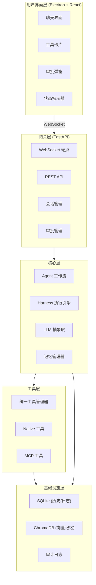

# Athena — 自主 AI Agent 桌面应用

<p align="center">
  🏛️ <strong>Athena</strong> 🏛️
</p>

<p align="center">
  <strong>基于 Harness Engineering 方法论的自主 AI Agent 桌面应用</strong>
</p>

<p align="center">
  <a href="#快速开始">快速开始</a> •
  <a href="#功能特性">功能特性</a> •
  <a href="#技术架构">技术架构</a> •
  <a href="#开发指南">开发指南</a> •
  <a href="#api-文档">API 文档</a>
</p>

---

## 📖 项目简介

Athena 是一个采用 **Harness Engineering** 方法论构建的自主 AI Agent 桌面应用。它将"大脑"（LLM）与"外骨骼"（工程框架）解耦，通过工程化的管理（Schema、审批、预算、状态）来驾驭 AI 模型，确保 Agent 在真实世界中稳定、可控、可观测。

### 核心设计理念

- **三层任务分类系统**：直接回答 → 工具调用 → 子 Agent 委派
- **Human-in-the-Loop (HITL)**：关键操作支持人工审批
- **状态持久化**：会话恢复、记忆管理
- **可观测性**：实时执行过程可视化
- **安全防护**：风险分级、沙箱隔离

---

## ✨ 功能特性

### 🤖 智能 Agent 系统
- **三层任务分类**：根据任务复杂度自动选择执行路径
- **子 Agent 并行执行**：支持复杂任务拆解和并行处理
- **上下文压缩**：智能压缩长对话，保持上下文连贯

### 🔧 工具生态系统
- **统一工具管理**：Native 工具 + MCP 工具统一接口
- **MCP 协议支持**：集成 Model Context Protocol，扩展工具能力
- **工具风险分级**：低/中/高风险等级，配套审批机制

### 💾 记忆与状态管理
- **长期记忆**：基于 ChromaDB 的向量记忆系统
- **会话恢复**：中断后自动恢复会话状态
- **事实提取**：从对话中提取关键信息存储

### 🖥️ 桌面应用体验
- **跨平台**：支持 macOS、Windows、Linux
- **实时通信**：WebSocket 双向通信
- **流式响应**：实时显示 AI 思考过程

### 🔒 安全与审批
- **HITL 审批**：高风险操作需人工确认
- **沙箱隔离**：可选 Docker 沙箱执行环境
- **审计日志**：完整操作记录

---

## 🏗️ 技术架构

### 六层架构设计



### 技术栈

| 层级 | 技术选型 | 职责 |
|------|----------|------|
| **用户界面** | Electron + React + Vite + TypeScript + Tailwind CSS | 跨平台桌面应用 |
| **后端 API** | FastAPI (Python) | WebSocket 连接、路由、会话管理 |
| **Agent 核心** | 自定义 Harness + LangChain | 执行引擎、工具调用、循环控制 |
| **数据持久化** | SQLite | 对话历史、执行日志、会话状态 |
| **向量记忆** | ChromaDB | 长期记忆、语义检索 (RAG) |
| **通信协议** | WebSocket | 双向实时通信 |
| **工具管理** | UnifiedToolManager | Native/MCP 工具统一管理 |

---

## 📁 项目结构

```
Athena/
├── start.sh                   # 一键启动/停止/构建脚本
├── pyproject.toml             # Python 项目配置
├── .env.example               # 环境变量配置模板
├── athena/                    # Python 后端核心
│   ├── config/               # 配置管理
│   ├── core/                 # 核心业务逻辑
│   │   ├── agent/           # Agent 工作流
│   │   ├── compression/     # 上下文压缩
│   │   ├── harness/         # Harness 执行引擎
│   │   ├── llm/             # LLM 抽象层
│   │   ├── memory/          # 记忆系统
│   │   ├── recovery/        # 会话恢复
│   │   ├── security/        # 安全模块
│   │   └── tools/           # 工具管理
│   │       ├── builtin/     # 内置工具
│   │       ├── mcp/         # MCP 工具
│   │       └── sandbox/     # 沙箱环境
│   ├── db/                  # 数据库层
│   ├── gateway/             # API 网关
│   │   ├── routes/          # REST API 路由
│   │   └── ws/              # WebSocket 处理（handler、连接管理、事件协议）
│   ├── models/              # 数据模型
│   └── utils/               # 工具函数
├── desktop/                  # Electron 前端
│   ├── electron/           # Electron 主进程 (main.ts, preload.ts)
│   ├── src/                # React 渲染进程
│   │   ├── components/    # UI 组件 (Chat, ToolCard, ApprovalDialog 等)
│   │   ├── hooks/         # React Hooks (useWebSocket)
│   │   ├── store/         # Zustand 状态管理
│   │   ├── api/           # API 客户端
│   │   ├── types/         # TypeScript 类型定义
│   │   └── utils/         # 工具函数
│   └── dist/               # 构建产物
├── prompt/                   # AI 提示词模板
├── tests/                    # 测试用例
├── doc/                      # 项目文档
├── data/                     # 数据存储
└── sql/                      # SQL 脚本
```

---

## 🚀 快速开始

### 环境要求

- **Python**: >= 3.11
- **Node.js**: >= 18.x
- **操作系统**: macOS / Windows / Linux

### 1. 克隆项目

```bash
git clone https://github.com/your-username/athena.git
cd athena
```

### 2. 后端设置

```bash
# 创建虚拟环境
python -m venv .venv
source .venv/bin/activate  # Windows: .venv\Scripts\activate

# 安装依赖
pip install -e ".[dev]"

# 配置环境变量
cp .env.example .env
# 编辑 .env 文件，配置 LLM API Key 等
```

### 3. 前端设置

```bash
cd desktop
npm install
```

### 4. 启动应用

```bash
# 启动后端 (终端 1)
cd athena
python -m athena.main

# 启动前端 (终端 2)
cd desktop
npm run dev
```

### 5. 访问应用

- **前端界面**: http://localhost:5173 (Vite 开发服务器)
- **后端 API**: http://localhost:8000
- **API 文档**: http://localhost:8000/docs

> 💡 **快速启动**: 也可以使用 `./start.sh start` 一键同时启动后端和前端。

### 6. start.sh 使用说明

```bash
./start.sh start      # 同时启动后端 + 前端（默认）
./start.sh backend    # 仅启动后端
./start.sh frontend   # 仅启动前端
./start.sh stop       # 停止所有服务
./start.sh restart    # 重启所有服务
./start.sh status     # 查看进程与端口状态
./start.sh build      # 构建生产产物 + Electron 打包
./start.sh test       # 运行 pytest 测试套件
./start.sh install    # 安装/校验所有依赖
./start.sh logs       # 实时查看日志
./start.sh help       # 显示使用说明
```

---

## ⚙️ 配置说明

### 环境变量配置

复制 `.env.example` 为 `.env`，按需修改：

```bash
# 服务器配置
HOST=127.0.0.1
PORT=8000
DEBUG=true

# LLM Provider 配置 (JSON 数组)
LLM_PROVIDERS='[{"name":"primary","provider":"openai","model":"gpt-4o","api_key":"sk-your-key"}]'

# 数据库路径
SQLITE_DB_PATH=./data/athena.db
CHROMADB_PATH=./data/chromadb

# Harness 配置
MAX_TURNS_PER_RUN=20
RETRY_BUDGET=3
TOOL_TIMEOUT=60

# 记忆系统配置
SUMMARY_THRESHOLD=10
MEMORY_SYNC_INTERVAL=900
MEMORY_TTL_DAYS=90
```

### LLM Provider 配置

支持多种 LLM 提供商：

```json
[
  {
    "name": "primary",
    "provider": "openai",
    "model": "gpt-4o",
    "api_key": "sk-your-api-key",
    "temperature": 0.7,
    "max_tokens": 4096
  },
  {
    "name": "secondary",
    "provider": "anthropic",
    "model": "claude-3-opus",
    "api_key": "sk-ant-your-api-key"
  },
  {
    "name": "fallback",
    "provider": "ollama",
    "model": "qwen2.5:14b",
    "base_url": "http://localhost:11434"
  }
]
```

---

## 🧪 测试

### 运行测试

```bash
# 运行所有测试
pytest

# 运行特定测试文件
pytest tests/test_harness.py

# 运行带覆盖率的测试
pytest --cov=athena --cov-report=html
```

### 测试结构

```
tests/
├── conftest.py              # 测试配置
├── test_database.py         # 数据库测试
├── test_harness.py          # Harness 执行引擎测试
├── test_memory.py           # 记忆系统测试
├── test_recovery.py         # 会话恢复测试
├── test_tools_endpoints.py  # 工具 API 测试
└── ...
```

---

## 📚 API 文档

### REST API

启动后端后访问 http://localhost:8000/docs 查看 Swagger 文档。

#### 主要端点

| 模块 | 方法 | 端点 | 描述 |
|------|------|------|------|
| 会话 | `POST` | `/api/sessions` | 创建新会话 |
| 会话 | `GET` | `/api/sessions` | 获取会话列表 |
| 会话 | `GET` | `/api/sessions/{id}` | 获取会话详情 |
| 会话 | `POST` | `/api/sessions/{id}/messages` | 发送消息 |
| 工具 | `GET` | `/api/tools` | 获取工具列表 |
| MCP | `POST` | `/api/mcp/servers` | 添加 MCP 服务器 |
| MCP | `GET` | `/api/mcp/servers` | 获取 MCP 服务器列表 |
| 记忆 | `GET` | `/api/memory` | 查询长期记忆 |
| 审批 | `POST` | `/api/approval/{id}/approve` | 审批通过 |
| 审批 | `POST` | `/api/approval/{id}/reject` | 审批拒绝 |
| 设置 | `GET` | `/api/settings` | 获取系统配置 |
| 设置 | `PATCH` | `/api/settings` | 更新系统配置 |
| Provider | `GET` | `/api/providers` | 获取 LLM Provider 列表 |
| 健康 | `GET` | `/api/health` | 健康检查 |

### WebSocket 协议

连接地址: `ws://localhost:8000/ws/{session_id}`

#### 事件类型

| 事件 | 描述 |
|------|------|
| `message` | 新消息 |
| `thinking` | AI 思考中 |
| `tool_call` | 工具调用 |
| `tool_result` | 工具返回 |
| `approval_request` | 审批请求 |
| `error` | 错误信息 |

---

## 🔧 开发指南

### 代码风格

- **Python**: 遵循 PEP 8，使用 type hints
- **TypeScript**: 遵循 ESLint 规则
- **提交规范**: Conventional Commits

### 添加新工具

1. 在 `athena/core/tools/builtin/` 创建工具文件
2. 实现工具函数和 Schema
3. 在 `registry.py` 注册工具
4. 编写测试用例

```python
# 示例：添加一个计算工具
from athena.core.tools.builtin.registry import register_builtin_tools

@register_builtin_tools
def register_calculator(tool_manager):
    async def calculate(expression: str) -> str:
        """计算数学表达式"""
        try:
            result = eval(expression)  # 注意：生产环境应使用安全的表达式解析
            return str(result)
        except Exception as e:
            return f"计算错误: {e}"
    
    tool_manager.register_native(
        name="calculator",
        description="计算数学表达式",
        handler=calculate,
        parameters={"expression": {"type": "string", "description": "数学表达式"}},
        risk_level="low"
    )
```

### 添加 MCP 工具

1. 配置 MCP 服务器连接
2. 使用 MCP 管理器注册工具
3. 工具自动同步到工具管理器

---

## 📦 部署

### 开发环境

```bash
# 后端
python -m athena.main

# 前端
cd desktop && npm run dev
```

### 生产环境

```bash
# 构建前端
cd desktop && npm run build

# 打包 Electron 应用
npm run electron:build
```

### Docker 部署 (可选)

```bash
# 构建沙箱镜像
docker build -t athena-sandbox -f Dockerfile.sandbox .

# 启动服务
docker-compose up -d
```

---

## 🤝 贡献指南

1. Fork 项目
2. 创建功能分支 (`git checkout -b feature/AmazingFeature`)
3. 提交更改 (`git commit -m 'feat: Add AmazingFeature'`)
4. 推送到分支 (`git push origin feature/AmazingFeature`)
5. 创建 Pull Request

### 开发流程

1. 阅读 [技术规格文档](doc/Athena技术规格文档.md)
2. 查看 [Issues](https://github.com/your-username/athena/issues) 了解待办事项
3. 遵循代码规范和提交规范
4. 确保测试通过

---

## 📄 许可证

本项目采用 MIT 许可证 - 查看 [LICENSE](LICENSE) 文件了解详情

---

## 🙏 致谢

- [LangChain](https://github.com/langchain-ai/langchain) - AI 应用框架
- [FastAPI](https://github.com/tiangolo/fastapi) - 现代 Python Web 框架
- [Electron](https://github.com/electron/electron) - 跨平台桌面应用框架
- [React](https://github.com/facebook/react) - 用户界面库
- [ChromaDB](https://github.com/chroma-core/chroma) - 向量数据库

---

## 📞 联系方式

- **项目主页**: [https://github.com/your-username/athena](https://github.com/your-username/athena)
- **问题反馈**: [Issues](https://github.com/your-username/athena/issues)
- **文档**: [doc/](doc/)

---

<p align="center">
  Made with ❤️ by Athena Team
</p>