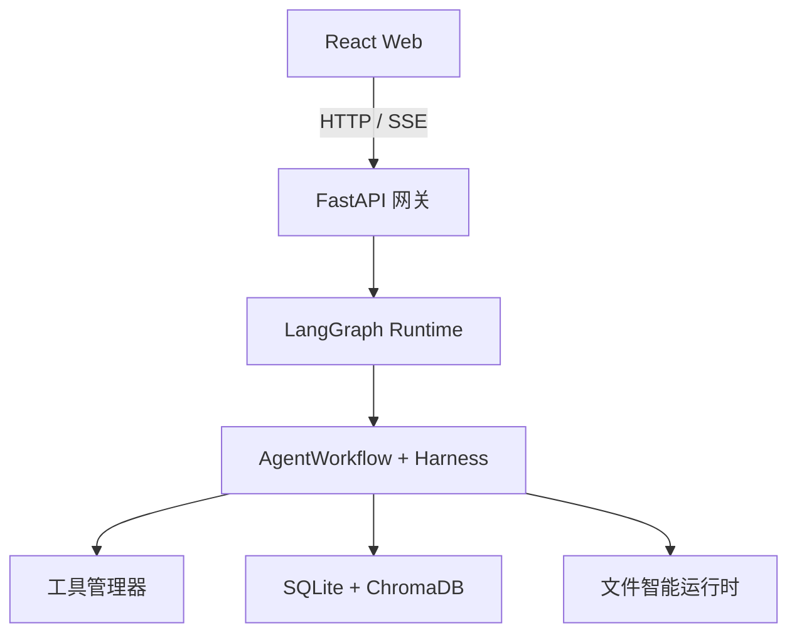

# Athena

Athena 是一个面向本地运行的自主 AI Agent 桌面应用。项目将 LLM 与可控的执行框架分离，通过会话状态、工具治理、审批、预算、记忆和事件流，让 Agent 的执行过程可恢复、可观测。

## 功能概览

- Agent 工作流：支持工具调用、重试、预算控制、错误处理和子 Agent 并行执行。
- 工具系统：统一管理内置工具与 MCP 工具，支持启用/禁用、风险等级和人工审批。
- 会话与恢复：持久化消息、步骤和工具调用，支持中断会话恢复或放弃。
- 记忆与检索：SQLite 保存记忆元数据，ChromaDB 保存向量；支持向量检索、关键词检索、融合排序、摘要和事实提取。
- 文件智能：支持文本、PDF、Word、Excel、图片和代码文件的上传、解析、检索与分析。
- 浏览器体验：React Web 前端通过 HTTP Command 和 SSE 接收 LLM 流式输出、工具执行、审批和文件处理事件。
- 可选安全能力：路径安全过滤和 Docker 沙箱执行。沙箱默认关闭。

## 技术架构


```mermaid
flowchart TB
    UI[React Web]
    API[FastAPI 网关]
    Agent[AgentWorkflow + Harness]
    Tools[工具管理器]
    Storage[SQLite + ChromaDB]
    Files[文件智能运行时]
    Runtime[LangGraph Runtime]

    UI -->|HTTP / SSE| API
    API --> Runtime
    Runtime --> Agent
    Agent --> Tools
    Agent --> Storage
    Agent --> Files
```

主要技术栈：

| 模块 | 技术 |
| --- | --- |
| 后端 | Python 3.11+、FastAPI、Uvicorn、Pydantic Settings |
| Agent 与 LLM | LangChain、OpenAI、Anthropic、Ollama 适配器 |
| 工具 | 内置异步工具、MCP SDK、可选 Docker 沙箱 |
| 持久化 | SQLite、SQLAlchemy、ChromaDB |
| 文件处理 | pypdf、pdfplumber、python-docx、openpyxl、Pillow、RapidOCR、Tree-sitter |
| 前端 | React 18、TypeScript、Vite、Zustand、Tailwind CSS |

## 项目结构

```text
Athena/
├── athena/
│   ├── config/               # 环境配置
│   ├── core/                 # Agent、Harness、LLM、记忆、检索、工具、文件和安全能力
│   ├── contracts/            # Command/Event 协议与端口
│   ├── gateway/              # REST API、SSE 和认证
│   ├── infrastructure/       # SQLite、ChromaDB 等基础设施
│   ├── models/               # 领域模型
│   └── main.py               # FastAPI 应用入口
├── agent_runtime/            # LangGraph、命令消费和恢复
├── desktop/                  # React Web 前端
│   └── src/                  # 页面、组件、状态、SSE 和 API 客户端
├── tests/                    # 后端测试
├── prompt/                   # 系统提示词和摘要/恢复提示词
├── doc/                      # 架构、文件智能和检索评估文档
├── sql/                      # SQL Schema
├── data/                     # 本地数据库、文件和评估数据
├── logs/                     # 启动脚本生成的日志
├── .env.example              # 环境变量模板
├── pyproject.toml            # Python 项目与依赖配置
└── start.sh                  # 开发环境统一启动脚本
```

## 快速开始

### 环境要求

- Python 3.11 或更高版本
- Node.js 18 或更高版本，以及 npm
- macOS、Linux，或使用 Git Bash / WSL 的 Windows 环境
- 至少一个可用的 LLM Provider。Ollama 可用于本地模型；云端 Provider 需要对应 API Key。

### 安装

```bash
git clone https://github.com/doubleu8190/Athena.git
cd Athena

# 创建并激活 Python 虚拟环境
python3 -m venv .venv
source .venv/bin/activate       # Windows: .venv\Scripts\activate

# 安装后端及开发依赖
python -m pip install -e ".[dev]"

# 安装桌面端依赖
cd desktop
npm install
cd ..

# 创建本地配置
cp .env.example .env            # Windows 可手动复制文件
```

编辑 `.env`，至少配置一个可用的 LLM Provider。不要把包含真实 API Key 的 `.env` 提交到版本库。

### 启动

推荐使用统一启动脚本：

```bash
./start.sh start
```

该命令会启动 FastAPI 后端和 Vite Web 开发服务器。也可以分别启动：

```bash
# 终端 1：后端
python -m athena.main

# 终端 2：Web 前端
cd desktop
npm run dev
```

默认地址：

| 服务 | 地址 |
| --- | --- |
| FastAPI | http://127.0.0.1:8000 |
| 健康检查 | http://127.0.0.1:8000/api/health |
| Swagger API 文档 | http://127.0.0.1:8000/docs |
| Vite Web 开发服务器 | http://127.0.0.1:5173 |
| SSE 事件流 | http://127.0.0.1:8000/api/sessions/{id}/events |

5173 是前端 Vite 开发服务器地址；生产构建产物位于 `desktop/dist`。

### 启动脚本命令

```bash
./start.sh start                       # 启动后端和桌面端
./start.sh backend                     # 仅启动后端
./start.sh frontend                    # 仅启动 Vite Web 前端
./start.sh status                      # 查看进程、端口和健康状态
./start.sh stop                        # 停止脚本启动的进程
./start.sh restart                     # 重启全部服务
./start.sh test                        # 运行后端测试
./start.sh build                       # 测试、类型检查和前端生产构建
./start.sh install                     # 安装或检查前后端依赖
./start.sh logs [backend|frontend|all] # 查看实时日志
./start.sh help                       # 查看完整帮助
```

## 配置

配置通过环境变量或项目根目录下的 `.env` 文件注入。Pydantic Settings 支持使用 `__` 表示嵌套字段，例如 `LLM_RETRY__TIMEOUT_MS`。

### 常用配置

```dotenv
HOST=127.0.0.1
PORT=8000
DEBUG=true

# 按优先级排列：primary -> secondary -> fallback
LLM_PROVIDERS='[{"name":"primary","provider":"openai","model":"gpt-4o","api_key":"sk-your-api-key"}]'
LLM_TEMPERATURE=0.7
LLM_MAX_TOKENS=4096

SQLITE_DB_PATH=./data/athena.db
CHROMADB_PATH=./data/chromadb
FILE_STORAGE_PATH=./data/files

MAX_TURNS_PER_RUN=20
RETRY_BUDGET=3
TOOL_TIMEOUT=60
LLM_STREAM_TIMEOUT=120
APPROVAL_TIMEOUT=120

SANDBOX_ENABLED=false
```

`LLM_PROVIDERS` 是 JSON 数组，列表顺序决定 Provider 优先级。当前代码支持 `openai`、`anthropic`、`deepseek` 和 `ollama`；`ollama` 可以不填写 API Key，并可通过 `base_url` 指定地址。

完整配置项和默认值请参见 [.env.example](.env.example) 与 [athena/config/settings.py](athena/config/settings.py)。文件上传大小、分块、并发、检索、上下文压缩、影子评估和审批等参数也都可以通过环境变量调整。

## API 与事件协议

启动后端后，推荐直接使用 `/docs` 查看带请求和响应模型的 OpenAPI 文档。常用 REST API 包括：

| 模块 | 示例端点 | 用途 |
| --- | --- | --- |
| 健康 | `GET /api/health` | 检查服务状态 |
| 会话 | `GET/POST /api/sessions` | 查询或创建会话 |
| 会话 | `GET /api/sessions/{id}/messages` | 查询消息 |
| 会话 | `POST /api/sessions/{id}/runs` | 提交消息命令 |
| 事件 | `GET /api/sessions/{id}/events` | SSE 重放与实时事件 |
| 工具 | `GET/PATCH /api/tools` | 查询和治理工具 |
| MCP | `GET/POST /api/mcp/servers` | 查询或注册 MCP 服务 |
| 审批 | `GET /api/approvals` | 查询待处理审批 |
| 审批 | `POST /api/approvals/{id}/respond` | 允许或拒绝审批 |
| 记忆 | `GET /api/memory`、`POST /api/memory/search` | 管理和搜索记忆 |
| 文件 | `/api/sessions/{id}/attachments` | 上传和管理附件 |
客户端通过 HTTP 提交版本化 Command，通过 SSE 接收 Application Event。Durable Event 使用会话内 `session_seq` 重放，Realtime Delta 仅用于低延迟展示。

## 测试与构建

```bash
# 后端全部测试
pytest

# 指定测试
pytest tests/test_harness.py -q

# 覆盖率
pytest --cov=athena --cov-report=html

# 前端类型检查
cd desktop
npm run typecheck

# 前端生产构建
npm run build

# 构建前端生产产物
npm run build
```

`./start.sh build` 会依次运行后端测试、前端类型检查和 Vite 生产构建，输出前端构建产物到 `desktop/dist`。当前版本不再依赖 Electron 打包流程。

## 相关文档

- [系统架构](doc/architecture.md)
- [技术规格文档](doc/Athena技术规格文档.md)
- [文件智能设计](doc/文件系统设计v2.md)
- [SQLAlchemy 迁移说明](doc/sqlalchemy-migration.md)

## 贡献

提交代码前请运行相关测试，并保持后端模块边界和前端类型检查通过。新增功能应同步补充测试或对应文档。

## 许可证

本项目采用 MIT 许可证，详见 [LICENSE](LICENSE)。
