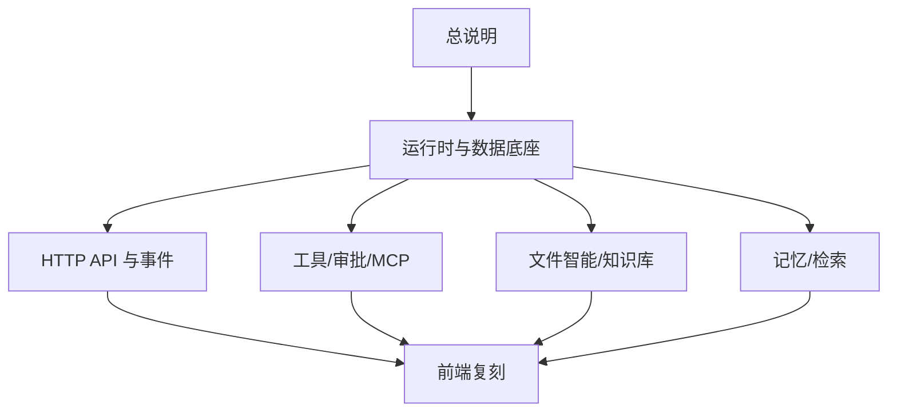

# Athena 当前系统文档索引

以下文档以当前工作树中实际注册的运行时和路由为准。推荐从总说明开始阅读；每份文档顶部都有依赖关系。

| 顺序 | 文档 | 用途 |
| --- | --- | --- |
| 1 | [系统实现总说明](athena-system-overview.md) | 定义复刻目标、组件、生命周期、不变量和验收标准 |
| 2 | [运行时与数据底座](athena-runtime.md) | 定义启动、命令、Root/Worker、DAG、事件、表和恢复 |
| 3 | [HTTP API 与事件协议](athena-api.md) | 定义全部当前 REST、SSE、请求字段、响应和错误 |
| 4 | [工具、审批与 MCP 实现](athena-tools-approval-mcp.md) | 定义内置工具、文件工具、审批、沙箱、MCP 和治理 |
| 5 | [文件智能与知识库实现](athena-files-knowledge.md) | 定义上传、适配器、解析、分块、索引、检索和分析 |
| 6 | [记忆、上下文检索与检索轨迹](athena-memory-retrieval.md) | 定义长期记忆、revision、融合召回、图上下文和轨迹 |
| 7 | [前端复刻说明](athena-frontend.md) | 定义页面、状态、SSE 投影和用户流程 |

`athena-target-implementation.md` 是之前留下的目标架构设计稿，描述范围大于当前已接入实现；它不是本套“当前系统功能”文档的依据。`optional-none-audit.md` 是代码审计记录，也不是产品功能定义。

## 阅读依赖图



## 启动和验证

```bash
python3 -m venv .venv
source .venv/bin/activate
python -m pip install -e ".[dev]"
cd frontend && npm install && cd ..
cp .env.example .env
./start.sh start
```

服务地址：后端 `http://127.0.0.1:8000`，Swagger `http://127.0.0.1:8000/docs`，前端 `http://127.0.0.1:5173`，SSE `/api/sessions/{id}/events`。后端测试使用 `./start.sh test`，前端生产构建使用 `cd frontend && npm run build`。
