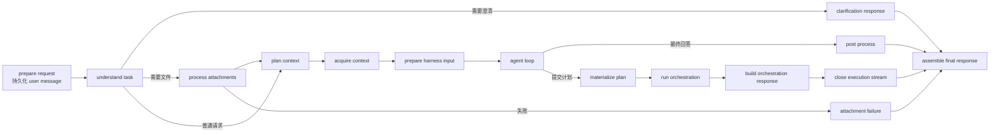

# Athena 项目架构说明

> 分析对象：`/Users/udouble/Documents/code/Athena`
>
> 分析基线：2026-09-29 工作区源码。本文以当前实现为准；若与旧 README 或历史文档不一致，以代码和配置为准。

## 1. 架构摘要

Athena 是一个本地运行的自主 AI Agent 应用，整体形态是**异步模块化单体**：

- 一个 FastAPI 进程同时承载 REST API、SSE 事件出口和后台运行时消费者。
- Agent 执行由 LangGraph 主图驱动，图节点负责流程编排，核心能力通过显式依赖注入组合。
- 领域能力集中在 `athena/core`，数据库、向量库、图数据库和 Docker 等适配器集中在 `athena/infrastructure`。
- 前端是 React + TypeScript + Vite Web 应用，通过 HTTP 提交命令，通过会话级 SSE 接收可重放的运行事件。
- PostgreSQL 是业务数据、事件、作业和 LangGraph checkpoint 的统一持久化底座；pgvector 承载向量检索，Neo4j 承载图关系检索。

```mermaid
flowchart TB
    UI[React Web 前端\nHTTP + SSE]
    GW[FastAPI Gateway\nREST / Auth / SSE]
    CC[CommandConsumer\n异步命令消费]
    LG[LangGraph 主图\nAgentState + checkpoint]
    LOOP[Harness / Execution Loop\nLLM ↔ Tool]
    CTX[Context Service\n任务理解与上下文计划]
    ORCH[Orchestration\n计划、并行任务、汇总]
    TOOLS[UnifiedToolManager\n内置工具 / MCP / 子 Agent]
    CORE[Core Services\n记忆 / 文件 / 检索 / 压缩 / 图]
    PG[(PostgreSQL\n业务表、事件、作业、pgvector)]
    N4J[(Neo4j\n实体关系图)]
    FS[(文件存储\ndata/files)]
    LLM[LLM Providers\nOpenAI / Anthropic / DeepSeek / Ollama]
    SANDBOX[可选 Docker Sandbox]

    UI -->|POST /api/*| GW
    UI -->|GET /api/sessions/{id}/events| GW
    GW -->|持久化命令| PG
    GW --> CC
    CC --> LG
    LG --> CTX
    LG --> LOOP
    LOOP --> LLM
    LOOP --> TOOLS
    LG --> ORCH
    ORCH --> LOOP
    CTX --> CORE
    CORE --> PG
    CORE --> N4J
    CORE --> FS
    TOOLS --> SANDBOX
    LOOP -->|事件发布| PG
    PG -->|事件重放 / 实时通知| GW
    GW -->|SSE| UI
```

## 2. 仓库结构与职责

```text
Athena/
├── athena/
│   ├── config/                 # Pydantic Settings 与环境变量配置
│   ├── contracts/              # Command、Event、状态、端口、工具策略等稳定协议
│   ├── core/                   # 与传输和数据库解耦的核心能力域
│   │   ├── compression/        # 上下文压缩与摘要
│   │   ├── files/              # 文件解析、分块、向量化、重排、知识库处理
│   │   ├── graph/              # 图索引协议与文档实体关系抽取
│   │   ├── harness/             # 单轮 Agent 执行、预算、错误处理
│   │   ├── llm/                 # Provider、重试、token 统计
│   │   ├── memory/              # 长期记忆、融合检索、蒸馏和异步写入
│   │   ├── retrieval/           # 检索轨迹与评估协议
│   │   ├── sandbox/              # 沙箱端口、工作区模型
│   │   ├── security/            # 路径安全过滤
│   │   └── tools/               # 工具规范、注册表、MCP、内置工具
│   ├── gateway/                # HTTP/SSE/Auth/Approval 适配层
│   ├── infrastructure/         # PostgreSQL、pgvector、Neo4j、Docker 适配器
│   ├── models/                 # API 和持久化之间共享的 Pydantic/领域模型
│   ├── observability/          # LangSmith trace/span 封装
│   ├── runtime/                # LangGraph、命令消费、恢复、上下文和编排运行时
│   ├── utils/                  # 日志、ID、提示词和消息转换
│   ├── container.py            # RuntimeContainer 显式依赖容器
│   └── main.py                 # FastAPI app 与生命周期组装入口
├── frontend/                  # React/TypeScript/Vite 前端
├── tests/                     # 后端单元、集成和架构边界测试
├── prompt/                   # 系统提示词、摘要、事实/图抽取提示词
├── deploy/                   # PostgreSQL/Neo4j Docker Compose 与初始化脚本
├── sql/                      # 数据库脚本或历史 schema 资源
├── data/                     # 本地文件、数据库挂载数据和运行数据
├── logs/                     # 启动脚本日志
├── pyproject.toml            # Python 依赖、构建和 pytest 配置
└── start.sh                  # 后端/前端启动、测试、构建和日志管理
```

当前源码中实际使用的是 `frontend/` 和 `athena/runtime/`。README 中仍出现 `desktop/`、`agent_runtime/` 等历史目录名，阅读或维护时应以当前目录为准。

## 3. 后端分层

### 3.1 配置与依赖组装层

`athena/config/settings.py` 使用 Pydantic Settings 读取 `.env` 和环境变量，并通过 `__` 支持嵌套配置。配置覆盖服务监听、认证、LLM Provider、PostgreSQL、embedding、Neo4j、文件智能、Harness、记忆、压缩、审批和沙箱。

`athena/main.py` 的 `lifespan` 是唯一的应用组装入口，按依赖顺序创建：

1. PostgreSQL `Database` 及所有 Repository。
2. Neo4j 图存储并执行 schema 初始化。
3. `AgentStore`、事件发布器、审批管理器。
4. 内置工具、MCP 工具管理器及持久化 MCP 服务恢复。
5. 主/副 LLM Provider。
6. 文件智能运行时、pgvector 文件存储、重排器和知识库 worker。
7. 长期记忆服务、pgvector 记忆存储、融合检索、摘要/事实抽取和记忆 worker。
8. 上下文压缩器和 `LangGraphRuntime`。
9. `RuntimeContainer`、恢复协调器、PostgreSQL checkpointer、主图和 `CommandConsumer`。

所有运行时依赖集中写入 `app.state.runtime`，路由通过 `get_runtime_container()` 读取。当前架构有意避免全局 service locator 和大量 `set_*` 注入，依赖关系更容易测试和审查。

### 3.2 Gateway 层

`athena/gateway` 只负责协议转换、鉴权和运行时调用，不承载 Agent 核心流程：

| 模块 | 主要职责 |
| --- | --- |
| `routes/sessions.py` | 会话 CRUD、消息查询、运行命令提交、暂停/恢复/取消 |
| `routes/commands.py` | 查询异步命令状态、按 run 取消 |
| `routes/events.py` | 会话级 SSE，支持事件重放和实时订阅 |
| `routes/approval.py` | 待审批项、审批日志/统计、允许/拒绝/取消 |
| `routes/files.py` | 会话附件查询、类型能力和删除 |
| `routes/knowledge_bases.py` | 知识库及文档上传、删除、版本查询 |
| `routes/memory.py` | 记忆搜索、列表、详情和修订 |
| `routes/retrieval.py` | 检索运行摘要和分阶段详情 |
| `routes/tools.py` / `routes/mcp.py` | 工具治理和 MCP 服务管理 |
| `routes/providers.py` / `routes/settings.py` | Provider 测试和设置视图 |
| `auth/*` | 登录、登出、基于签名 session cookie 的认证 |

所有业务路由挂在 `/api` 前缀下；运行提交返回 `202`，结果不通过 HTTP 响应返回，而是由 SSE 事件流推送。

### 3.3 Runtime 层

`athena/runtime` 是应用编排层，连接 Gateway、Core 和 Infrastructure：

- `command_consumer.py` 从持久化命令队列领取请求，执行幂等检查、并发控制、暂停/取消和状态更新。
- `agent_graph.py` 定义唯一的 LangGraph 主入口，并以 `run_id` 作为 checkpoint `thread_id`。
- `nodes/` 提供主图节点：准备请求、任务理解、附件处理、上下文计划/获取、Agent 循环、计划编排、结果组装。
- `execution_loop/` 是单轮 Harness 的状态图，核心分支为 `llm_call`、`execute_tool_batch`、`finish_execution` 和 `plan_requested`。
- `context/` 根据 `UserTaskSpec` 选择 memory、file、knowledge、graph 等上下文 Provider，并合并为可注入的 context bundle。
- `orchestration/` 负责结构化计划物化、任务派发、worker 执行、重试、事件发布和结果汇总。
- `recovery_reconciler.py` 在启动时处理上次进程退出留下的运行状态；`AsyncPostgresSaver` 让图可以从断点继续。
- `transport.py` 中的 `RuntimeEventPublisher` 将事件持久化并广播到进程内 `SessionEventBus`，供 SSE 使用。

主图的当前路径如下：



### 3.4 Core 能力域

`athena/core` 尽量以端口和协议表达依赖，具体适配器由 `infrastructure` 提供。

| 能力域 | 实现要点 |
| --- | --- |
| LLM | 多 Provider、主/副模型、指数退避、超时、fallback、token 计数 |
| Harness | 每轮预算、最大 turn、工具调用、错误分类、上下文压缩和执行结果 |
| Tools | 统一工具规范和风险等级；内置文件/shell 工具；MCP 动态注册；子 Agent 工具 |
| Approval | 高风险工具在执行前暂停，持久化请求并等待用户决定或超时 |
| Memory | 记忆实体、修订、候选解析、融合检索、访问统计、事实抽取和异步写入 |
| Files | 文本/PDF/Word/Excel/图片/代码适配器，抽取、分块、embedding、重排、分析 |
| Retrieval | 文件和记忆的向量/关键词召回、RRF 融合、cross-encoder 重排、轨迹记录 |
| Graph | 文档实体/关系抽取和 Neo4j 图检索，作为上下文 Provider 使用 |
| Compression | 根据 token 预算对对话上下文做摘要，避免超过模型窗口 |
| Sandbox/Security | 工作区路径过滤、Docker shell runner；沙箱是否强制由配置控制 |

### 3.5 Infrastructure 层

- `infrastructure/postgre`：异步 SQLAlchemy engine、数据库初始化、模型和 Repository。Repository 负责会话、消息、运行、工具调用、事件、审批、记忆、文件、知识库、编排和检索轨迹。
- `infrastructure/pgvector`：文件向量和记忆向量的存取，embedding 配置由统一 Settings 提供。
- `infrastructure/neo4j`：Neo4j 图连接、schema、实体/关系查询和图上下文读取。当前启动流程把 Neo4j 视为必需运行时依赖，连接或 schema 初始化失败会阻止应用启动。
- `infrastructure/sandbox/docker_runner.py`：按需启动和复用 Docker 沙箱容器，执行受控命令。

## 4. 端到端运行时流程

### 4.1 用户提交请求

1. 前端 `apiClient.submitRun()` 向 `POST /api/sessions/{session_id}/runs` 发送 JSON 或 multipart/form-data。
2. Gateway 创建带 `command_id`、`run_id` 和 `message_id` 的异步命令并返回 `202`。
3. `CommandConsumer` 从数据库领取命令，检查会话运行状态和幂等键。
4. LangGraph 以 `run_id` 建立 checkpoint 身份，首次执行创建初始 `AgentState`，中断执行则从 PostgreSQL checkpoint 恢复。
5. 主图依次执行任务理解、上下文获取、Harness/工具循环，期间向 `RuntimeEventPublisher` 发布生命周期事件。
6. 事件先持久化到 `AgentStore`，再通过 `SessionEventBus` 通知当前进程内的 SSE 客户端。
7. 前端根据 `session_seq` 去重、按 `stream_id/chunk_id` 重组流式答案，并将步骤、工具调用、审批和编排任务投影到 Zustand store。
8. 终态事件和最终消息落库，前端可通过历史 API 和 SSE replay 恢复界面。

### 4.2 Agent 循环

`HarnessTurnExecutor` 将对话、上下文和可用工具交给 LLM：

- LLM 返回最终文本时进入 `finish_execution`。
- LLM 返回工具调用时由工具执行节点批量执行，再回到下一轮 LLM。
- LLM 请求计划时进入主图的 `materialize_execution_plan` 分支，由 orchestration 子系统调度多个任务，再由汇总器生成最终回答。
- 可重试错误受 LLM retry budget、最大 turn 和工具 timeout 共同限制；不可重试错误直接转为结构化执行失败。

### 4.3 SSE 可靠性模型

`GET /api/sessions/{id}/events` 不是简单的 token 推送：

- 事件带会话序号 `session_seq`，前端丢弃已处理序号以避免重复投影。
- 流式答案带 `stream_id` 和 `chunk_id`，支持乱序到达后的按序拼接。
- 新连接会先从持久化事件表按 watermark 重放，再订阅实时总线。
- `stream.snapshot` 可在客户端缺少早期 delta 时恢复当前答案；thinking 流不按可恢复 snapshot 处理。
- SSE 只承载运行状态和增量输出，历史消息正文仍通过 REST 查询。

## 5. 数据与持久化模型

| 数据 | 存储 | 用途 |
| --- | --- | --- |
| 会话、消息、运行、工具调用 | PostgreSQL | 业务主数据和历史查询 |
| Durable application events | PostgreSQL | SSE replay、审计、断线恢复 |
| LangGraph checkpoint | PostgreSQL checkpointer | Agent 图中断恢复 |
| 记忆正文、修订、访问统计 | PostgreSQL | 记忆生命周期和版本 |
| 记忆/文件 embedding | PostgreSQL + pgvector | 语义召回 |
| 文件元数据和知识库任务 | PostgreSQL | 上传、版本、异步处理状态 |
| 原始文件内容 | `FILE_STORAGE_PATH`，默认 `./data/files` | 文件持久化和重新解析 |
| 文档实体和关系 | Neo4j | Graph RAG 和关系上下文 |
| 运行日志 | `logs/` | 本地诊断，不作为业务状态源 |

后台 worker 主要包括知识文档处理 worker、记忆写入 worker 和内存访问统计 flush 任务。应用关闭时按逆序停止 worker、关闭 checkpointer、释放 MCP/Docker/Neo4j/PostgreSQL 资源。

## 6. 前端架构

`frontend/src` 采用按职责拆分的 React 单页应用：

| 目录/文件 | 职责 |
| --- | --- |
| `App.tsx` | 根布局、会话加载、视图切换、命令分发 |
| `api/client.ts` | REST 请求封装、JSON/multipart、错误处理 |
| `hooks/useSessionEventStream.ts` | 会话 SSE 连接、重放、序列去重、事件投影 |
| `store/chatStore.ts` | Zustand 状态：会话、消息、步骤、工具、审批、时间线、编排任务 |
| `components/Chat.tsx`、`Sidebar.tsx` | 主对话和会话列表 |
| `components/ActivityPanel.tsx`、`ExecutionTimeline.tsx` | 运行过程、工具和编排状态 |
| `components/pages/*` | Memory、Tools、Approvals、Providers、MCP、Knowledge Base、Retrieval、Settings 等管理视图 |
| `types/*` | API、事件和 UI 状态类型 |
| `utils/*` | 时间线建模、格式化、安全字符串化和工具摘要 |

Vite 开发服务器固定在 `5173`，将 `/api` 代理到 `127.0.0.1:8000`。生产构建由 `npm run build` 生成静态资源；当前前端目录名为 `frontend`，不是 README 中的 `desktop`。

## 7. 安全、可靠性和可观测性

- 非 loopback 监听时，`main.py` 强制开启认证，并要求用户名、密码和至少 32 字节 session secret。
- 高风险工具由 `ApprovalManager` 拦截，审批记录持久化，避免进程重启丢失待处理状态。
- 工具运行时使用统一的 `ToolRuntime`，路径过滤和 Docker 沙箱可分别控制；`SANDBOX_REQUIRED` 可将沙箱不可用变成启动失败。
- 所有 LLM、工具、图节点和编排阶段都通过应用事件暴露状态；LangSmith 追踪为可选能力，追踪故障不会阻断 Agent。
- `RecoveryReconciler` 处理重启时遗留的运行状态，LangGraph checkpoint 支持从节点边界续跑。
- 事件、命令和工具调用均有结构化状态，前端可以区分 queued/running/retrying/completed/failed/paused 等状态。

## 8. 测试与质量边界

`tests/` 覆盖以下高风险边界：

- Agent loop、预算、重试、错误处理和 LangGraph 路由。
- 命令消费、事件节点、运行恢复和会话状态。
- 工具注册、禁用工具、审批、shell 沙箱和 MCP API。
- 记忆写入/检索、向量、关系、Graph RAG、文件解析和 reranking。
- 架构边界测试：禁止旧数据库模块、全局 service locator、工具名硬编码分支和绕过 Provider 的实现。

建议将 `pytest`、前端 `npm run typecheck` 和 `npm run build` 作为合并前最低验证集；涉及 embedding、Neo4j、Docker 或真实 Provider 的测试应通过 fixture 或显式环境开关隔离。

## 9. 当前架构的优点与关注点

### 优点

1. `RuntimeContainer`、contracts 和 ports 使依赖方向清晰，核心逻辑可以使用 fake 适配器测试。
2. 命令、事件、checkpoint 三者分离，能够同时支持异步执行、SSE 实时反馈、断线重放和中断恢复。
3. 文件、记忆、图检索和工具系统都被封装成可组合的 Provider/Service，便于扩展能力。
4. 工具审批、预算、超时、重试和沙箱在执行边界统一治理，风险控制点集中。
5. 测试中有专门的架构边界断言，能够防止旧实现和隐式全局依赖回流。

### 关注点与改进建议

1. README 的目录和技术描述存在历史残留：`desktop` 应改为 `frontend`，`agent_runtime` 应改为 `athena/runtime`，并同步当前 Neo4j 的必需启动约束。
2. `main.py` 仍是较大的组合根。随着能力继续增加，可将生命周期初始化拆为 database/tool/memory/file/runtime 等 builder，保持 `main.py` 聚焦于组装顺序。
3. 当前实时事件总线是进程内实现；若未来部署多个 API 进程，需要引入共享 broker 或粘性会话，否则跨进程 SSE 客户端只能依赖持久化 replay，无法稳定接收即时事件。
4. Neo4j、embedding 模型和 Docker 对本地启动成本较高。可以保留“生产必需”模式，同时提供测试/轻量开发 profile，让不需要 Graph RAG 的开发者能启动最小能力集。
5. 前后端事件类型虽已通过 `contracts/events.py` 与 `frontend/src/types/events.ts` 对齐，但仍建议在 CI 中增加协议快照或 schema 校验，避免事件字段变更只在运行时暴露。

## 10. 启动与维护入口

```bash
# 后端
python -m athena.main

# 前端
cd frontend && npm run dev

# 全量开发入口
./start.sh start

# 测试和构建
./start.sh test
./start.sh build
```

常用运行地址：

| 服务 | 地址 |
| --- | --- |
| FastAPI | `http://127.0.0.1:8000` |
| OpenAPI | `http://127.0.0.1:8000/docs` |
| 健康检查 | `http://127.0.0.1:8000/api/health` |
| Vite | `http://127.0.0.1:5173` |
| 会话事件流 | `GET /api/sessions/{session_id}/events` |

