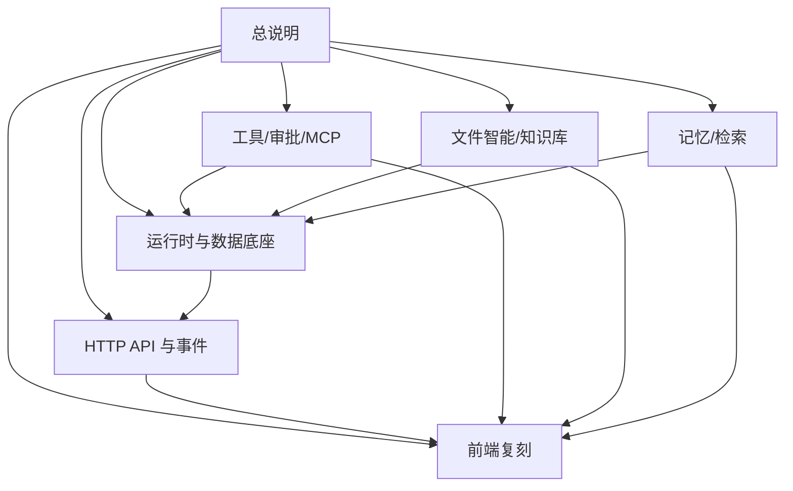

# Athena 当前系统实现总说明

本文是复刻 Athena 的总目标文档。它定义当前工作树中已经接入并由运行时实际使用的系统边界、行为、不变量、依赖和验收标准。实现时以本文及其依赖文档为准；历史 README、已删除模块和只存在于类型定义但没有调用链的能力不属于当前系统目标。

## 文档依赖关系

本文是根文档，不依赖其他 Athena 文档。实现顺序建议为：

1. [运行时与数据底座](athena-runtime.md)：进程启动、数据库、命令、Agent 状态、恢复和事件。
2. [HTTP API 与事件协议](athena-api.md)：前后端可以使用的 REST/SSE 合约。
3. [工具、审批与 MCP](athena-tools-approval-mcp.md)：工具注册、治理、调用和人工审批。
4. [文件智能与知识库](athena-files-knowledge.md)：附件、解析、索引、文件工具和知识库。
5. [记忆与检索](athena-memory-retrieval.md)：长期记忆、混合检索、图检索和轨迹。
6. [前端复刻](athena-frontend.md)：React 页面、状态投影和用户操作。

运行时文档依赖工具、文件、记忆文档；API 文档依赖运行时；前端文档依赖 API 和事件文档。各模块文档依赖关系如下：



## 1. 实现目标

Athena 是一个本地优先的自主 AI Agent 桌面 Web 应用。系统必须提供以下可见结果：

- 用户创建会话并发送消息；消息以异步运行的方式执行，最终答案和中间步骤通过会话级 SSE 实时显示，并可在断线后重放。
- Agent 能先理解任务，再选择会话历史、当前附件、知识库、长期记忆和图关系作为上下文；能直接回答，也能调用工具或生成固定的 Plan DAG。
- 工具调用统一经过注册、启用状态、风险级别和审批策略；高风险或被配置为需要审批的调用暂停，用户决定后从精确的 checkpoint 继续。
- 复杂任务由 Root Agent 生成一次性 DAG；TaskExecutor 按依赖运行 Worker Agent，任务结果持久化后仅在全部任务终态时恢复 Root 汇总。
- 文件可以作为会话附件或知识库文档上传，后台解析、分块、关键词/向量索引、重排、摘要、表格提取、图片分析和代码符号分析可被 Agent 使用。
- 长期记忆支持事实/摘要写入、向量与关键词融合检索、访问统计、过期清理、不可变 revision、有效性和图关系。
- 所有业务事实以 PostgreSQL 为准；pgvector 保存文件和记忆 embedding，Neo4j 保存知识图和记忆关系，原始文件保存在本地 blob 目录，LangGraph checkpoint 也保存在 PostgreSQL。

## 2. 当前实际组件

| 组件 | 实际实现 | 复刻要求 |
| --- | --- | --- |
| 后端 | Python 3.11+、FastAPI、Uvicorn、Pydantic Settings | 一个进程同时承载 REST、SSE、后台消费者和 worker |
| Agent | LangGraph 1.2.x + PostgreSQL checkpointer | Root 图和执行循环必须可 checkpoint/resume |
| LLM | LangChain，支持 OpenAI、Anthropic、DeepSeek 兼容接口、Ollama | 主 Provider；可选副 Provider和 fallback 列表 |
| 业务库 | PostgreSQL + SQLAlchemy async | 会话、消息、运行、事件、工具、审批、文件、记忆、编排 |
| 向量 | pgvector + Sentence Transformers 等 embedding | 文件/记忆使用同一 embedding 配置签名和维度 |
| 图库 | Neo4j 5 | 当前启动阶段会连接并初始化，失败阻止应用启动 |
| 文件 | 本地内容寻址 blob | 支持文本、CSV、Markdown、JSON、PDF、DOCX、XLSX、图片、代码 |
| 沙箱 | Docker runner | `exec_shell` 和 MCP 进程可使用；是否强制由配置控制 |
| 前端 | React 18、TypeScript、Vite、Zustand | HTTP 提交命令，EventSource 接收事件 |

## 3. 启动前置条件

必须准备 Python 3.11+、Node.js 18+、PostgreSQL（含 `vector`；中文检索建议启用 `zhparser`）和 Neo4j 5。至少配置一个 LLM Provider。Docker 只在启用 shell 或 MCP 沙箱时需要。

配置从项目根目录 `.env` 和环境变量读取，支持 `__` 嵌套。最小配置包括：

```dotenv
HOST=127.0.0.1
PORT=8000
POSTGRES_USER=doubleu
POSTGRES_PASSWORD=...
POSTGRES_DB=athena
LLM_PROVIDERS='[{"name":"primary","provider":"openai","model":"gpt-4o","api_key":"..."}]'
FILE_STORAGE_PATH=./data/files
EMBEDDING_PROVIDER=sentence_transformers
EMBEDDING_MODEL=BAAI/bge-m3
EMBEDDING_DIMENSION=1024
NEO4J_URI=bolt://127.0.0.1:7687
NEO4J_USERNAME=neo4j
NEO4J_PASSWORD=...
```

默认关键参数：单次运行最多 20 个 LLM turn、3 次重试；工具超时 60 秒，LLM 超时 120 秒；文件最大 512 MB，目标分块 800 token、重叠 80 token；记忆 TTL 90 天、最低记忆分数 0.7；上下文窗口 128000 token、达到 80% 时压缩，保留最近 3 轮。

监听非 loopback 地址时必须开启认证，并配置不少于 32 字节的 `AUTH_SESSION_SECRET`。认证开启后，写请求还要通过来源校验。

完整配置按以下分组实现；字段名称就是环境变量名转大写后的形式，嵌套对象使用双下划线：

| 分组 | 当前使用字段 |
| --- | --- |
| 服务/认证 | `HOST`、`PORT`、`DEBUG`、`AUTH_ENABLED`、`AUTH_USERNAME`、`AUTH_PASSWORD`、`AUTH_SESSION_SECRET`、`AUTH_SESSION_TTL_HOURS` |
| LLM | `LLM_PROVIDERS`、`LLM_TEMPERATURE`、`LLM_MAX_TOKENS`、`LLM_RETRY__MAX_ATTEMPTS/MIN_DELAY_MS/MAX_DELAY_MS/JITTER/TIMEOUT_MS`、`LLM_SECONDARY_RETRY__...` |
| PostgreSQL/embedding | `POSTGRES_*`、`EMBEDDING_PROVIDER/MODEL/DEVICE/VERSION/DIMENSION/API_KEY/BASE_URL` |
| Neo4j/Graph | `NEO4J_*`、`GRAPH_MAX_HOPS`、`GRAPH_ENTITY_LIMIT`、`GRAPH_PATH_LIMIT`、`GRAPH_MIN_CONFIDENCE`、`GRAPH_EXTRACTION_CONCURRENCY`、`GRAPH_TIMEOUT_SECONDS` |
| 文件 | `FILE_STORAGE_PATH`、`FILE_MAX_UPLOAD_BYTES`、`FILE_CHUNK_TOKENS`、`FILE_CHUNK_OVERLAP_TOKENS`、`FILE_PARSE_CONCURRENCY`、`FILE_EMBEDDING_CONCURRENCY`、`PDF_OCR_*` |
| Agent | `MAX_TURNS_PER_RUN`、`RETRY_BUDGET`、`TOOL_TIMEOUT`、`LLM_TIMEOUT`、`TASK_UNDERSTANDING_TIMEOUT_SECONDS` |
| 记忆/检索 | `SUMMARY_THRESHOLD`、`MEMORY_*`、`VECTOR_WEIGHT`、`KEYWORD_WEIGHT`、`RRF_K`、`RETRIEVAL_*`、`KNOWLEDGE_*` |
| 压缩 | `MAX_CONTEXT_TOKENS`、`COMPRESSION_THRESHOLD`、`KEEP_RECENT_TURNS`、`MAX_SUMMARY_TOKENS`、`SUMMARY_INCREMENTAL`、`SAVE_SUMMARY_TO_MEMORY` |
| 审批 | `APPROVAL_BATCH_MODE`、`APPROVAL_KEYBOARD_SHORTCUTS`、`APPROVAL_SOUND_ALERT` |
| 沙箱 | `SANDBOX_ENABLED/REQUIRED/DOCKER_BINARY/WORKSPACE_ROOT/SHELL_IMAGE/DEFAULT_NETWORK/MAX_TIMEOUT/MAX_OUTPUT_BYTES/MEMORY_MB/CPU_LIMIT/PIDS_LIMIT/REQUIRE_DIGEST/MCP_AUTO_RESTORE`、`EXEC_SHELL_ENABLED` |
| 可观测性 | `LANGCHAIN_TRACING_V2`、`LANGCHAIN_API_KEY`、`LANGCHAIN_PROJECT`、`LANGCHAIN_ENDPOINT` |

开发启动使用 `python -m athena.main` 和 `cd frontend && npm run dev`；统一脚本还提供 `backend/frontend/status/stop/restart/test/build/install/logs/help` 子命令。应用热重载只监听 `athena/` 目录。

## 4. 应用生命周期

启动顺序必须保持以下依赖顺序：

1. 读取 Settings，配置日志和可选 LangSmith 环境变量。
2. 连接 PostgreSQL，创建 ORM schema；校验 embedding 维度/签名。
3. 连接 Neo4j 并初始化图 schema；失败直接阻止服务接受请求。
4. 创建 AgentStore、事件发布器和 ApprovalManager。
5. 注册 8 个内置工具，恢复持久化 MCP 服务及其工具，并把治理配置同步到 ToolCatalog。
6. 创建主/副 LLM Provider。
7. 创建文件运行时、文件向量库、cross-encoder 重排器、图文档索引器和知识文档 worker。
8. 创建长期记忆服务、记忆向量库、融合检索、事实抽取、摘要器和记忆写入 worker。
9. 创建上下文压缩器和 LangGraphRuntime；打开 PostgreSQL checkpointer。
10. 构建 Root graph，启动 CommandConsumer，再启动知识文档 worker。
11. 将所有依赖放入 `app.state.runtime`，路由只通过 RuntimeContainer 访问。

关闭顺序是知识文档 worker、命令消费者、记忆 worker、checkpointer、记忆访问统计 flush、MCP、Docker、Neo4j、PostgreSQL。启动中途失败也必须执行同样的逆序清理。

## 5. 用户请求的完整行为

1. 前端向 `POST /api/sessions/{session_id}/runs` 发送 JSON，或以 multipart 同时上传附件。
2. Gateway 校验会话、文件类型和命令字段，生成 `message_id`/`run_id`，以 `command_id` 做幂等入队，返回 HTTP 202。
3. CommandConsumer 领取 `run.start`，原子获取每个会话唯一运行锁，创建 `run:{run_id}` checkpoint。
4. Root graph 持久化用户消息，执行任务理解。若需要澄清，直接持久化澄清问题并结束；否则规划上下文并并发获取各 provider。
5. 执行循环让 LLM 生成流式回答或工具调用。工具批次先通过审批闸门，再按调用逐个执行；结果写入消息、步骤、tool_calls 和事件。
6. 若 LLM 生成结构化计划，系统只校验/持久化计划，不让 LLM 负责调度。TaskExecutor 计算 ready task，启动独立 Worker checkpoint，任务完成后推进 DAG。
7. 所有中间任务必须进入 `done`、`failed`、`timed_out` 或 `cancelled` 才创建 `run.resume`；resume payload 只含计划标识/唤醒信息，Root 从 PostgreSQL 重新读取任务结果。
8. Root 生成最终答案，关闭流，执行事实抽取/摘要等后处理，写入最终 assistant message，发布 `run.completed` 或 `run.failed`。
9. 前端 SSE 先 replay 持久化 watermark 前的事件，再订阅实时总线；以 `session_seq` 去重，以 `stream_id + chunk_id` 重组文本。

## 6. 必须保持的不变量

- 一个 session 同时最多一个 `created/running` Agent run。
- `command_type + idempotency_key` 唯一；相同命令重试返回已存在命令，不重复执行；相同 key 不同 payload 返回冲突。
- PostgreSQL 是业务事实来源；进程内通知丢失时，SSE 必须依靠 replay 恢复。
- Root thread 为 `run:{run_id}`；Worker thread 为 `task:{task_id}:exec:{execution_generation}`。
- Plan 创建后固定；依赖只在 `plan_json`，Task 记录不复制依赖。
- Task 结果先提交到 PostgreSQL，再启动后继 Task；依赖失败递归取消后继。
- 中间 Task 完成不恢复 Root，只有全体 Task 终态才恢复。
- 审批只恢复产生该审批的 Root/Worker checkpoint；批次决定必须一次包含全部审批项。
- 附件访问必须验证会话直接归属，或属于已就绪的全局知识库文档。
- API 永不返回 LLM、embedding、MCP 环境变量或存储内部 key 的明文。

## 7. 复刻验收

复刻版本至少应通过这些端到端验收：创建/重命名/删除会话；提交相同 command_id 的幂等行为；断开 SSE 后按 Last-Event-ID replay；普通回答的 token 流；工具成功、失败、超时、禁用和审批恢复；DAG 并行/依赖失败传播/最终汇总；六类文件上传、解析失败和删除清理；知识库文档版本；记忆搜索和 revision；MCP 单台失败不影响其它注册；认证 cookie 和跨源写请求拒绝。

## 8. 功能到代码边界

| 功能 | 当前实现入口 |
| --- | --- |
| 应用启动和依赖组装 | `athena/main.py`、`athena/container.py` |
| 环境配置 | `athena/config/settings.py` |
| REST/SSE/Auth | `athena/gateway/routes/`、`athena/gateway/auth/` |
| 命令队列和运行恢复 | `athena/runtime/command_consumer.py`、`athena/agents/root/graph.py`、`athena/runtime/langgraph_runtime.py` |
| LLM/工具循环 | `athena/runtime/execution_loop/`、`athena/core/harness/` |
| Plan/Worker 编排 | `athena/planning/`、`athena/runtime/task_executor.py`、`athena/runtime/nodes/orchestration.py` |
| 工具和治理 | `athena/core/tools/manager.py`、`athena/core/tools/catalog.py`、`athena/core/tools/builtin/`、`athena/core/tools/mcp/` |
| 文件和知识库 | `athena/core/files/`、`athena/infrastructure/postgre/repositories/file_repository.py` |
| 记忆和上下文 | `athena/core/memory/`、`athena/context/` |
| PostgreSQL/pgvector/Neo4j | `athena/infrastructure/postgre/`、`athena/infrastructure/pgvector/`、`athena/infrastructure/neo4j/` |
| 前端 | `frontend/src/App.tsx`、`frontend/src/api/client.ts`、`frontend/src/hooks/useSessionEventStream.ts`、`frontend/src/store/chatStore.ts` |

模块细节见依赖文档，API 字段和状态以 [HTTP API 与事件协议](athena-api.md) 为准。
