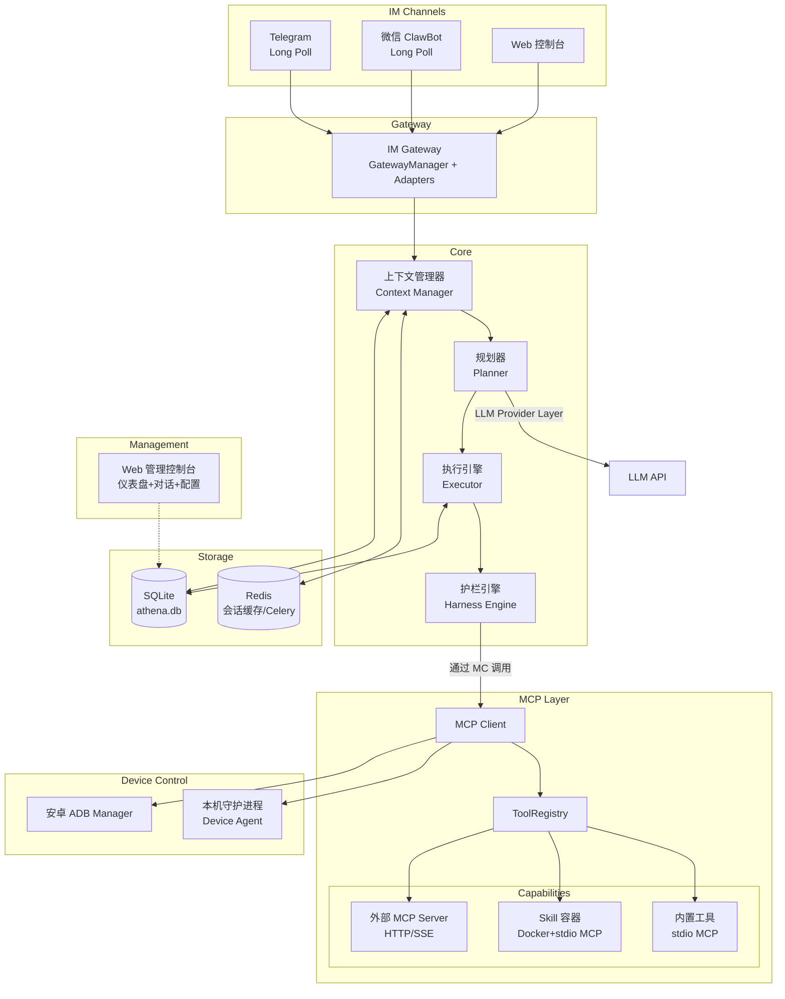
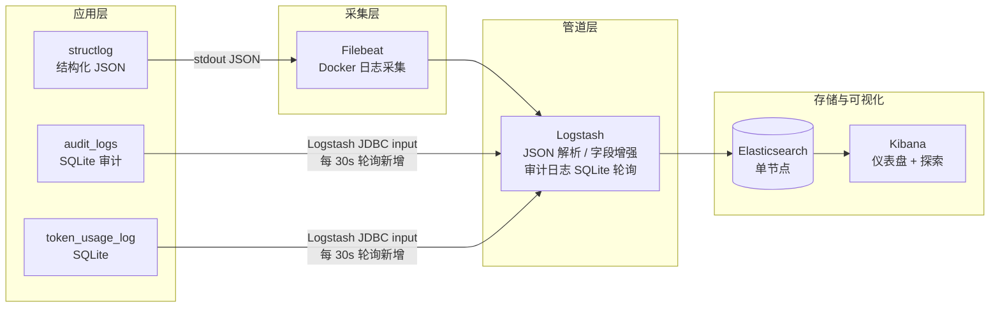

# Athena - 技术设计文档

项目名称：Athena

文档类型：技术设计文档

版本：1.0

日期：2026-06-10

---

## 概述

本文档定义 Athena 系统的技术架构、核心模块设计、数据模型、接口规范及部署方案。Athena 是一个**个人智能助手**，面向单用户场景，支持多 IM 渠道接入（按需启用）、基于大语言模型的智能代理核心，具备严格安全护栏、可插拔工具/技能生态，并通过 MCP（Model Context Protocol）协议实现外部工具的标准化集成。系统支持本机与安卓设备的受控操作，内置上下文管理与长期记忆，并预留未来 RAG 知识检索的扩展点。

### 关键设计原则

- **单用户优先**：无需多用户隔离、RBAC 权限体系或用户白名单。安全机制聚焦于操作风险控制而非用户权限管理。
- **安全前置**：Harness Engine独立于 LLM，所有执行路径强制参数校验、沙盒预演与用户确认。
- **开放集成**：通过 MCP 协议统一接入内置工具、Skill 容器及第三方工具服务器，实现工具生态的可扩展性。
- **轻量化部署**：核心数据库使用 SQLite + Redis，降低运维复杂度，单机即可运行。
- **上下文连续**：完善的多层上下文管理，支持多轮对话、任务中间状态传递及长期用户记忆。
- **可观测**：全链日志、Token 计量作为一等公民，支持成本分析。
- **原生 Function Calling 优先**：仅支持具有原生 Function Calling 能力的 LLM，确保工具调用参数的可靠性和执行安全性。

---

## 系统架构

### 架构全景图



### 核心流程概要

1. 用户从 IM 渠道或 Web 控制台发送消息。
2. Gateway 转换为统一消息格式，做去重和基本校验。
3. Core 启动/恢复会话，上下文管理器注入对话历史、用户记忆和环境状态。
4. Planner 通过 LLM Provider 抽象层调用 LLM，结合可用工具集（由 MCP 客户端动态发现）生成任务计划。
5. Executor 按序执行子任务：
   - 参数模板渲染 → 护栏检查 → (高风险) 沙盒预演 → 用户确认 → 通过 MCP 客户端调用目标工具。
   - 记录业务日志与 Token 消耗。
   - 失败时指数退避重试，自动降级（fallback/skip/abort），触发熔断则终止。
   - 每步完成后异步更新 context_snapshot。
6. 结果通过 Gateway 返回用户，上下文更新。

---

## 技术栈选型

| 层次     | 技术选型                          | 说明                                                       |
| ------ | ----------------------------- | -------------------------------------------------------- |
| 语言     | Python 3.14.5                 | 异步支持、生态丰富                                                |
| Web 框架 | FastAPI                       | 异步高性能、自带 OpenAPI 文档                                      |
| 异步任务   | Celery (Redis broker)         | 任务编排、重试、调度                                               |
| 数据库    | SQLite + SQLAlchemy 2.0       | 轻量、零运维；ORM 屏蔽方言差异                                        |
| 数据库迁移  | Alembic                       | 版本化 schema 管理                                            |
| 缓存/上下文 | Redis 7                       | 会话热数据、Celery broker、result backend                       |
| LLM 抽象 | 自研 Provider 适配层               | 统一 DeepSeek / OpenAI / Anthropic接口                       |
| MCP 协议 | 官方 MCP Python SDK             | 工具发现、调用标准化                                               |
| 容器管理   | Docker SDK for Python         | Skill 容器生命周期                                             |
| 模板引擎   | Jinja2 (SandboxedEnvironment) | 计划模板渲染                                                   |
| 日志     | structlog                     | 结构化 JSON 日志                                              |
| 日志采集   | Filebeat                      | 轻量级日志采集，解析 Docker 容器 stdout JSON 日志，输送至 Logstash         |
| 日志管道   | Logstash                      | 日志过滤、解析、增强、路由，输出至 Elasticsearch                          |
| 日志存储   | Elasticsearch 8.x             | 集中式日志索引与全文搜索，单节点模式即可满足个人助手需求                             |
| 日志可视化  | Kibana 8.x                    | 日志探索、仪表盘、告警规则管理                                          |
| 监控     | Prometheus metrics            | 通过 `prometheus_fastapi_instrumentator` 暴露于 `/metrics` 端点 |
| 包管理    | pip-tools                     | 依赖锁定                                                     |

---

## 模块详细设计

### IM 接入网关

IM 接入网关负责将不同 IM 渠道的消息转换为统一格式送入 Core，并将 Core 的回复（包括确认请求）转换回各渠道的原生交互格式。

#### Gateway 抽象层

引入 `BaseIMAdapter` 抽象基类，统一长轮询型渠道（Telegram, 微信 iLink）和内部直连型渠道（Web）：

```python
# athena/gateway/base.py

from abc import ABC, abstractmethod
from enum import Enum
from dataclasses import dataclass

class AdapterState(Enum):
    DISCONNECTED = "disconnected"
    AUTHENTICATING = "authenticating"    # 微信：扫码中
    CONNECTED = "connected"
    RECONNECTING = "reconnecting"
    FAILED = "failed"

@dataclass
class AdapterInfo:
    """暴露给管理 API / 仪表盘的状态信息。"""
    channel: str
    state: AdapterState
    last_heartbeat: datetime | None
    error: str | None
    metadata: dict  # e.g., {"bot_id": "..."}

class BaseIMAdapter(ABC):
    """所有 IM 渠道适配器的抽象基类。

    长轮询型子类（Telegram, 微信 iLink）实现 start_long_poll()。
    所有子类实现 send_message() 和 send_confirmation()。
    """

    @property
    @abstractmethod
    def channel(self) -> str:
        """返回渠道标识字符串，如 "telegram"。"""
        ...

    @abstractmethod
    async def start(self) -> None:
        """初始化适配器。应用启动时调用一次。

        长轮询适配器：启动后台 asyncio 任务。
        Web 适配器：注册内部路由，无需持久连接。
        """
        ...

    @abstractmethod
    async def stop(self) -> None:
        """优雅关闭。取消长轮询循环、关闭连接。"""
        ...

    @abstractmethod
    async def send_message(
        self,
        user_id: str,
        chat_id: str,
        text: str,
        reply_token: str | None = None,
        inline_keyboard: dict | None = None,
        attachments: list[dict] | None = None,
    ) -> str:
        """发送消息到该渠道。返回平台分配的消息 ID。"""
        ...

    @abstractmethod
    async def send_confirmation(
        self,
        user_id: str,
        chat_id: str,
        confirmation: ConfirmationRequest,
    ) -> None:
        """发送用户确认请求（渠道原生交互格式）。"""
        ...

    @abstractmethod
    def get_info(self) -> AdapterInfo:
        """返回当前适配器状态，用于仪表盘/健康检查。"""
        ...

    async def _dispatch_to_core(self, unified_msg: UnifiedMessage) -> None:
        """将 UnifiedMessage 送入 Core 处理管线。由 GatewayManager 注入。"""
        ...
```

**GatewayManager**（`athena/gateway/manager.py`）管理所有适配器的生命周期：

- 根据配置实例化已启用的渠道适配器
- 注入 `_core_dispatch` 回调到每个适配器
- 在应用启动/停止时统一调用所有适配器的 `start()`/`stop()`
- 对外暴露 `get_adapter(channel)` 和适配器状态汇总

**渠道适配器代码结构**：

```
athena/gateway/
├── __init__.py
├── base.py              # BaseIMAdapter ABC, AdapterState, AdapterInfo
├── manager.py           # GatewayManager — 适配器生命周期协调
├── telegram.py          # Telegram Long Poll 适配器
├── wechat.py            # 微信 ClawBot iLink 长轮询适配器
└── web.py               # Web 控制台适配器（内部 API 直连）
```

**消息分发流**：

```
                        ┌──────────────────────┐
 Telegram long poll ─────┤  telegram.py         │
 微信 long poll ─────────┤  wechat.py           ├──► UnifiedMessage ──► Core
 Web API ────────────────┤  web.py              │
                        └──────────────────────┘
```

每种适配器将原生消息转换为 `UnifiedMessage`，调用 `_dispatch_to_core()`。Core 不感知适配器内部实现。GatewayManager 负责将出站消息（包括确认请求）路由到正确的适配器。

#### 统一消息模型

```python
class UnifiedMessage:
    message_id: str            # 渠道侧唯一消息 ID，用于去重和回复定位
    channel: Literal["telegram", "web", "wechat"]
    user_id: str
    session_id: str            # 由 Context Manager 在首次消息时基于
                               # user_id + channel + chat_id 确定性生成，
                               # 后续消息复用已有 session_id。
                               # Gateway 层不负责生成，传入空字符串即可。
    content: str
    timestamp: datetime
    attachments: list[dict]
    raw_metadata: dict         # 其余渠道特有字段
    chat_type: str | None = None    # "private" | "group" | "channel"
    reply_token: str | None = None  # 用于回复时定位原消息
                                     # 微信: 填入 context_token（发送时回传）
                                     # Telegram: 填入原消息的 message.message_id（发送时作为 reply_to_message_id）
```

- **`chat_type`**：区分私聊/群聊/频道。Telegram 支持私聊和群聊，微信 iLink 当前仅私聊，字段预留群聊扩展。
- **`reply_token`**：**统一用于"回复时定位原消息"**，不承载其他语义。
  - **微信**：适配器从入站消息提取 `context_token` 填入此字段；发送回复时回传该 token，服务端据此关联上下文。
  - **Telegram**：适配器从入站消息提取 `message.message_id` 填入此字段；发送回复时作为 `reply_to_message_id` 参数使用，在 Telegram 客户端中形成线程式回复。
  - **Web**：通常为空或填入原始请求的 `message_id`，用于前端 UI 形成回复链。
- 消息去重：基于 `message_id` 做幂等检查，已处理的消息直接丢弃。

#### 各渠道适配器详细设计

##### Telegram 适配器（`gateway/telegram.py`）

- **接入方式**：**长轮询（Long Poll）**。Athena 通过 `getUpdates` API 主动向 `api.telegram.org` 拉取消息，无需公网暴露端口。
- **底层机制**：`POST https://api.telegram.org/bot<token>/getUpdates`，支持 `timeout` 参数（推荐 30 秒），服务端 hold 连接直到有新消息或超时。通过 `offset` 参数（`last_update_id + 1`）实现消息确认和去重。
- **Python 库**：推荐使用 `python-telegram-bot`（`Application.run_polling()`）或 `aiogram`（`Dispatcher.start_polling()`），库自动管理 offset、重连和错误处理。
- **适配器生命周期**：`start()` 中启动后台 asyncio 任务循环拉取消息；`stop()` 中取消任务并等待当前请求完成。适配器状态按 `CONNECTED`（正常轮询中）、`RECONNECTING`（连续失败后退避重连）、`FAILED`（Token 无效或持续失败）流转。
- **消息解析**：从 `message.from.id`、`message.chat.id`、`message.text` 提取字段，映射到 `UnifiedMessage`。附件（photo, document, voice 等）提取 `file_id` 和 MIME 类型填入 `attachments`。Inline Keyboard 按钮点击以 `callback_query` 形式返回，同样通过 `getUpdates` 获取。
- **消息去重**：以 `message.message_id` 作为 `UnifiedMessage.message_id`。
- **`reply_token` 提取**：适配器从入站 `message.message_id` 提取后填入 `UnifiedMessage.reply_token`。发送回复时，Core 将 `reply_token` 传给适配器，适配器作为 `reply_to_message_id` 参数调用 Telegram API，在客户端形成线程式回复。
- **会话映射**：`chat_id` 使用 `message.chat.id`（支持群聊）。
- **配置要求**：`TELEGRAM_BOT_TOKEN` 环境变量；可选 `TELEGRAM_POLL_TIMEOUT`（默认 30 秒）。
- **长轮询安全**：无需公网暴露端口，攻击面仅限出站 HTTPS 连接。适配器做入站数据校验（UTF-8 合法性、类型校验）。若 Token 泄露，通过 Telegram BotFather 吊销即可。
- **与 Webhook 互斥**：使用 `getUpdates` 前必须确保未设置 Webhook（`deleteWebhook`），两者不能共存。

##### 微信 iLink Bot 适配器（`gateway/wechat.py`）

> ⚠️ **实验性支持声明**：微信 iLink（智联）API 并非微信官方面向开发者发布的公开 Bot API。
> 其底层依赖第三方开源项目 [openclaw-weixin](https://github.com/hao-ji-xing/openclaw-weixin)
> （ClawBot 插件），属于个人微信的逆向/模拟方案，存在以下风险：
> 
> - **合规风险**：个人微信协议未开放给第三方，存在账号封禁风险
> - **稳定性风险**：API 可能随微信客户端更新而不可用
> - **安全风险**：第三方逆向方案的安全审计不透明
> 
> **推荐替代方案**：
> 
> - **企业微信**：使用[企业微信 Bot API](https://developer.work.weixin.qq.com/document/path/91770)（官方支持，稳定性高），适配成本约 3~5 天
> - **微信公众号**：使用[公众号消息接口](https://developers.weixin.qq.com/doc/offiaccount/Message_Management/Receiving_standard_messages.html)（需公网 Webhook，官方支持），适配成本约 5~7 天

- **接入方式**：**长轮询（Long Poll）**。Athena 主动通过 HTTP 长连接向 `ilinkai.weixin.qq.com` 拉取消息，无需公网暴露端口。
- **底层协议**：基于 iLink（智联）协议。通过第三方方案 ClawBot（openclaw-weixin）实现个人微信适配，详见上方实验性声明。

**认证与连接生命周期**：

1. **获取二维码**：`GET /ilink/bot/get_bot_qrcode?bot_type=3` 获取扫码登录二维码图片。
2. **轮询扫码状态**：`GET /ilink/bot/get_qrcode_status?qrcode={id}`，状态包括 `wait`（等待扫码）→ `scaned`（已扫待确认）→ `confirmed`（确认成功，返回 `bot_token` 和 `ilink_bot_id`）/ `expired`（过期，重新获取，最多重试 3 次）。
3. **持久化凭证**：`bot_token` 保存至 `/data/wechat_credentials.json`（权限 `0600`），包含 `obtained_at` 和 `expires_at`（24h）。重启时若凭证未过期，直接跳过扫码进入已连接状态。
4. **重新认证**：Token 有效期 24 小时。到期前 5 分钟输出告警日志；到期后适配器转入 DISCONNECTED 状态，自动重新进入 QR 认证流程。若 Telegram 或 Web 渠道可用，推送通知"微信 Bot Token 已过期，请通过管理 API 重新认证"。

**长轮询消息接收**（asyncio 后台 task）：

- `POST /ilink/bot/getupdates`，服务端 hold 连接最多 35 秒。客户端设置 40s timeout。
- 请求体中携带 `get_updates_buf` 游标，服务端仅返回未读取的新消息。空响应（timeout 无新消息）为正常情况，立即重新发起轮询。
- 收到 HTTP 401 → token 过期 → 触发 re-auth。
- 连续 5 次失败 → 转入 RECONNECTING 状态，退避重连（初始 5s，最大 60s）。

**消息格式映射**（微信 → UnifiedMessage）：

```python
# 微信 iLink 入站消息示例
{
  "from_user_id": "wxid_abc123",
  "to_user_id": "wxid_bot",
  "client_id": "msg_uuid",
  "context_token": "ct_xyz789",
  "item_list": [
    {"type": "TEXT", "text_item": {"text": "你好"}},
    {"type": "IMAGE", "image_item": {"url": "https://cdn...", "aes_key": "..."}}
  ]
}

# 映射为 UnifiedMessage：
#   message_id   = raw["client_id"]
#   channel      = "wechat"
#   user_id      = raw["from_user_id"]
#   content      = 提取 TEXT item 的文本内容
#   attachments  = 非 TEXT item 列表（IMAGE, VOICE, VIDEO, FILE）
#   raw_metadata = {"context_token": ..., "raw": raw}
#   chat_type    = "private"
#   reply_token  = raw["context_token"]   # 回复时必须回传
```

**消息发送**：

- `POST /ilink/bot/sendmessage`，必须携带 `context_token`（从收到的消息中提取）和 `from_user_id`/`to_user_id`。
- 每条请求需附带 HTTP 头 `Authorization: Bearer {bot_token}` 和随机生成的 `X-WECHAT-UIN`（Base64 编码的随机 uint32）。
- **配额限制**：24 小时内约 10 条主动推送消息（非直接回复用户消息的主动发送）。对话式回复不受此限制。接近配额时输出告警日志。

**所有 iLink API 请求通用 HTTP 头**：

```
Content-Type: application/json
AuthorizationType: ilink_bot_token
Authorization: Bearer {bot_token}
X-WECHAT-UIN: {base64(random uint32)}
```

**媒体附件处理**：

- 图片/语音/视频/文件通过 AES-128-ECB 加密传输。适配器负责解密后提取 URL 填入 `UnifiedMessage.attachments`。

##### Web 控制台适配器（`gateway/web.py`）

- **接入方式**：内部 API 直连。管理控制台通过 `POST /api/v1/im/web/message` 发送消息，通过 SSE 接收回复和确认事件。
- 现有设计保持不变，提取为独立适配器实现 `BaseIMAdapter` 接口。

#### 用户确认交互格式（按渠道）

当 Executor 需要用户确认时，Gateway 将确认请求转换为各渠道的原生交互格式。所有渠道共享相同的确认数据结构：

```python
@dataclass
class ConfirmationRequest:
    task_id: str
    step: int
    risk_level: str          # "low" | "medium" | "high" | "critical"
    preview_text: str        # 操作预演的人类可读摘要
    cooling_off_seconds: int
    timeout_seconds: int
    nonce: str               # 64 位随机十六进制，防重放
    channel: str
    user_id: str
    chat_id: str
```

##### Telegram

使用 Inline Keyboard Markup，按钮 callback_data 为 Base64 编码的 JSON：

```json
// 发送给 Telegram 的消息
{
  "chat_id": "<chat_id>",
  "text": "⚠️ **高风险操作需要确认**\n\n" +
          "**操作**: 删除文件 `/workspace/config.yaml`\n" +
          "**预演结果**: 文件大小 2.3KB，最近修改于 2026-06-10\n\n" +
          "⏳ 冷静期剩余: 30 秒",
  "parse_mode": "Markdown",
  "reply_markup": {
    "inline_keyboard": [
      [
        {
          "text": "⏳ 请等待 30 秒...",
          "callback_data": "<base64_json>"
        }
      ]
    ]
  }
}

// callback_data 解码后的 JSON 结构
{
  "action": "confirm_subtask",
  "task_id": "uuid",
  "step": 3,
  "approved": true,
  "nonce": "<random_64_hex>"       // 防重放
}
```

- **冷却期 UI 策略**（考虑 Telegram API 限流）：
  - 冷静期内确认按钮保持**禁用态**（按钮文字："⏳ 请等待 30 秒..."），
    Telegram 客户端本身会阻止用户点击 callback_data 不可用的按钮。
  - 服务端在收到 callback_query 时二次校验冷静期时间戳，双重保障。
  - **倒计时更新策略**：放弃每秒更新按钮文字，改为以下简化方案：
    - 初次发送时按钮显示冷却总时长（如 "⏳ 请等待 30 秒..."）。
    - 仅更新消息正文中的倒计时提示文字，且每 **15 秒** 更新一次（整个 30 秒冷却期仅更新 ~2 次）。
    - 冷却期结束后编辑消息正文追加 "✅ 现在可以确认"，并将按钮文字改为 "✅ 确认执行"。
  - 若冷却期 ≤ 15 秒（medium 级别），不做中间更新，冷却期结束后一次性更新。
  - **限流保护**：`editMessageText` 调用频率限制为每分钟最多 4 次（远低于 Telegram ~30 次/分钟的限制）。
- 增加「拒绝」按钮（冷却期结束后显示）。
- 超时后编辑原消息移除按钮，追加文字"⏰ 确认超时，操作已取消"。

##### 微信 ClawBot（iLink）

微信 iLink API 当前**不支持交互按钮**，采用**文本回复式确认**：

```
⚠️ **高风险操作需要确认**

**操作**: 删除文件 `/workspace/config.yaml`
**预演结果**: 文件大小 2.3KB，最近修改于 2026-06-10

⏳ 冷静期: 30 秒
⌛ 超时: 60 秒

回复 **确认** 执行此操作
回复 **取消** 放弃此操作

[操作编号: #task-{task_id}-step{step}]
```

- 用户直接回复文本 "确认" / "取消"（支持中英文及变体：confirm/cancel/yes/no/是/否）。
- 适配器通过 `context_token` 关联回复与原确认请求：发送确认提示时记录 `{context_token -> ConfirmationRequest}` 映射（内存中，最长 120s 超时）。
- 收到用户回复时，先检查 `context_token` 是否匹配待确认请求。若匹配且内容为确认/取消关键词，则转发至确认处理器而非 Core 正常消息处理。
- **多确认并发安全**：每条确认提示使用不同的 `context_token`（即不同的用户消息），无歧义。
- **冷却期内收到回复处理**：
  1. 用户在冷却期内回复"确认"/"取消"等关键词时，系统记录收到回复的时间戳。
  2. 若内容为"取消"：直接执行取消逻辑（不受冷却期限制），终止子任务。
  3. 若内容为"确认"：计算剩余冷却时间 `remaining = cooling_off_seconds - (now - confirm_sent_at)`。
     - `remaining > 0`：回复引导消息 "⏳ 冷静期剩余 {{remaining}} 秒，请等待后再次确认"。
       该引导消息不计入主动推送配额（属对话式回复）。
     - `remaining <= 0`：正常处理确认，执行子任务。
  4. 冷却期内收到的"确认"不消耗 `nonce`，用户需在冷却结束后重新发送确认。
  5. 同一确认请求对同一用户最多发送 3 次引导消息，防止消息刷屏。
- **超时处理**：asyncio 定时器到期后自动取消，发送跟进消息"⏰ 确认超时，操作已取消"。
- **iLink 后续升级**：若 iLink API 后续支持按钮/模板消息，适配器可升级为与 Telegram 一致的按钮式确认，无需改动确认抽象层。

##### Web 控制台

- 通过 SSE 推送 `confirm_required` 事件，前端弹出确认卡片，包含预演内容、冷静期倒计时和确认/拒绝按钮。
- 冷静期未到时确认按钮禁用（灰色 + 倒计时文字）。
- 确认回复：`POST /api/v1/im/web/message/confirm`，入参 `{"task_id": "...", "step": 3, "approved": true}`。
- 超时处理由前端和服务端双重保障：前端到期自动关闭卡片；服务端到期未收到回调则按超时策略处理。

#### 渠道安全

各渠道均无需对外开放入站端口，攻击面大幅缩小。

##### Telegram（长轮询）

- 无入站端点，无需 Webhook 签名验证或 IP 白名单。
- **TLS 强制**：仅通过 HTTPS 连接 `api.telegram.org`，拒绝降级。
- **Token 保护**：`bot_token` 通过环境变量注入，日志中自动脱敏。若 Token 泄露，通过 BotFather 吊销即可。
- **入站数据校验**：所有 `getUpdates` 响应中的消息内容做 UTF-8 合法性和类型校验。
- **出站速率限制**：Telegram API 限制约 30 条消息/秒，`getUpdates` 调用频率由长轮询 timeout 自然控制，无需额外入站速率限制。

##### 微信 iLink（长轮询）

- 无入站 Webhook 端点，攻击面不同。安全措施：
  - **TLS 强制**：仅通过 HTTPS 连接 `ilinkai.weixin.qq.com`，拒绝降级。
  - **Token 保护**：`bot_token` 存储于 `/data/wechat_credentials.json`（`0600` 权限），日志中自动脱敏。
  - **入站数据校验**：所有长轮询响应中的消息内容做 UTF-8 合法性和类型校验。
  - **无外部端口暴露**：长轮询为纯出站连接，无需对外开放任何端口。

##### 通用防护

- **速率限制**（Redis 滑动窗口）按渠道分别配置：

| 渠道       | 限制  | 说明     |
| -------- | --- | ------ |
| Telegram | N/A | 纯出站长轮询 |
| Web      | 无限制 | 本地回路   |
| 微信       | N/A | 纯出站长轮询 |

- Telegram 和微信无入站端点，无需入站速率限制。Web 为本地回路，不做限制。
- Gateway 层做消息去重（`message_id` 幂等检查）。

### 认证与用户配置

Athena 是个人助手，无需多用户 RBAC 体系。用户身份通过渠道原生 ID 标识，
在配置文件中声明允许的用户 ID 和渠道：

```yaml
# user.yaml
user:
  telegram:
    user_id: "123456789"
  web:
    user_id: "admin"
  wechat:
    user_id: "wxid_your_wechat_id"    # iLink Bot API 返回的 wxid
```

- 收到消息时，Gateway 校验 `(user_id, channel)` 是否匹配配置。
- 未匹配的消息直接丢弃并记录告警日志。
- 不同渠道的 user_id 视为同一用户的不同入口，共享所有上下文和数据。
- 工具执行权限由护栏引擎基于风险等级统一控制，不再需要用户级权限映射。
- 渠道按需启用：未在 `user.yaml` 中配置的渠道不会初始化对应的适配器，相关环境变量也无需填写。

### Athena Core

#### 上下文管理器 (Context Manager)

- 职责：管理对话历史、任务执行上下文、长期用户记忆、Token 窗口控制。
- 存储分层：

| 存储                          | 角色       | 说明                                  |
| --------------------------- | -------- | ----------------------------------- |
| Redis                       | 主存储（热数据） | 对话历史、当前任务执行上下文。读写性能要求高，TTL 自动过期。    |
| `sessions.context_snapshot` | 冷备份/恢复点  | 关键状态变更时异步写入，用于 Redis 数据丢失或会话过期后的恢复。 |

- 写入时机：
  
  - 每次子任务执行完成后，将当前完整上下文（摘要后的对话历史 + 任务状态）序列化写入 `context_snapshot`。
  - 会话进入 idle 或用户主动断开时立即写入一次。
  - 会话过期清理 Redis 前，确保 snapshot 已持久化。

- **写入原子性保证**：`context_snapshot` 更新与 `subtask_executions` 写入在同一 SQLite
  事务中执行：
  
  ```python
  async with db.transaction():
      await db.execute(update_session_snapshot(session_id, snapshot))
      await db.execute(insert_subtask_execution(execution))
  ```
  
  SQLite WAL 模式下事务保证两者要么同时成功，要么同时回滚，不会出现不一致。
  
  - 若事务失败（如进程崩溃），两者均不写入，恢复时该 step 视为未完成，重新执行。
  - 若事务成功，两者必然一致。

- 会话创建/恢复：
  
  - 接收消息后，Context Manager 以 `hash(user_id + channel + chat_id)` 作为
    `session_id` 查找或创建会话记录。
  - 若已存在 active/idle 会话，直接复用 Redis 中的上下文，**无需任何提示**，
    对用户完全透明。
  - 若会话已过期（expired）但 `context_snapshot` 存在：
    从 SQLite 加载 snapshot 到 Redis 并静默恢复上下文，回复中附带 “📋 已恢复上次会话”。
    用户无需做任何选择，当前消息直接正常处理。

- Token 窗口管理：
  
  - 使用 `tiktoken` 估算 Token 数，若超过模型窗口的 80%，触发压缩。
  - 压缩策略：由 Context Manager 调用 summarizer（一次 LLM 调用）对较早对话轮次进行摘要，
    替换原始文本。摘要结果写入 `context_snapshot.conversation_summary`，
    供快照恢复时直接复用，避免重复调用 LLM。
  - **压缩算法保证**：
    - `message_history` 始终保留最近 K 轮完整消息（K 默认 10，可配）。
    - 被压缩的更早消息从 `message_history` 中移除，替换为一句话描述写入 `conversation_summary`。
    - 后续压缩时，新的摘要与旧的 `conversation_summary` **合并**（而非覆盖），形成累积摘要。
  - 移除已完成且无后续引用的子任务细节，仅保留摘要。

- 会话生命周期：
  
  ```
  active ──(30min 无活动)──▶ idle ──(24h 后)──▶ expired
    ▲                          │                    │
    │   用户发消息（自动恢复）     │                    │
    └──────────────────────────┘                    │
                                                    ▼
                                               Redis 清除
                                               snapshot 保留（可手动恢复）
  ```
  
  - **active → idle**：30 分钟无新消息，Redis 上下文保留，用户再次发消息时无缝恢复，
    无需提示。
  - **idle → expired**：24 小时后，Redis 上下文清除（此时 `context_snapshot` 已确保写入 SQLite）。
  - **expired 后恢复**：用户再次发消息时，从 `context_snapshot` 静默加载到 Redis，附带 "📋 已恢复上次会话"。
  - **用户主动结束**：立即写入 snapshot，Redis 数据保留 5 分钟后清除。

- 用户记忆注入：
  
  - 通过 `MemoryStore.semantic_search(query, top_k)` 从向量存储中检索与当前对话相关的长期记忆，注入系统提示词。
  - 向量检索由独立的 RAG Skill 提供 embedding 生成和向量存储（Chroma）。
  - **降级**：向量库不可用时自动降级为 `simple_query`（按 key 前缀 + 更新时间排序），
    检索结果注入时追加提示"(注意: 当前语义记忆检索不可用，仅返回最近更新的记忆条目)"。

#### 规划器 (Planner)

- 接收标准化的 `UnifiedMessage` 和上下文管理器提供的完整上下文。
- 通过 **LLM Provider 抽象层** 调用 LLM，使用标准化的 tool 调用机制生成任务计划。
- 计划结构：

```json
{
  "task_id": "uuid",
  "subtasks": [
    {
      "step": 1,
      "intent": "search_web",
      "tool_name": "web_search",
      "args": {"query": "latest GPT-5 news"},
      "depends_on": [],
      "critical": false,
      "on_failure": "fallback",
      "fallback_tool": {
        "tool_name": "bing_search",
        "mcp_server_id": "ext-bing",
        "args_mapping": "passthrough",
        "args_overrides": {}
      }
    },
    {
      "step": 2,
      "intent": "save_file",
      "tool_name": "file_write",
      "args": {"path": "news_summary.txt", "content": "{{step1.output}}"},
      "depends_on": [1],
      "critical": true,
      "on_failure": "abort"
    }
  ]
}
```

字段说明：

| 字段              | 类型                                | 默认值       | 说明                                                                         |
| --------------- | --------------------------------- | --------- | -------------------------------------------------------------------------- |
| `critical`      | `bool`                            | `true`    | `false` 时该步骤失败不影响熔断计数，允许跳过                                                 |
| `on_failure`    | `"abort" \| "skip" \| "fallback"` | `"abort"` | 重试耗尽后的降级策略（详见执行引擎章节）                                                       |
| `fallback_tool` | `object?`                         | `null`    | `on_failure=fallback` 时的备用工具定义；若省略则由 ToolRegistry 按 `capability_tags` 动态查找 |

`fallback_tool` 子字段：

- `tool_name`：备用工具名。

- `mcp_server_id`：目标 MCP Server（可选，省略时在所有 server 中查找同名工具）。

- `args_mapping`：`"passthrough"` 原样传递参数；`"remap"` 通过 `args_overrides` 转换。

- `args_overrides`：映射规则，如 `{"q": "{{args.query}}"}`。

**静态 fallback 与动态查找的优先级**：

当 `on_failure=fallback` 时，Executor 按以下顺序确定备用工具：

1. 计划中显式指定的 `fallback_tool`（静态）。若指定的工具当前可用（`status='active'` 且所在 server 已连接），直接使用。
2. 若静态 `fallback_tool` 不可用（工具已下架/server 离线），降级为动态查找 `ToolRegistry.resolve_fallback()`。
3. 动态查找也失败时，降级为 `abort`（计入熔断计数）。

> 规则：**静态 > 动态 > abort**。动态查找仅在静态未提供或静态不可用时触发。

- **Fallback 链深度限制**：为防止无限 fallback（fallback 工具的 fallback 工具再次失败又触发 fallback），
  系统强制执行 `max_fallback_depth`（默认 1，在 `athena.yaml` 中全局配置）：
  
  - 每个子任务最多使用 **1 次** fallback 工具。若 fallback 工具也失败，不再继续查找替代工具，
    直接降级为 `abort`，计入熔断计数。
  - `subtask_executions` 表中通过 `fallback_depth` 字段记录当前 fallback 层级（0 = 原始工具，1 = 第 1 次 fallback）。
  - 审计日志中记录完整 fallback 链：`fallback_chain: [{from: "web_search", to: "bing_search", reason: "timeout"}]`，
    便于事后分析外部服务的稳定性。

- 可用工具集由 MCP 客户端通过 `tools/list` 动态获取，包含内置工具、Skill 提供的工具以及注册的外部 MCP Server 工具。

- 系统提示词中注入工具列表（含描述、参数 schema、`capability_tags`）、安全边界和护栏规则摘要。

- **多路径规划提示**：当某步骤依赖外部服务且存在相同 `capability_tag` 的其他工具时，Planner 应生成 `fallback_tool`。

#### LLM Provider 抽象层

在 Core 与 LLM API 之间引入统一抽象，解耦具体提供商：

```python
class LLMProvider(ABC):
    @abstractmethod
    async def generate(
        self, messages: list[dict], tools: list[dict]
    ) -> LLMResponse:
        ...

class LLMResponse:
    text: str
    tool_calls: list[dict]
    token_usage: dict
    model: str
```

- 实现：`OpenAIProvider`、`AnthropicProvider`、`LiteLLMProvider`（可代理多种模型）。
- 配置：`llm.yaml` 声明默认 provider、API Key 环境变量、模型名。

##### LLM 配置示例 (`llm.yaml`)

```yaml
default_provider: DeepSeek
fallback_chain:
  - openai
  - anthropic
providers:
  openai:
    api_key_env: OPENAI_API_KEY
    model: gpt-4o
    max_tokens: 4096
  anthropic:
    api_key_env: ANTHROPIC_API_KEY
    model: claude-sonnet-4-6
    max_tokens: 4096
  litellm:
    api_key_env: LITELLM_API_KEY
    base_url: http://litellm:4000
    model: gpt-4o
```

- Fallback 链：`fallback_chain` 中按顺序尝试 provider，调用失败时自动切换到下一个。

> Athena 仅支持具有原生 Function Calling 能力的模型。所有已配置的 provider 均需原生支持 tool calling。

##### 系统全局配置 (`athena.yaml`)

`athena.yaml` 存放与用户身份无关的系统行为和资源限制相关的全局配置项：

```yaml
# athena.yaml — 系统全局配置
system:
  max_fallback_depth: 1             # fallback 链最大深度，防止无限 fallback
  global_max_concurrent_tasks: 8    # 全局并发任务上限（硬限制，超过排队）
  session_idle_timeout_minutes: 30  # active → idle 超时（分钟）
  session_expire_hours: 24          # idle → expired 超时（小时）

harness:
  circuit_breaker_threshold: 3      # 熔断阈值，abort 子任务数达到后终止整个任务
  cooling_off_defaults:             # 冷静期默认值（秒），可被 harness_rules 按工具/渠道覆盖
    low: 0
    medium: 15
    high: 30
    critical: 60

mcp:
  heartbeat_interval_seconds: 30    # MCP Server 心跳检测间隔
  reconnect_backoff_max_seconds: 60 # MCP Server 重连退避上限
  tools_list_refresh_on_reconnect: true  # 重连后是否自动刷新工具列表
```

- 所有配置项均有默认值，`athena.yaml` 不存在时系统使用默认值运行。
- 配置文件路径通过环境变量 `SYSTEM_CONFIG_PATH` 指定（默认 `/data/athena.yaml`）。
- 配置项修改后需重启 Core 进程生效（未来可通过管理 API 动态热加载）。

#### 执行引擎 (Executor)

- 状态机：`PENDING → RUNNING → RETRYING → SUCCESS / FAILED / SKIPPED / FALLBACK_USED`。

- 执行循环：
  
  1. 从计划中选择无依赖或依赖已满足的子任务。
  
  2. 模板渲染：使用 **Jinja2 SandboxedEnvironment** 渲染 `{{stepN.output}}` 等
     模板变量，得到工具的实际运行时参数值。禁用文件系统/命令访问，变量仅从
     `TaskContext` 获取。
  
  3. 护栏检查：基于**渲染后**的实际参数值调用 `pre_check()`，包括黑名单、参数边界、
     配额（含全局并发配额）。对工具参数而非模板变量做检查，确保检查的是运行时实际值。
  
  4. 风险分级：根据渲染后的参数、工具风险等级和 `supports_preview` 决定是否需要预演和
     用户确认（参见设备控制章节）。
  
  5. 通过 MCP 客户端调用工具 `tools/call`，超时 120 秒。
  
  6. 失败重试：使用 `tenacity` 指数退避策略，初始 1 秒，最大 60 秒，最多 5 次。
  
  7. 降级处理（重试耗尽后，按 `on_failure` 策略自动执行）：
     
     ```
     子任务重试耗尽
           │
     ┌─────┼─────┐
     ▼     ▼     ▼
     abort  skip  fallback
     │     │     │
     │     │     ├─ fallback_depth ≥ max_fallback_depth？ → abort（防止无限 fallback）
     │     │     ├─ plan 中有静态 fallback_tool 且可用 → 使用（depth += 1）
     │     │     ├─ 静态 fallback 不可用 → ToolRegistry.resolve_fallback() 动态查找
     │     │     ├─ 找到：新工具执行（独立重试计数≤3），成功→status=fallback_used（depth += 1）
     │     │     └─ 未找到（返回 None）→ abort
     │     │
     │     ├─ critical=true → 降级为 abort
     │     └─ critical=false：
     │         ├─ status=skipped，输出为 null
     │         ├─ 下游模板中 {{stepN.output}} → ""
     │         ├─ 不计入熔断计数
     │         └─ 推送 "ℹ️ 步骤 {step} 执行失败已跳过"
     │
     ├─ failed_count += 1（仅 abort 计入）
     ├─ failed_count ≥ 3（熔断阈值）→ 终止整个任务
     └─ 推送 "⚠️ 子任务 {intent} 多次失败，任务已终止"
     ```
  
  8. 日志记录：每步开始、成功、失败、重试、降级、跳过均记录，并同步记录 LLM 调用的 Token 消耗（按 `source` 字段区分 planner / executor / summarizer / context_compressor）。
  
  9. 上下文更新：将执行结果写入任务上下文，异步写入 `context_snapshot`。

- 故障恢复：

##### 前置条件：工具幂等性契约

恢复的可靠性取决于工具是否支持幂等。要求所有**对外部有副作用**的工具（发邮件、写数据库、
调第三方 API 等）实现以下至少一种幂等机制：

| 机制                  | 说明                                                                                        | 适用场景               |
| ------------------- | ----------------------------------------------------------------------------------------- | ------------------ |
| **Idempotency Key** | 工具接收 `idempotency_key` 参数（格式 `{task_id}:{step}:{retry_count}`），重复调用同一 key 时返回首次执行结果而非重复执行 | 发邮件、HTTP POST、创建资源 |
| **天然幂等**            | 操作本身即使重复执行也不产生额外副作用                                                                       | 读操作、查询类 API        |

> ⚠️ `_preview=true` 模式在设计上不产生副作用，因此**无法**用于检测上一次真实执行是否已生效。
> 对于不支持 Idempotency Key 的工具，故障恢复时一律标记为 failed 并通知用户，不应依赖
> preview 模式做操作检测。

- 不支持幂等的工具在注册时必须声明 `idempotent: false`，此类工具的 step 在故障恢复时
  **一律标记为 failed**（而非自动重放），系统将通过 IM 通知用户手动处理。
- 工具的 `idempotent` 字段在注册时由护栏引擎校验。

##### 恢复步进逻辑

恢复不是简单的"从最后 step 继续"，而是逐 step 判断：

```
Worker 接管孤儿任务
      │
      ▼
1. 从 sessions.context_snapshot 恢复上下文到 Redis
      │
      ▼
2. 读取 context_snapshot.current_task.completed_steps
   和 subtask_executions 表，逐 step 比对：
      │
   ┌──┴──────────────────────────────────┐
   │                                     │
   ▼                                     ▼
step 已在 completed_steps 中      step 不在 completed_steps 中
   │                                     │
   ▼                                     ├─ subtask_executions 中 status = 'success'?
跳过（幂等安全）                             │   ┌─ YES → 补记到 completed_steps，跳过
   │                                     │   └─ NO  → 进入「恢复执行判断」
                                         │
                                         ▼
                              ┌─ status = 'pending'（尚未开始）
                              │    → 直接执行，is_recovered = FALSE
                              │
                              ├─ status = 'running'（Worker 崩溃时正在执行）
                              │    → 检查 idempotency_key：
                              │       工具支持幂等 → 重放执行，is_recovered = TRUE
                              │       工具不支持幂等 → 标记 failed，通知用户
                              │
                              └─ status = 'failed'（之前已失败）
                                   → 检查 retry_count < max_retries？
                                       YES → 递增 retry_count，重试
                                       NO  → 保持 failed
```

##### 恢复防循环

- `tasks` 表新增 `recovery_attempts` 和 `max_recovery_attempts`（默认 3）。
- 每次 Celery Worker 重启后接管未完成任务时 `recovery_attempts += 1`。
- 若 `recovery_attempts > max_recovery_attempts`：
  - 任务标记为 `abandoned`，写入审计日志。
  - 推送 IM 通知用户："⚠️ 你的任务 "{task_summary}" 多次恢复失败，已被终止。请重新发起。"
- `context_snapshot` 中的 `completed_steps` 为恢复的**权威来源**（比 `subtask_executions.status` 优先级更高）：
  - 每次 step 成功完成后，Executor 将 step 编号**立即**追加到 `context_snapshot.current_task.completed_steps` 并在同一 SQLite 事务中写入 `subtask_executions` 记录（见上下文管理器原子性保证）。
  - 两者通过事务保证一致性，恢复时以 `context_snapshot.completed_steps` 为准。
  - `subtask_executions` 中的 `status` 字段仅用于展示与审计，不参与恢复判定。

##### Worker 启动恢复

- **Celery Worker 启动时**扫描 `tasks` 表中 `status = 'running'` 的任务，恢复这些未完成的任务。

- **恢复并发控制（乐观锁）**：多个 Celery Worker 可能同时扫描到同一个 `status='running'`
  的任务。为避免重复恢复，采用乐观锁机制：
  
  ```sql
  -- Worker 尝试获取恢复权（单条 SQL，原子操作）
  UPDATE tasks
  SET status = 'recovering',
      recovery_attempts = recovery_attempts + 1,
      updated_at = CURRENT_TIMESTAMP
  WHERE task_id = ?
    AND status = 'running';
  ```
  
  - 受影响行数 = 1 → 当前 Worker 获得恢复权，开始执行恢复逻辑。
  - 受影响行数 = 0 → 其他 Worker 已抢先获取，当前 Worker 跳过该任务。
  
  > 恢复完成后，任务状态从 `recovering` 正常流转至 `running`/`completed`/`failed`。
  > 若恢复过程再次崩溃，下次扫描时 `status` 为 `recovering` 且 `updated_at` 超过超时
  > 阈值（默认 10 分钟）的任务将被重新接管。

- `subtask_executions` 中 `started_at` 超过执行超时阈值（默认 10 分钟）且未完成的标记为 `timeout`。

- Core（FastAPI 进程）不参与任务恢复，仅提供 API 供查询任务状态。

- 并发控制：
  
  - 单用户并发任务数 ≤ 2（护栏配额检查）。
  - 全局并发由 Celery Worker `--concurrency=N` 形成硬上限。
  - 超限任务排队，IM 通知用户“当前繁忙，你的任务已排队，预计等待约 X 分钟”。

#### 护栏引擎 (Harness Engine)

- 独立的规则评估模块，提供同步的 `evaluate(action, context) -> (allow, reason)`。

- 规则集：
  
  - 静态黑名单：禁止的命令/路径正则表达式列表，如 `rm -rf /`、格式化命令等。
  - 参数边界：文件路径强制前缀 `/workspace/`，网络搜索查询过滤敏感词等。
  - 配额检查：单用户并发任务数 ≤ 2，单日操作次数上限，全局并发任务上限。
  - 冷静期（cooling_off）：按风险等级定义确认前的强制等待时长，防止冲动确认。
  
  冷却期规则
  
  ```json
  {
    "risk_level": "high",
    "cooling_off_seconds": 30,
    "timeout_seconds": 60,
    "applies_to_tools": "*",          // "*" 表示全局，或 ["adb_shell", "file_delete"]
    "applies_to_channels": ["telegram", "web", "wechat"]  // 省略或 "*" 表示全局
  }
  ```

- 规则持久化：规则定义存储在 SQLite `harness_rules` 表中。

- 热更新机制：
  
  - Harness Engine 保持内存缓存，每 30 秒自动轮询数据库。
  - 轮询检查 `MAX(harness_rules.revision)` 是否变化，变化时才重新加载全量规则。
    增量查询极轻量（单行整数），不影响 SQLite 性能。
  - 支持 `POST /api/v1/admin/harness/reload` 即时刷新。
  - 规则变更不要求原子性，保证下一个评估周期生效。

- 所有拦截事件写入审计日志。

### MCP 客户端与能力提供层

#### MCP 客户端

- 基于官方 MCP Python SDK 实现，作为 Athena Core 与能力提供层之间的统一桥梁。

- 连接管理：
  
  - 支持 `stdio`（用于内置工具和 Skill 容器）和 `HTTP/SSE`（用于远程外部服务器）。
  - 启动时读取已注册的 MCP Server 列表（来自 SQLite），建立连接并握手。
  - 定期心跳检测，连接断开则自动重连。

- **工具状态机**：`ToolRegistry` 中的每个工具具有独立于 server 连接状态的生命周期：
  
  ```
  ┌─────────────────────────────────────────────────────────┐
  │                                                         │
  │  注册 ──► active ──（server 断开）──► stale               │
  │              ▲                          │               │
  │              │     （重连 + tools/list 刷新成功）          │               │
  │              └──────────────────────────┘               │
  │              │                          │               │
  │              │     （管理员操作）         │               │
  │              ▼                          ▼               │
  │           disabled                  disabled            │
  │              │                           │              │
  │              └────（管理员重新启用）────────┘              │
  │                         │                               │
  │                         ▼                               │
  │                      active                             │
  └─────────────────────────────────────────────────────────┘
  ```
  
  | 状态         | 说明                                       | Planner 行为              |
  | ---------- | ---------------------------------------- | ----------------------- |
  | `active`   | 工具所在 server 已连接，`tools/list` 刷新成功        | 正常推荐                    |
  | `stale`    | 工具所在 server 断开或 `tools/list` 刷新失败，尚未重连成功 | **不推荐**，降级/fallback 时排除 |
  | `disabled` | 管理员手动禁用                                  | **不推荐**，降级/fallback 时排除 |

- **失效传播机制**：
  
  - MCP Client 检测到 server 连接断开时，**立即**将 `mcp_servers.status` 设为 `'disconnected'`，
    同时将该 server 下所有工具的 `tools.status` 批量更新为 `'stale'`。
  - 重连成功后，调用 `tools/list` 刷新工具列表，ToolRegistry 对比新旧工具列表：
    - **新增的工具**（server 侧新注册的）：直接设为 `active`。
    - **已删除的工具**（server 侧已下架、不在 `tools/list` 返回中）：自动设为 `disabled`。
    - **保留的工具**（两边都存在）：若原状态为 `stale`，恢复为 `active`；
      若原状态为 `disabled`（管理员手动禁用），保持 `disabled` 不变。
    - 对比逻辑确保管理员的手动禁用操作不会因 server 重连而被意外覆盖。
  - `tools/list` 刷新失败（server 已连接但工具列表获取异常）：
    工具保持 `'stale'`，不参与 Planner 推荐；记录告警日志，等待下一轮心跳重试。

- 工具发现：
  
  - 调用 `tools/list` 获取所有可用工具及其参数 schema、描述、`supports_preview` 标识。
  - 将获取的工具注入到一个全局的 `ToolRegistry` 中，并区分 `source`（内置/技能/外部）。

- 工具调用：
  
  - 提供统一的 `call_tool(server_id, tool_name, arguments, preview=False)` 方法。
  - `preview=True` 时传入 `_preview: true`，工具实现应返回预期结果而不产生副作用。
  - 内部路由到对应的 MCP Server 发送 `tools/call` 请求。
  - 返回结果标准化为 Athena 内部的执行结果格式。

- 连接断开处理：
  
  - `call_tool` 内建心跳检测。若连接断开：
    - stdio 传输：立即标记失败，视为可重试异常（进程可能异常退出）。
    - HTTP/SSE：标记失败，重试前先尝试重新连接并刷新工具列表。

- 安全映射：
  
  - 外部工具注册时指定 Athena 侧的 `risk_level`。
  - 工具描述中的参数 schema 可自动生成，但允许覆盖以增强安全性。

- 工具降级发现：
  
  - `ToolRegistry.resolve_fallback(failed_tool_name, capability_tag=None) -> Tool | None`：
    返回单个确定性选择的备用工具，无可用工具时返回 `None`。
  - **确定性选择规则**（按优先级依次比较，平局时按下一级规则决出）：
    1. **`capability_tag` 精确匹配**：与失败工具共享至少一个 `capability_tag`
    2. **`risk_level` 最低优先**：优先选择风险等级更低的工具
    3. **`supports_preview` 优先**：支持预览的工具优先于不支持预览的
    4. **`source_server_id` 相同**：与失败工具同 server 的工具优先
    5. **`source` 相同**：同来源类型（builtin/skill/external）优先
    6. **字典序稳定排序**：按 `tool_name` 字典序，确保同样条件下结果确定
  - **排除条件**：已失败的 `tool_name` 本身、`status != 'active'`、所在 server 未连接。
  - 若 `capability_tag` 未指定，则使用失败工具的 `capability_tags` 进行匹配。
  - 供 Executor 在 `on_failure=fallback` 且静态 `fallback_tool` 未提供或不可用时动态查找替代工具。

#### 内置工具适配器

- 现有内置 Tool（`file_read/write/delete`、`web_search` 等）封装为一个本地 MCP Server，运行在 `stdio` 模式下。
- 这样内置工具与外部工具对 Planner 和执行引擎无差别，架构统一。

#### Skill 容器（Docker + MCP）

- 每个 Skill 容器内运行一个遵循 MCP 规范的服务（推荐 `stdio` 模式，通过 `docker exec` 传递标准输入/输出）。

- 安装流程：
  
  1. 管理员提供镜像地址及可选的 `allowed_domains`（逗号分隔的域名列表）。
  2. 系统拉取镜像。
  3. 创建容器，挂载指定工作目录（读写权限可选），设置资源限制。
  4. 网络配置：
     - 若 `allowed_domains` 为空：容器网络模式为 `none`。
     - 若 `allowed_domains` 非空：容器连接到专用 bridge 网络，通过全局共享的 `skill-proxy` 容器（Squid 代理）进行出口访问，代理 ACL 按 `allowed_domains` 动态配置。
  5. 容器环境变量注入 `HTTP_PROXY` / `HTTPS_PROXY` 指向代理（如有）。
  6. 容器启动：
     - 镜像的 ENTRYPOINT 即为 MCP Server 进程（stdio 模式，通过标准输入/输出通信）。
     - 若镜像不符合此约定，需在安装时通过 `command` 字段覆盖启动命令。
  7. 通过 attach 到容器的 stdin/stdout 建立 stdio 连接（或通过 `docker exec` 执行自定义
     command），完成 MCP 握手。
  8. 通过 MCP 握手获取工具列表，验证成功后注册到 ToolRegistry，标记 `source=skill`。

- 卸载流程：停止并删除容器，清理注册工具，移除代理 ACL 规则，记录审计日志。

- 代理 ACL 动态更新流程：
  
  1. Skill 安装/卸载时，将 `allowed_domains` 生成为 `/etc/squid/acl/<skill_id>.conf`。
  2. 执行 `docker exec skill-proxy squid -k reconfigure` 热加载配置。
  3. 卸载时删除对应的 ACL 文件并再次 reconfigure。

#### 外部第三方 MCP Server

- 数据源：**SQLite `mcp_servers` 表为主**。YAML 文件仅作初始化种子。
  - 首次启动时，若数据库为空，从 `MCP_SERVERS_CONFIG` 指定的 YAML 文件导入种子数据，已有则不覆盖。
  - 运行时所有增删改查直接写入数据库。
  - 提供"导出为 YAML"功能作为单向备份，不自动双向同步。
- 管理员通过 API 或管理界面添加外部 MCP Server：
  - 传输方式：`HTTP/SSE`，提供 URL。
  - 认证机制（`connection_config.auth_type`）：
    - `none`：无认证，适用于内网或无需认证的 MCP Server。
    - `static`：从环境变量读取固定 Token（`auth_token_env` 字段指定环境变量名），适用于个人 Access Token 场景。
    - `oauth2_client`：管理员通过 Web UI 引导完成 OAuth2 授权流程（Authorization Code Grant），
      Athena 负责自动刷新 Access Token 并持久化加密存储。适用于需要用户授权的第三方服务
      （如 Google Drive API、GitHub App 等）。OAuth2 凭证（`client_id`、`client_secret`、
      `token_endpoint`、`authorization_endpoint`）存储于 `connection_config` 中，
      实际 Token 经 AES-256-GCM 加密后存储于 `connection_config.encrypted_token` 子字段。
- 系统验证连接并获取工具列表，注册工具时要求管理员配置权限和风险等级。
- 支持动态启用/禁用，不适合的工具可下架。

##### MCP Server 种子文件示例 (`mcp_servers.yaml`)

```yaml
# 此文件仅在数据库为空时作为初始化种子，运行时修改请通过管理 API
servers:
  - server_id: builtin-core
    name: Athena Built-in Tools
    transport: stdio
    connection_config:
      command: python -m athena.tools.server
    source: builtin

  - server_id: ext-github
    name: GitHub MCP Server
    transport: http
    connection_config:
      url: https://github-mcp.example.com
      auth_type: static           # none | static | oauth2_client
      auth_token_env: GITHUB_MCP_TOKEN  # 仅 auth_type=static 时有效
    source: external
    tools_default_risk: medium

  - server_id: ext-google-drive
    name: Google Drive MCP Server
    transport: http
    connection_config:
      url: https://gdrive-mcp.example.com
      auth_type: oauth2_client
      authorization_endpoint: https://accounts.google.com/o/oauth2/auth
      token_endpoint: https://oauth2.googleapis.com/token
      client_id: ${GOOGLE_CLIENT_ID}       # 从环境变量读取
      client_secret_env: GOOGLE_CLIENT_SECRET  # client_secret 通过环境变量注入
      scopes:
        - https://www.googleapis.com/auth/drive.readonly
      encrypted_token: null               # 授权后由 Athena 自动填充（AES-256-GCM 加密）
    source: external
    tools_default_risk: medium
```

### 设备控制代理

#### 本机守护进程 (Device Agent)

- 独立进程（Windows/macOS），通过加密 WebSocket（WSS）与 Athena 主服务建立长连接。
- 认证机制（PSK）：
  1. PSK（Pre-Shared Key）通过环境变量 `DEVICE_PSK` 配置于 Athena 服务端和设备端。
  2. WebSocket 连接使用 WSS，消息体使用 PSK 应用层对称加密。
  3. 服务端启动时加载 PSK，验证每个 WebSocket 连接的消息签名。
- 仅执行服务端下发且经过护栏签名和确认的指令，操作集极简化：`run_script`、`screenshot`、`simulate_keystroke` 等。
- 所有命令可先在本机沙盒中预演（如文件操作预跑在临时目录），生成变更预览。

#### 安卓控制 (ADB Manager)

- 维护设备注册表，设备需局域网内 ADB 可连接，serial 唯一。
- 封装操作为 MCP 工具（或直接作为内置工具，但仍推荐 MCP 化）：
  - `adb_shell`、`adb_screenshot`、`adb_install`、`adb_tap` 等。
- 高危操作预演可通过在虚拟设备或逻辑模拟中检查命令语法及可能影响。

#### 预演-确认流程（集成入护栏体系）

**Preview 接口标准化**：

- 工具元数据中增加 `supports_preview: bool` 字段。
- 若 `supports_preview: true`，执行器在需要预演时调用 `tools/call` 并传入 `_preview: true`。
- 工具实现收到 `_preview=true` 后仅返回预期结果，不产生副作用（类似 Terraform plan）。
- 对于不支持 preview 的工具，护栏引擎降级为基于规则的分析，并提示用户"该操作无法预演，请谨慎确认"。

**确认触发条件**：

- 读操作：自动执行，无需确认。
- 写操作/设备控制：根据工具的风险等级和 `supports_preview`，决定是否需要"沙盒预演 + 用户确认"。

**冷静期机制**：

冷静期（Cooling-off）指用户看到预演结果后必须等待的最短时间，防止冲动确认。时长按风险等级划分，
通过护栏规则（`rule_type = 'cooling_off'`）配置：

| 风险等级       | 冷静期（秒） | 确认超时（秒） | 说明                        |
| ---------- | ------ | ------- | ------------------------- |
| `low`      | 0      | 120     | 不强制等待，直接确认即可              |
| `medium`   | 15     | 120     | 预演结果展示后等待 15 秒后才可点击确认     |
| `high`     | 30     | 60      | 预演结果展示后等待 30 秒后才可点击确认     |
| `critical` | 60     | 30      | 等待 60 秒，且只能在倒计时最后 30 秒内确认 |

> 冷静期和超时时长均可在护栏规则中按工具或全局覆盖。

**确认超时处理**：

- 计时起点：`confirm_required` 通知送达用户后开始计时（IM 消息发送成功或 SSE 事件推送成功）。
- 超时后：
  1. 该子任务状态变更为 `timeout_cancelled`。
  2. 整个任务标记为 `cancelled`（不同于 `failed`，不计入熔断计数）。
  3. 通过 IM 推送通知用户："⏰ 确认超时（{{timeout_seconds}}秒），操作已自动取消。"
  4. 写入审计日志（`event_type = 'confirm_timeout'`）。
- 用户主动拒绝：
  1. 子任务状态变更为 `user_rejected`，任务标记为 `cancelled`。
  2. 推送通知："✕ 操作已被取消。"
- 超时被取消的任务**不支持自动恢复**，用户需重新发起请求。

**任务确认状态机**：

```
Executor 发出 confirm_required
        │
        ▼
  ┌─ PENDING_CONFIRM ──（倒计时开始）──▶ TIMEOUT → task cancelled
  │        │
  │   用户点击确认
  │        │
  │   冷静期已过？─── 未过 ──▶ 显示倒计时，按钮禁用
  │        │
  │        ▼ 已过
  │   CONFIRMED → Executor 继续执行子任务
  │
  │   用户点击拒绝
  │        │
  │        ▼
  └── REJECTED → task cancelled
```

### 日志、Token 与监控

#### 日志体系架构（ELK Stack）

Athena 采用 **ELK（Elasticsearch + Logstash + Kibana）+ Filebeat** 构建集中式日志管理：



##### 各组件职责

| 组件                | 角色         | 关键配置                                                                                        |
| ----------------- | ---------- | ------------------------------------------------------------------------------------------- |
| **structlog**     | 应用内结构化日志生成 | JSON 格式，包含 `event`、`session_id`、`task_id`、`timestamp`、`level` 等标准字段                         |
| **Filebeat**      | 日志采集代理     | 监听 Docker 容器 stdout，按 `docker.container.name` 标记来源，输出至 Logstash                             |
| **Logstash**      | 日志管道中心     | 接收 Filebeat 数据流 + 通过 JDBC input 定时轮询 SQLite `audit_logs` / `token_usage_log`；统一解析、字段增强、索引路由 |
| **Elasticsearch** | 日志索引与搜索引擎  | 单节点模式（`discovery.type=single-node`），按天创建索引（`athena-logs-YYYY.MM.DD`），启用压缩                   |
| **Kibana**        | 可视化与探索     | 预置仪表盘（日志探索、Token 成本、审计事件）；Index Pattern 自动匹配 `athena-*`                                     |

##### 日志流

**路径 1 — 应用日志（实时流）**：

```
structlog → stdout → Docker json-file → Filebeat → Logstash → Elasticsearch → Kibana
```

- Filebeat 通过 `autodiscover` 自动感知新容器日志源。
- Logstash 解析 JSON 体，从 Docker 元数据中提取 `container.name`，统一时间格式为
  `@timestamp`（ISO 8601 + UTC），移除冗余字段以降低索引体积。

**路径 2 — SQLite 结构化数据（定时轮询）**：

```
audit_logs / token_usage_log (SQLite) → Logstash JDBC input → Elasticsearch → Kibana
```

- Logstash 每 30 秒通过 SQLite JDBC driver 查询 `recorded_at > :sql_last_start` 的记录。
- 按 `event_type`（审计日志）或 `source`（Token 日志）设置 Elasticsearch `_index` 路由。
- Token 数据导入后用于 Kibana 成本分析看板。

##### Elasticsearch 索引策略

| 索引模式                      | 内容                 | 分片  | 副本  | 保留策略         |
| ------------------------- | ------------------ | --- | --- | ------------ |
| `athena-logs-YYYY.MM.DD`  | 应用 + 审计日志（实时流）     | 1   | 0   | ILM: 30 天后删除 |
| `athena-token-YYYY.MM.DD` | Token 消耗记录（SQLite） | 1   | 0   | ILM: 90 天后删除 |
| `athena-audit-YYYY.MM.DD` | 审计事件（SQLite，独立索引）  | 1   | 0   | ILM: 永久保留    |

> 单节点、单用户场景下分片数设为 1、副本数为 0，避免不必要的资源开销。
> ILM（Index Lifecycle Management）策略通过 Kibana 或 Logstash template 配置。

##### 核心日志的 structlog 事件字段规范

Logstash pipeline 依赖以下字段做索引和路由，因此应用日志**必须**包含这些字段：

```json
{
  "event": "subtask_executed",
  "level": "info",
  "session_id": "...",
  "task_id": "...",
  "step": 1,
  "tool_name": "web_search",
  "mcp_server_id": "builtin",
  "status": "success",
  "fallback_used": false,
  "fallback_from": null,
  "duration_ms": 1234,
  "input_args": {"query": "..."},
  "output_preview": "...",
  "token_usage": {
    "model": "gpt-4o",
    "source": "executor",
    "prompt_tokens": 500,
    "completion_tokens": 150,
    "total_tokens": 650
  },
  "timestamp": "2026-06-09T12:00:00Z"
}
```

- 所有日志事件必含 `event`、`level`、`timestamp`。
- 与 Token 相关的日志必含 `token_usage` 子对象，`source` 字段按 `planner | executor | summarizer | context_compressor` 区分调用来源。
- `timestamp` 由 structlog 在发出时打上 UTC 时间戳，Logstash 以此覆盖 Docker JSON log driver 的时间戳。

##### Kibana 预置仪表盘

| 仪表盘            | 内容                                       |
| -------------- | ---------------------------------------- |
| **日志探索**       | 按 event 类型、level、时间范围、session_id 自由搜索和过滤 |
| **Token 成本分析** | 按 source、model、日期聚合；成本趋势折线图；模型用量分布饼图     |
| **任务执行监控**     | 子任务成功率、平均耗时、熔断趋势（abort 计数）、fallback 使用率  |
| **护栏安全概览**     | 拦截事件按 rule_type 分布、冷却期触发/超时统计            |
| **系统健康**       | MCP Server 连接状态、Skill 容器资源使用、Celery 队列积压 |

> 上述仪表盘通过 Kibana Saved Objects 导出为 JSON（存于 `deploy/kibana/dashboards/`），
> 首次启动时通过 Kibana Import API 或 `kibana-setup` 初始化容器导入。

##### 与 Prometheus 的分工

| 维度   | Prometheus + AlertManager    | ELK (Elasticsearch + Kibana)         |
| ---- | ---------------------------- | ------------------------------------ |
| 数据类型 | 时序指标（metrics）                | 日志事件 + 结构化数据（Token/审计）               |
| 用途   | 实时告警、资源监控、任务队列积压             | 日志搜索、问题排查、成本分析、审计追溯                  |
| 告警   | 是（如护栏拦截率飙升、Celery Worker 失联） | 可选（Kibana Alerting，如 30 分钟内熔断 > 3 次） |
| 保留   | 默认 15 天                      | 30~90 天（可配）                          |

##### 数据保留策略

| 数据类型       | 存储位置                   | 保留策略                                  |
| ---------- | ---------------------- | ------------------------------------- |
| 应用日志       | Elasticsearch          | ILM: hot 阶段 7 天 → delete 阶段 30 天后删除   |
| Token 消耗记录 | Elasticsearch + SQLite | ES: ILM 90 天；SQLite: 永久保留（单用户数据量极小）   |
| 审计日志       | Elasticsearch + SQLite | ES: ILM 永久保留；SQLite: 永久保留             |
| 基础日志       | Docker stdout          | Docker json-file driver 轮转，保留最近 5 个文件 |

> SQLite 中的原始数据始终保留不删（单用户场景数据量极小），作为 Elasticsearch 的长期备份和数据恢复来源。

---

## Web 管理控制台

个人助手的管理控制台聚焦核心需求，功能从简：

### 功能模块

| 模块    | 功能                                          |
| ----- | ------------------------------------------- |
| 仪表盘   | Token 消耗趋势、任务成功率、护栏拦截统计                     |
| 命令控制台 | Web 内嵌对话界面，以 `web` 渠道身份向 Athena 发送指令，实时查看回复 |
| 配置查看  | MCP Server 状态、Skill 列表、设备在线状态、护栏规则（只读）      |

> 其他管理操作（MCP Server 注册、Skill 安装/卸载、设备注册、护栏规则编辑）通过配置文件
> 或直接调用管理 API 完成，个人使用场景无需构建 UI。

### 命令控制台

Web 控制台内嵌一个对话界面，用户可直接以 `web` 渠道身份向 Athena 发送指令。

- 身份映射：Web 登录账号关联 `user.yaml` 中 `channel = 'web'` 的用户配置。
- 消息通过 `POST /api/v1/im/web/message` 内部接口送入 Core，走完整的上下文 → 规划 → 执行 → 回复流程。
- 界面功能：
  - 对话列表：按 session 分组，支持新建/切换/恢复历史会话。
  - 消息输入：支持多行文本和附件粘贴，按回车发送。
  - 实时回复：通过 Server-Sent Events (SSE) 逐步骤推送执行进度及最终回复。
  - 预演确认卡片：高风险操作在界面内弹出确认按钮。

##### SSE 事件类型

Web 命令控制台通过 `POST /api/v1/im/web/message` 发起请求后，
响应为 SSE 流（`Content-Type: text/event-stream`），事件类型如下：

| event 类型            | 数据格式                                                                                                                        | 说明             |
| ------------------- | --------------------------------------------------------------------------------------------------------------------------- | -------------- |
| `plan_generating`   | `{"task_id": "..."}`                                                                                                        | Planner 开始生成计划 |
| `plan_generated`    | `{"task_id": "...", "subtask_count": 3, "summary": "..."}`                                                                  | 计划生成完成         |
| `subtask_started`   | `{"step": 1, "tool_name": "...", "intent": "..."}`                                                                          | 子任务开始执行        |
| `subtask_completed` | `{"step": 1, "status": "success", "output_preview": "..."}`                                                                 | 子任务完成          |
| `subtask_failed`    | `{"step": 2, "status": "failed", "error": "...", "retry": 1}`                                                               | 子任务失败（含重试信息）   |
| `subtask_skipped`   | `{"step": 2, "reason": "non-critical failure", "error": "..."}`                                                             | 非关键子任务失败后已跳过   |
| `subtask_fallback`  | `{"step": 2, "original_tool": "web_search", "fallback_tool": "bing_search", "reason": "primary tool failed after retries"}` | 已切换到备用工具执行     |
| `confirm_required`  | `{"step": 3, "risk_level": "high", "preview": {...}, "cooling_off_seconds": 30, "timeout_seconds": 60}`                     | 需用户确认          |
| `confirm_timeout`   | `{"step": 3, "reason": "timeout"}`                                                                                          | 确认超时，操作已自动取消   |
| `confirm_result`    | `{"step": 3, "approved": true/false}`                                                                                       | 用户已做出确认/拒绝选择   |
| `task_completed`    | `{"task_id": "...", "summary": "..."}`                                                                                      | 全部任务完成         |
| `task_failed`       | `{"task_id": "...", "error": "..."}`                                                                                        | 任务失败（超过熔断阈值）   |
| `error`             | `{"code": "...", "message": "..."}`                                                                                         | 请求级别错误         |

- 确认回复：客户端通过 `POST /api/v1/im/web/message/confirm` 回传确认结果，
  入参 `{"task_id": "...", "step": 3, "approved": true}`。

### 技术实现

- 前端：FastAPI 内嵌静态资源（Vue 3 或 React SPA），或作为独立微前端部署。
- 后端：复用现有 FastAPI 应用，通过 `/api/v1/admin/*` 路由提供 REST API。
- 认证：管理 API 使用 API Key 签名认证。

---

## 数据库设计（SQLite）

### 通用配置

- 数据库文件：`athena.db`，存储于 `/data` 卷。
- 启用 WAL 模式：`PRAGMA journal_mode=WAL;`，允许读写并发。
- 外键约束：`PRAGMA foreign_keys = ON;`（应用层也需校验）。
- 连接池：FastAPI 进程使用 SQLAlchemy `StaticPool`（单进程内共享一个连接，
  配合 WAL 模式避免 "database is locked"）。Celery Worker 同样使用 `StaticPool`。
  避免使用连接池（如 `QueuePool`），SQLite 不支持网络并发连接。
- 迁移管理：使用 Alembic，迁移脚本存于 `athena/migrations/`，Core 容器 entrypoint 启动时自动执行 `alembic upgrade head`。

### 核心表结构

#### 用户配置

个人助手无需用户表——用户身份在 `user.yaml` 配置文件中声明，运行时校验。
若需记录用户偏好，可使用 `user_memories` 表。

#### 会话与上下文

```sql
CREATE TABLE sessions (
    session_id TEXT PRIMARY KEY,
    user_id TEXT NOT NULL,
    channel TEXT NOT NULL,
    chat_id TEXT NOT NULL,          -- 按 (user_id, channel, chat_id) 隔离
    status TEXT DEFAULT 'active',   -- 'active', 'idle', 'expired'
    context_snapshot TEXT,          -- JSON, 冷备份/恢复点
    last_active_at TIMESTAMP DEFAULT CURRENT_TIMESTAMP,
    created_at TIMESTAMP DEFAULT CURRENT_TIMESTAMP
);

- **上下文快照结构 (context_snapshot)**：`context_snapshot` 字段为 JSON 对象，结构如下：

```json
{
  "version": 1,
  "snapshot_at": "2026-06-10T12:00:00Z",
  "conversation_summary": "用户询问了...，助手执行了...",
  "message_history": [
    {"role": "user", "content": "...", "timestamp": "..."},
    {"role": "assistant", "content": "...", "timestamp": "..."}
  ],
  "current_task": {
    "task_id": "uuid",
    "status": "running",
    "completed_steps": [1, 2],
    "step_outputs": {"step1": "...", "step2": "..."}
  },
  "injected_memories": ["memory_id_1", "memory_id_2"],
  "token_count_estimate": 3500
}
```

- `conversation_summary`：压缩后的对话摘要，覆盖**早期轮次**（超出最近 K 轮的部分）。由 Context Manager 的 summarizer（LLM 调用）在 Token 窗口超过 80% 时生成，将早期对话压缩为一句话描述。
- `message_history`：**最近 K 轮**完整原始消息（K 取决于 Token 窗口大小，默认保留最近 10 轮）。压缩后，被摘要覆盖的更早消息从 `message_history` 中移除，仅保留摘要。
- **恢复时的加载逻辑**：
  1. 优先使用 `message_history`（最近 K 轮原始消息）注入到上下文中。
  2. 若 `message_history` 为空（如首次压缩后尚未产生新消息），则回退到 `conversation_summary`。
  3. 正常情况（非空 `message_history`）下：`conversation_summary` 作为前缀插入 + `message_history` 按时间顺序追加，两者共同组成完整的对话上下文，无重复内容。
  4. `message_history` 中的消息是互斥于 `conversation_summary` 覆盖范围之外的。
- `current_task`: 进行中的任务状态，`completed_steps` 为已完成步骤序号。
  **此为故障恢复的权威来源**：每次 step 成功后立即写入 snapshot，
  优先级高于 `subtask_executions.status`。恢复时若 snapshot 和
  `subtask_executions` 不一致，以 snapshot 为准。
- `step_outputs`: 已完成步骤的输出内容（供后续步骤模板渲染使用）。
  恢复时用于跳过已完成的 step 并为其下游 step 提供模板变量。
- `injected_memories`: 当前上下文注入的用户记忆 ID 列表。
- `token_count_estimate`: 快照时刻的 Token 估算值（不含 snapshot 本身）。

CREATE TABLE user_memories (
    memory_id TEXT PRIMARY KEY,
    user_id TEXT NOT NULL,
    key TEXT NOT NULL,
    value TEXT,
    vector_id TEXT,                      -- 向量存储中的全局唯一引用键（如 "mem_abc123"）
    sync_status TEXT DEFAULT 'pending',  -- 向量同步状态: 'pending'|'synced'|'failed'|'deleted'
    meta_json TEXT,                      -- 其余元数据（如 synced_at、tags、source 等）
    updated_at TIMESTAMP DEFAULT CURRENT_TIMESTAMP
);

```
- `user_memories` 仅存储记忆元数据和原始文本。向量 embedding 及语义检索由 RAG Skill
  （Chroma / Qdrant）独立管理，`vector_id` 列建立两边的关联。
- 简单键值查询走 SQLite；语义检索走 RAG Skill 的向量存储。

#### 任务与执行

```sql
CREATE TABLE tasks (
    task_id TEXT PRIMARY KEY,
    user_id TEXT NOT NULL,
    session_id TEXT NOT NULL,
    plan_json TEXT,                -- JSON
    status TEXT DEFAULT 'pending',
    recovery_attempts INTEGER DEFAULT 0,  -- 故障恢复已尝试次数（防循环）
    max_recovery_attempts INTEGER DEFAULT 3,
    created_at TIMESTAMP DEFAULT CURRENT_TIMESTAMP,
    updated_at TIMESTAMP DEFAULT CURRENT_TIMESTAMP,
    completed_at TIMESTAMP
);

CREATE TABLE subtask_executions (
    execution_id TEXT PRIMARY KEY,
    task_id TEXT NOT NULL,
    step INTEGER NOT NULL,
    tool_name TEXT,
    mcp_server_id TEXT,
    status TEXT,                           -- 'pending', 'running', 'success', 'failed',
                                           -- 'timeout', 'timeout_cancelled', 'user_rejected',
                                           -- 'skipped', 'fallback_used'
    retry_count INTEGER DEFAULT 0,
    is_recovered BOOLEAN DEFAULT FALSE,     -- 本次执行是否为故障恢复后的重放
    fallback_used BOOLEAN DEFAULT FALSE,    -- 本次执行是否使用了备用工具
    fallback_from TEXT,                     -- 若 fallback_used=true，记录原始 tool_name
    fallback_depth INTEGER DEFAULT 0,       -- fallback 链深度（0=原始工具，1=第1次fallback；受 max_fallback_depth 限制）
    idempotency_key TEXT,                   -- 幂等键，用于外部有副作用工具的重复执行检测
                                            -- 格式: "{task_id}:{step}:{retry_count}"
    started_at TIMESTAMP,
    finished_at TIMESTAMP,
    input_args TEXT,               -- JSON（渲染后的实际参数）
    output_preview TEXT,           -- 截断的结果
    token_usage_json TEXT,         -- JSON
    FOREIGN KEY (task_id) REFERENCES tasks(task_id)
);
```

#### 工具与技能

```sql
CREATE TABLE mcp_servers (
    server_id TEXT PRIMARY KEY,
    name TEXT NOT NULL,
    transport TEXT NOT NULL,        -- 'stdio', 'http', 'sse'
    connection_config TEXT NOT NULL, -- JSON，包含传输与认证配置
                                    -- 通用字段: auth_type ("none"|"static"|"oauth2_client")
                                    -- static: auth_token_env (环境变量名)
                                    -- oauth2_client: authorization_endpoint, token_endpoint,
                                    --   client_id, client_secret_env, scopes, encrypted_token (AES-256-GCM)
                                    -- stdio 示例: { "command": "python -m athena.tools.server" }
                                    -- http 示例: { "url": "https://...", "auth_type": "static", "auth_token_env": "..." }
    status TEXT DEFAULT 'disconnected',
    registered_at TIMESTAMP DEFAULT CURRENT_TIMESTAMP
);

CREATE TABLE tools (
    id TEXT PRIMARY KEY,
    name TEXT NOT NULL,
    version TEXT NOT NULL,
    description TEXT,
    parameters_schema TEXT,         -- JSON
    risk_level TEXT DEFAULT 'medium',
    supports_preview BOOLEAN DEFAULT FALSE,  -- 是否支持 dry-run preview
    idempotent BOOLEAN DEFAULT TRUE,         -- 是否支持幂等调用（用于故障恢复安全重放）
    capability_tags TEXT,                    -- JSON array, 如 '["web_search", "text_retrieval"]'
                                            -- 同一 tag 下的工具视为功能等价，可互为 fallback
    source TEXT NOT NULL,           -- 'builtin', 'skill', 'external'
    source_server_id TEXT,          -- 关联 mcp_servers.server_id
    handler_info TEXT,              -- 内部路由信息，格式取决于 source:
                                    -- 'builtin': 模块路径，如 "athena.tools.filesystem.read_file"
                                    -- 'skill': MCP tool name，如 "pdf_extract"
                                    -- 'external': 远端工具名，如 "github_search_repos"
    status TEXT DEFAULT 'active',   -- 'active', 'stale', 'disabled'（见 MCP 客户端工具状态机）
    created_at TIMESTAMP DEFAULT CURRENT_TIMESTAMP,
    FOREIGN KEY (source_server_id) REFERENCES mcp_servers(server_id)
);

- 工具全局唯一标识为 `(name, source_server_id)` 组合。`id` 为主键，用于内部关联。
- Planner 生成的计划中的 `tool_name` 对应 `tools.name`。当同名工具存在于不同 server 时，
  由 MCP Client 根据 `source_server_id` 路由到正确的 server。
- **外键完整性**：`source_server_id` 外键关联 `mcp_servers(server_id)`，即使是 `source='builtin'` 的
  内置工具，也需要在 `mcp_servers` 表中有一条对应的记录（例如 `server_id='builtin-core'`,
  `transport='stdio'`），以保持外键完整性。`mcp_servers.yaml` 种子文件中已包含 `builtin-core` 的
  初始化条目，确保数据库首次初始化时该记录自动创建。

CREATE TABLE skills (
    skill_id TEXT PRIMARY KEY,
    name TEXT NOT NULL,
    version TEXT NOT NULL,
    image_uri TEXT,
    allowed_domains TEXT,           -- 逗号分隔，空=无网络
    container_id TEXT,
    mcp_server_id TEXT,             -- 关联的 mcp_servers 记录
    status TEXT DEFAULT 'installed',
    installed_at TIMESTAMP DEFAULT CURRENT_TIMESTAMP
);
```

#### 设备

```sql
CREATE TABLE device_registry (
    device_id TEXT PRIMARY KEY,
    type TEXT NOT NULL,               -- 'host' or 'android'
    connection_info TEXT,             -- JSON, 含 PSK 公钥等
    status TEXT DEFAULT 'offline',
    last_heartbeat TIMESTAMP
);
```

#### 护栏规则

```sql
CREATE TABLE harness_rules (
    rule_id TEXT PRIMARY KEY,
    rule_type TEXT NOT NULL,          -- 'blacklist', 'path_boundary', 'quota', 'cooling_off'
    name TEXT NOT NULL,
    description TEXT,
    config_json TEXT NOT NULL,        -- 规则参数
    priority INTEGER DEFAULT 0,
    enabled BOOLEAN DEFAULT TRUE,
    updated_at TIMESTAMP DEFAULT CURRENT_TIMESTAMP,
    -- 修改计数器，用于 Harness Engine 轮询检测变更
    revision INTEGER DEFAULT 1
);
```

#### 日志与审计

```sql
CREATE TABLE audit_logs (
    event_id TEXT PRIMARY KEY,
    event_type TEXT NOT NULL,
    actor_user_id TEXT,
    details_json TEXT,
    timestamp TIMESTAMP DEFAULT CURRENT_TIMESTAMP
);

CREATE TABLE token_usage_log (
    log_id TEXT PRIMARY KEY,
    session_id TEXT,
    task_id TEXT,
    step INTEGER,
    source TEXT DEFAULT 'planner',     -- 'planner', 'executor', 'summarizer', 'context_compressor'
    model TEXT,
    prompt_tokens INTEGER,
    completion_tokens INTEGER,
    total_tokens INTEGER,
    recorded_at TIMESTAMP DEFAULT CURRENT_TIMESTAMP
);
```

### 索引

```sql
CREATE INDEX idx_sessions_user ON sessions(user_id, channel);
CREATE INDEX idx_sessions_chat ON sessions(user_id, channel, chat_id);
CREATE INDEX idx_memories_user ON user_memories(user_id);
CREATE INDEX idx_memories_sync_status ON user_memories(sync_status);
CREATE INDEX idx_memories_vector_id ON user_memories(vector_id);
CREATE INDEX idx_subtask_task ON subtask_executions(task_id, step);
CREATE INDEX idx_tasks_recovery ON tasks(status, updated_at)
    WHERE status = 'running';                -- 故障恢复扫描
CREATE INDEX idx_subtask_idempotency ON subtask_executions(task_id, step, retry_count);
CREATE INDEX idx_audit_type_time ON audit_logs(event_type, timestamp);
CREATE INDEX idx_token_usage_session ON token_usage_log(session_id, recorded_at);
CREATE INDEX idx_token_usage_source ON token_usage_log(source, recorded_at);
CREATE INDEX idx_harness_rules_type ON harness_rules(rule_type, enabled);
-- 常用查询: 按 rule_type 过滤已启用的规则，冷却期规则按风险等级检索
CREATE INDEX idx_harness_rules_cooling_off ON harness_rules(rule_type, enabled)
    WHERE rule_type = 'cooling_off';
```

---

## API 接口设计

### 通用规范

#### 响应格式

所有 API 响应使用统一的 JSON 格式：

```json
{
  "code": 0,
  "message": "success",
  "data": { ... }
}
```

错误响应：

```json
{
  "code": 40101,
  "message": "Invalid API Key",
  "detail": "The provided API key is expired",
  "data": null
}
```

#### 分页

列表类接口统一使用 cursor-based 分页：

- 请求参数：`?cursor=<next_cursor>&limit=50`（默认 50，最大 200）
- 响应中 `data` 包含 `items` 数组和 `next_cursor` 字段，`next_cursor` 为 `null` 时表示已到末尾。
- 示例：`GET /api/v1/admin/audit-logs?event_type=harness_block&limit=50&cursor=abc123`

### IM 消息接入

- `POST /api/v1/im/web/message` - Web 控制台消息发送（需管理认证，入参 `{ "content": "...", "session_id": "..." }`，通过 SSE 返回执行过程和最终回复）
- `POST /api/v1/im/web/message/confirm` - Web 控制台确认回复，入参 `{"task_id": "...", "step": 3, "approved": true}`

### IM 管理（需 API Key 认证）

- `GET /api/v1/admin/im/wechat/qrcode` - 获取微信扫码登录二维码（返回 PNG base64）
- `GET /api/v1/admin/im/wechat/status` - 查看微信适配器连接状态（含 token 有效期）
- `POST /api/v1/admin/im/wechat/reconnect` - 强制微信重新认证（作废旧 token，重新生成 QR 码）
- `GET /api/v1/admin/im/status` - 查看所有 IM 渠道连接状态（含 Telegram 长轮询和微信连接状态）

### 管理 API（需 API Key 认证）

- MCP Server 管理：
  
  - `POST /api/v1/admin/mcp-servers` 注册外部 MCP Server
  - `DELETE /api/v1/admin/mcp-servers/{server_id}` 移除
  - `PUT /api/v1/admin/mcp-servers/{server_id}/status` 启用/停用

- Skill 管理：
  
  - `POST /api/v1/admin/skills/install` 安装 Skill（镜像地址 + `allowed_domains`）
  - `DELETE /api/v1/admin/skills/{skill_id}` 卸载

- 设备管理：
  
  - `POST /api/v1/admin/devices` 注册设备
  - `DELETE /api/v1/admin/devices/{device_id}` 注销

- 护栏管理：
  
  - `GET /api/v1/admin/harness/rules` 查看所有规则
  - `PUT /api/v1/admin/harness/rules/{rule_id}` 更新规则
  - `POST /api/v1/admin/harness/reload` 即时刷新规则缓存

- 记忆管理：
  
  - `POST /api/v1/admin/memories/resync` 触发全量向量重同步

- 审计日志：
  
  - `GET /api/v1/admin/audit-logs` 搜索审计日志

- 仪表盘：
  
  - `GET /api/v1/admin/dashboard` 获取实时指标摘要

### 内部接口

- MCP 通信：通过标准 MCP 协议（stdio 或 HTTP）与 Skill 容器和外部服务器交互。
- 设备代理：WebSocket 自定义 RPC，消息格式 `{ "id": "...", "method": "...", "params": {...} }`，连接使用 PSK 加密认证。

---

## 安全设计

- 传输安全：所有对外、对内接口强制 HTTPS/TLS，设备代理通道使用 WSS。
- 认证：
  - 管理 API 使用 API Key 签名认证。
  - Device Agent 使用 PSK 对称加密认证。
  - IM 渠道：Telegram 验证 Bot Token。
- 权限模型：个人助手无需 RBAC。工具的风险等级（`risk_level`）由护栏引擎基于确定性规则统一控制，高风险操作强制用户确认。
- 护栏引擎：非 LLM 的确定性规则引擎，拦截所有敏感操作。
  - 规则存储于 SQLite，支持热更新（30s 轮询 + API 即时刷新）。
- 模板安全：
  - 计划模板使用 Jinja2 `SandboxedEnvironment`，禁用文件系统/命令访问。
  - 变量仅从 `TaskContext` 获取，Executor 层做最终参数边界校验。
- 沙盒与隔离：
  - 本地文件操作限制在 `/workspace` 根目录。
  - Skill 容器：非 root 用户、无特权、默认无网络。
  - 需网络时通过全局 `skill-proxy` 代理（Squid ACL）按 `allowed_domains` 白名单放行。
  - MCP 外部工具：权限最小化，管理员配置时明确授权。
- 审计：高危操作、权限变更、配置修改全量记录，日志防篡改。
- 密钥管理：通过环境变量或 Vault 注入，禁止硬编码。

---

## 部署方案

### Docker Compose 开发部署

```yaml
services:
  redis:
    image: redis:7-alpine
    restart: unless-stopped

  athena-core:
    build: .
    ports: "8000:8000"
    volumes:
      - ./data:/data              # SQLite 数据库和文件工作区
      - /var/run/docker.sock:/var/run/docker.sock  # Skill 容器管理
    environment:
      - SQLITE_DB_PATH=/data/athena.db
      - REDIS_URL=redis://redis:6379/0
      - CELERY_BROKER_URL=redis://redis:6379/1
      - CELERY_RESULT_BACKEND=redis://redis:6379/2
      - TELEGRAM_BOT_TOKEN=...
      - TELEGRAM_POLL_TIMEOUT=30
      - WECHAT_BOT_TOKEN=${WECHAT_BOT_TOKEN:-}
      - WECHAT_ILINK_BOT_ID=${WECHAT_ILINK_BOT_ID:-}
      - USER_CONFIG_PATH=/data/user.yaml        # 用户配置（渠道、user_id 等）
      - SYSTEM_CONFIG_PATH=/data/athena.yaml    # 系统全局配置
      - MCP_SERVERS_CONFIG=/data/mcp_servers.yaml  # 仅作初始化种子
      - LLM_CONFIG_PATH=/data/llm.yaml
    depends_on: [redis]
    entrypoint: ["/bin/sh", "-c", "alembic upgrade head && uvicorn athena.main:app --host 0.0.0.0 --port 8000"]
    logging:
      driver: json-file
      options:
        max-size: "10m"
        max-file: "3"
        labels: "app=athena,component=core"

  celery-worker:
    build: .
    command: celery -A athena.worker worker -l info --concurrency=8
    volumes:
      - ./data:/data
      - /var/run/docker.sock:/var/run/docker.sock
    environment:
      - SQLITE_DB_PATH=/data/athena.db
      - REDIS_URL=redis://redis:6379/0
      - CELERY_BROKER_URL=redis://redis:6379/1
      - CELERY_RESULT_BACKEND=redis://redis:6379/2
    depends_on: [redis]
    logging:
      driver: json-file
      options:
        max-size: "10m"
        max-file: "3"
        labels: "app=athena,component=worker"

  skill-proxy:
    image: squid:latest
    restart: unless-stopped
    volumes:
      - ./data/squid/squid.conf:/etc/squid/squid.conf       # ACL 主配置
      - ./data/squid/acl/:/etc/squid/acl/                   # ACL 片段目录，按 skill_id 动态写入

  # ─────────────────────────────────────
  # ELK Stack
  # ─────────────────────────────────────

  elasticsearch:
    image: docker.elastic.co/elasticsearch/elasticsearch:8.17.4
    restart: unless-stopped
    environment:
      - discovery.type=single-node
      - ES_JAVA_OPTS=-Xms512m -Xmx512m          # 个人助手场景 512MB 足够
      - xpack.security.enabled=false             # 内网单机部署，暂关闭安全认证
      - xpack.security.enrollment.enabled=false
      - xpack.monitoring.collection.enabled=true
      - "http.cors.enabled=true"
      - "http.cors.allow-origin=*"
    volumes:
      - ./data/elasticsearch:/usr/share/elasticsearch/data
    ports:
      - "9200:9200"
    healthcheck:
      test: ["CMD-SHELL", "curl -s http://localhost:9200/_cluster/health | grep -qE 'green|yellow'"]
      interval: 10s
      timeout: 5s
      retries: 30

  logstash:
    image: docker.elastic.co/logstash/logstash:8.17.4
    restart: unless-stopped
    environment:
      - LS_JAVA_OPTS=-Xms256m -Xmx256m
      - LS_OPTS=--pipeline.unsafe_shutdown
    volumes:
      - ./deploy/logstash/pipelines/:/usr/share/logstash/pipeline/
      - ./deploy/logstash/config/logstash.yml:/usr/share/logstash/config/logstash.yml
      - ./data/athena.db:/data/athena.db:ro          # 只读挂载 SQLite 供 JDBC 轮询
      - ./deploy/logstash/drivers/:/usr/share/logstash/drivers/  # SQLite JDBC driver jar
    ports:
      - "5044:5044"            # Beats input
    depends_on:
      elasticsearch:
        condition: service_healthy

  kibana:
    image: docker.elastic.co/kibana/kibana:8.17.4
    restart: unless-stopped
    environment:
      - ELASTICSEARCH_HOSTS=http://elasticsearch:9200
      - SERVER_NAME=kibana
      - XPACK_SECURITY_ENABLED=false
      - XPACK_ENCRYPTEDSAVEDOBJECTS_ENABLED=false
    ports:
      - "5601:5601"
    volumes:
      - ./deploy/kibana/kibana.yml:/usr/share/kibana/config/kibana.yml
    depends_on:
      elasticsearch:
        condition: service_healthy

  filebeat:
    image: docker.elastic.co/beats/filebeat:8.17.4
    restart: unless-stopped
    user: root                                  # 需读取 Docker socket
    volumes:
      - ./deploy/filebeat/filebeat.yml:/usr/share/filebeat/filebeat.yml
      - /var/lib/docker/containers:/var/lib/docker/containers:ro
      - /var/run/docker.sock:/var/run/docker.sock:ro
    command: filebeat -e --strict.perms=false
    depends_on:
      - logstash
```

### Redis DB 分配

| DB  | 用途                    |
| --- | --------------------- |
| 0   | 会话上下文缓存               |
| 1   | Celery broker（任务队列）   |
| 2   | Celery result backend |

> 未来高负载时可独立替换 Celery broker 为 RabbitMQ，会话缓存不受影响。

### ELK 配置文件

#### Filebeat (`deploy/filebeat/filebeat.yml`)

```yaml
filebeat.inputs:
  - type: container
    enabled: true
    paths:
      - /var/lib/docker/containers/*/*.log
    json.keys_under_root: true
    json.add_error_key: true
    json.overwrite_keys: true
    # 只采集 Athena 相关容器的日志
    processors:
      - add_docker_metadata:
          host: "unix:///var/run/docker.sock"
      - drop_event:
          when:
            not:
              regexp:
                docker.container.labels.app: "athena"

output.logstash:
  hosts: ["logstash:5044"]
  loadbalance: true

logging.level: info
logging.to_files: false
```

#### Logstash 配置

**主配置 (`deploy/logstash/config/logstash.yml`)**：

```yaml
http.host: "0.0.0.0"
xpack.monitoring.enabled: true
xpack.monitoring.elasticsearch.hosts: ["http://elasticsearch:9200"]
```

**Pipeline 定义 (`deploy/logstash/pipelines/pipelines.yml`)**：

```yaml
- pipeline.id: athena-app-logs
  path.config: "/usr/share/logstash/pipeline/app_logs.conf"
  pipeline.workers: 1

- pipeline.id: athena-sqlite-sync
  path.config: "/usr/share/logstash/pipeline/sqlite_sync.conf"
  pipeline.workers: 1
  schedule: { every: "30s" }
```

**应用日志 Pipeline (`deploy/logstash/pipelines/app_logs.conf`)**：

```ruby
input {
  beats {
    port => 5044
  }
}

filter {
  # 从 Docker 元数据提取容器名
  mutate {
    add_field => {
      "[docker][container_name]" => "%{[docker][container][name]}"
    }
  }

  # 统一时间戳：优先使用 structlog 的 timestamp 字段
  if [timestamp] {
    date {
      match => ["timestamp", "ISO8601"]
      target => "@timestamp"
    }
  }

  # 移除冗余字段以降低索引体积
  prune {
    whitelist_names => [
      "@timestamp", "event", "level", "logger",
      "session_id", "task_id", "step",
      "tool_name", "mcp_server_id", "status",
      "fallback_used", "fallback_from",
      "duration_ms", "input_args", "output_preview",
      "token_usage", "error", "traceback",
      "docker", "host", "message"
    ]
  }

  # severity 映射（Kibana 按级别着色）
  translate {
    field => "level"
    destination => "[log][level]"
    dictionary => {
      "debug"   => "DEBUG"
      "info"    => "INFO"
      "warning" => "WARN"
      "error"   => "ERROR"
      "critical"=> "CRITICAL"
    }
    fallback => "INFO"
  }
}

output {
  elasticsearch {
    hosts => ["http://elasticsearch:9200"]
    index => "athena-logs-%{+YYYY.MM.dd}"
    manage_template => true
    template_overwrite => true
  }
}
```

**SQLite 同步 Pipeline (`deploy/logstash/pipelines/sqlite_sync.conf`)**：

```ruby
input {
  # 审计日志轮询
  jdbc {
    jdbc_driver_library => "/usr/share/logstash/drivers/sqlite-jdbc.jar"
    jdbc_driver_class => "org.sqlite.JDBC"
    jdbc_connection_string => "jdbc:sqlite:/data/athena.db"
    jdbc_user => ""
    statement => "SELECT *, strftime('%Y-%m-%dT%H:%M:%SZ', timestamp) AS timestamp_iso FROM audit_logs WHERE timestamp > :sql_last_start ORDER BY timestamp ASC"
    schedule => "*/30 * * * * *"
    tracking_column => "timestamp"
    use_column_value => true
    last_run_metadata_path => "/usr/share/logstash/data/.audit_last_run"
    clean_run => false
    type => "audit_log"
  }

  # Token 用量轮询
  jdbc {
    jdbc_driver_library => "/usr/share/logstash/drivers/sqlite-jdbc.jar"
    jdbc_driver_class => "org.sqlite.JDBC"
    jdbc_connection_string => "jdbc:sqlite:/data/athena.db"
    jdbc_user => ""
    statement => "SELECT *, strftime('%Y-%m-%dT%H:%M:%SZ', recorded_at) AS recorded_at_iso FROM token_usage_log WHERE recorded_at > :sql_last_start ORDER BY recorded_at ASC"
    schedule => "*/30 * * * * *"
    tracking_column => "recorded_at"
    use_column_value => true
    last_run_metadata_path => "/usr/share/logstash/data/.token_last_run"
    clean_run => false
    type => "token_usage"
  }
}

filter {
  if [type] == "audit_log" {
    mutate {
      rename => { "timestamp_iso" => "[@metadata][original_timestamp]" }
    }
    date {
      match => ["[@metadata][original_timestamp]", "ISO8601"]
      target => "@timestamp"
    }
  }

  if [type] == "token_usage" {
    mutate {
      rename => { "recorded_at_iso" => "[@metadata][original_timestamp]" }
    }
    date {
      match => ["[@metadata][original_timestamp]", "ISO8601"]
      target => "@timestamp"
    }
  }
}

output {
  if [type] == "audit_log" {
    elasticsearch {
      hosts => ["http://elasticsearch:9200"]
      index => "athena-audit-%{+YYYY.MM.dd}"
    }
  }

  if [type] == "token_usage" {
    elasticsearch {
      hosts => ["http://elasticsearch:9200"]
      index => "athena-token-%{+YYYY.MM.dd}"
    }
  }
}
```

> **SQLite JDBC Driver**：需从 [Maven Central](https://search.maven.org/artifact/org.xerial/sqlite-jdbc)
> 下载 `sqlite-jdbc-{version}.jar`，放置于 `deploy/logstash/drivers/` 目录。

#### Kibana (`deploy/kibana/kibana.yml`)

```yaml
server.name: kibana
server.host: "0.0.0.0"
elasticsearch.hosts: ["http://elasticsearch:9200"]
xpack.security.enabled: false
xpack.encryptedSavedObjects.enabled: false
```

### ELK 启动初始化（可选）

若希望 Kibana 启动后自动导入预置仪表盘和 Index Pattern，可增加一个
`kibana-setup` 一次性容器：

```yaml
  kibana-setup:
    image: appropriate/curl:latest
    depends_on:
      kibana:
        condition: service_started
    volumes:
      - ./deploy/kibana/dashboards/:/dashboards:ro
      - ./deploy/kibana/setup.sh:/setup.sh:ro
    entrypoint: ["/bin/sh", "/setup.sh"]
    restart: "no"
```

`setup.sh` 中通过 Kibana Saved Objects API 导入 JSON 文件，
并创建 `athena-*` Index Pattern 设为默认。

### 生产部署注意事项

- **SQLite 并发**：WAL 模式下支持一写多读。FastAPI 和 Celery Worker
  共享同一 SQLite 文件，单机部署完全满足需求。
- **Redis 持久化**：生产环境建议启用 Redis AOF 持久化（`appendonly yes`），
  避免重启后会话缓存丢失。
- **SQLite 备份**：使用 `sqlite3 /data/athena.db ".backup /backup/athena-$(date +%Y%m%d).db"`
  配合 cron 每日备份。备份前无需停服（WAL 模式支持）。
- **健康检查**：
  - Core: `GET /api/v1/health` — 检查 SQLite + Redis 连通性
  - Celery Worker: 通过 `celery inspect ping` 检查
  - Elasticsearch: `GET :9200/_cluster/health`
  - Kibana: `GET :5601/api/status`
  - Logstash: `GET :9600/_node/stats`
- **日志轮转**：structlog 输出到 stdout，由 Docker json-file driver 统一处理轮转和保留。
  应用日志在 Elasticsearch 中的保留由 ILM 策略管理（默认 30 天）。
- **ELK 资源规划**（单用户单机）：
  - Elasticsearch: 512MB heap，`./data/elasticsearch` 卷约 2~5 GB（取决于日志量）
  - Logstash: 256MB heap，极轻量
  - Kibana: 约 200~500MB 内存
  - Filebeat: 约 30~50MB 内存
  - 总计约 **1~1.5 GB** 额外内存，适合现代个人开发机配置
- **ELK 安全加固**（可选）：
  - 若暴露于公网，建议启用 Elasticsearch `xpack.security.enabled=true` 并设置密码。
  - Kibana 启用 `xpack.security.enabled=true`，配置登录凭据。
  - Filebeat → Logstash 连接启用 TLS（在 `filebeat.yml` 中配置 SSL 证书）。

### 环境变量清单

| 环境变量                    | 说明                                           | 默认值                        | 必填  |
| ----------------------- | -------------------------------------------- | -------------------------- | --- |
| `SQLITE_DB_PATH`        | SQLite 数据库文件路径                               | `/data/athena.db`          | 否   |
| `REDIS_URL`             | Redis 连接地址                                   | `redis://localhost:6379/0` | 是   |
| `CELERY_BROKER_URL`     | Celery 消息代理                                  | `redis://localhost:6379/1` | 是   |
| `CELERY_RESULT_BACKEND` | Celery 结果后端                                  | `redis://localhost:6379/2` | 否   |
| `TELEGRAM_BOT_TOKEN`    | Telegram Bot Token                           | -                          | 条件* |
| `TELEGRAM_POLL_TIMEOUT` | Telegram 长轮询超时（秒）                            | `30`                       | 否   |
| `WECHAT_BOT_TOKEN`      | 微信 iLink Bot Token（可通过 QR 扫码自动获取并持久化，也可预先配置） | -                          | 条件* |
| `WECHAT_ILINK_BOT_ID`   | 微信 iLink Bot ID                              | -                          | 条件* |
| `MCP_SERVERS_CONFIG`    | MCP Server 种子 YAML 文件路径                      | `/data/mcp_servers.yaml`   | 否   |
| `LLM_CONFIG_PATH`       | LLM Provider 配置文件路径                          | `/data/llm.yaml`           | 是   |
| `USER_CONFIG_PATH`      | 用户配置文件路径（渠道 user_id 等）                       | `/data/user.yaml`          | 是   |
| `SYSTEM_CONFIG_PATH`    | 系统全局配置文件路径（`athena.yaml`）                    | `/data/athena.yaml`        | 否   |
| `ADMIN_API_KEY`         | 管理 API 密钥                                    | -                          | 是   |
| `DEVICE_PSK`            | Device Agent PSK 密钥                          | -                          | 条件* |
| `LOG_LEVEL`             | 日志级别                                         | `INFO`                     | 否   |
| `PROMETHEUS_ENABLED`    | 是否暴露 Prometheus metrics                      | `true`                     | 否   |
| `ELASTICSEARCH_HOSTS`   | Elasticsearch 集群地址                           | `http://localhost:9200`    | 否   |
| `LOGSTASH_HOSTS`        | Logstash Beats input 地址                      | `localhost:5044`           | 否   |

\* 条件必填：启用 Telegram 渠道时需填入 `TELEGRAM_BOT_TOKEN`；启用微信渠道时需填入 `WECHAT_BOT_TOKEN`（也可通过 QR 扫码自动获取）和 `WECHAT_ILINK_BOT_ID`；启用设备代理时需填入 `DEVICE_PSK`。

> `ELASTICSEARCH_HOSTS` 和 `LOGSTASH_HOSTS` 供 Kibana 和 Filebeat 使用，在
> Docker Compose 中通过 `environment` 或配置文件注入。对于 structlog，日志仅输出
> stdout 由 Docker json-file driver 接管，无需直接连接 ELK。

---

## 开发规范与扩展性

### 代码结构

```text
athena/
├── core/                   # 核心引擎
│   ├── context.py          # 上下文管理器
│   ├── planner.py
│   ├── executor.py
│   ├── harness.py
│   └── llm_provider/       # LLM Provider 抽象层
│       ├── base.py         # LLMProvider 抽象基类
│       ├── openai.py
│       ├── anthropic.py
│       └── litellm.py
├── gateway/                # IM 网关
│   ├── __init__.py
│   ├── base.py             # BaseIMAdapter 抽象基类
│   ├── manager.py          # GatewayManager 适配器生命周期协调
│   ├── telegram.py         # Telegram Long Poll 适配器
│   ├── wechat.py           # 微信 ClawBot iLink 长轮询适配器
│   └── web.py              # Web 控制台适配器
├── mcp_client/             # MCP 客户端封装
│   ├── client.py
│   └── registry.py
├── tools/                  # 内置工具（MCP Server 实现）
│   ├── filesystem.py
│   └── web_search.py
├── skills/                 # Skill 管理器
│   └── manager.py
├── devices/                # 设备控制
│   ├── host_agent.py
│   └── adb_manager.py
├── models/                 # 数据模型 (SQLAlchemy)
├── api/                    # FastAPI 路由
│   ├── im.py               # IM 消息接入
│   ├── admin.py            # 管理 API
│   └── device.py           # 设备注册
├── migrations/             # Alembic 迁移脚本
├── deploy/                  # 部署与运维配置
│   ├── filebeat/
│   │   └── filebeat.yml     # Filebeat 日志采集配置
│   ├── logstash/
│   │   ├── config/
│   │   │   └── logstash.yml
│   │   ├── pipelines/
│   │   │   ├── pipelines.yml
│   │   │   ├── app_logs.conf      # 应用日志 pipeline
│   │   │   └── sqlite_sync.conf   # SQLite 同步 pipeline
│   │   └── drivers/               # JDBC driver jar 存放目录
│   └── kibana/
│       ├── kibana.yml
│       ├── dashboards/            # Kibana Saved Objects JSON
│       └── setup.sh               # 自动导入仪表盘脚本
├── tests/
│   ├── unit/
│   │   ├── test_harness.py
│   │   ├── test_context.py
│   │   └── test_executor.py
│   ├── integration/
│   │   ├── test_full_pipeline.py
│   │   └── mock_mcp_server.py
│   └── security/
│       └── test_harness_adversarial.py
├── worker.py               # Celery 任务
├── config.py
└── main.py
```

### 未来 RAG 扩展预留

- 设计独立的 `rag` 模块，可作为 Skill 实现。
- `user_memories` 表存储记忆元数据，配合 RAG Skill（管理向量存储）提供：
  - `semantic_search` — 语义记忆检索
  - `document_index` — 文档索引入库
- 向量存储可选择 Chroma 或 Qdrant 作为独立服务，通过 MCP Server 集成。
- 索引权限继承文件系统工具权限，护栏统一管理。

#### 记忆生命周期管理

记忆从创建到删除涉及 **SQLite（元数据）** 与 **向量库（embedding）** 的双写同步。
由于 RAG Skill 是独立 MCP Server，同步为**异步最终一致**模型：

```
用户写入/更新记忆
      │
      ▼
  1. SQLite 写入（同步）
     INSERT OR REPLACE INTO user_memories
     vector_id = NULL, sync_status = 'pending'
      │
      ▼
  2. 投递异步 Celery 任务: sync_memory_to_vector(memory_id)
      │
      ▼
  3. RAG Skill upsert_vector
     - 生成 embedding（由 RAG Skill 管理的 embedding 模型）
     - 写入 Chroma/Qdrant，获得 vector_id
      │
      ▼
  4. 回写 SQLite
     UPDATE user_memories
     SET vector_id = '<vector_id>',
         sync_status = 'synced',
         meta_json = '{"synced_at": "<timestamp>"}'
     -- 注: synced_at 等非查询维度字段仍存放于 meta_json
```

| 操作     | SQLite（同步）                             | 向量库（异步）                                                  | 回写                                      |
| ------ | -------------------------------------- | -------------------------------------------------------- | --------------------------------------- |
| **新增** | INSERT，`sync_status = 'pending'`，`vector_id = NULL` | Celery → `upsert_vector(text, metadata)`                 | 写入 `vector_id`，`sync_status = 'synced'` |
| **更新** | UPDATE value，`sync_status = 'pending'`               | Celery → `upsert_vector(text, metadata)`（覆盖已有 vector_id） | 更新 `meta_json.synced_at`，`sync_status = 'synced'` |
| **删除** | UPDATE `sync_status = 'deleted'`，保留记录             | Celery → `delete_vector(vector_id)`                      | 成功后物理删除 SQLite 行                        |

- `sync_status` 为独立列，取值: `'pending'` | `'synced'` | `'failed'` | `'deleted'`。
- 定时任务（每 5 分钟）扫描 `WHERE sync_status = 'pending'` 的记录，重新投递同步任务。
  `sync_status` 列上有索引，查询性能不受数据量增长影响。
- `sync_status = 'failed'` 且重试超过 3 次的记录写入告警日志，不再自动重试。

#### RAG Skill MCP 工具契约

RAG Skill 需暴露以下三个 MCP 工具供 MemoryStore 调用：

| 工具名               | 参数                                                         | 返回                                                     | 说明                          |
| ----------------- | ---------------------------------------------------------- | ------------------------------------------------------ | --------------------------- |
| `upsert_vector`   | `text`, `metadata`（含 `memory_id`, `user_id`）, `vector_id?` | `{"vector_id": "..."}`                                 | 新增或更新向量；提供 `vector_id` 则为更新 |
| `delete_vector`   | `vector_id`                                                | `{"deleted": true}`                                    | 从向量库删除                      |
| `semantic_search` | `query`, `user_id`, `top_k`                                | `[{"memory_id": "...", "score": 0.92, "text": "..."}]` | 按 user_id 过滤的语义检索           |

#### 故障降级与恢复

- **向量库不可用时（连接超时/返回 5xx）**：
  - `semantic_search` 降级为 SQLite 的 `simple_query`（按 key 前缀 + 更新时间排序），
    返回结果中标注 `"source": "sqlite_fallback"`。
  - `upsert_vector` / `delete_vector` 调用失败时，Celery 任务按指数退避重试（最多 5 次，
    初始 2s，最大 60s）。最终失败则标记 `sync_status = 'failed'`。
  - Planner 注入记忆时，若检索来源为 `sqlite_fallback`，在系统提示词中追加标记
    "(注意: 当前语义记忆检索不可用，仅返回最近更新的记忆条目)"。
- **向量库恢复后**：
  - 管理员手动触发全量重同步：`POST /api/v1/admin/memories/resync`，
    将所有记录标记为 `sync_status = 'pending'`，逐批重新 upsert。
  - 或由定时任务自动将 `failed` 记录逐步重试。
- **向量库备份**：
  - Chroma 使用 `chroma-client` 的 `get_collection` + 导出 API 做定期 JSON 快照。
  - Qdrant 使用 `POST /collections/{name}/snapshots` 创建快照。
  - 备份调度通过 Celery Beat（每日凌晨 4:00 UTC），快照文件存储于 `/data/backups/vectors/`。

#### MemoryStore 抽象

```python
class MemoryStore:
    async def semantic_search(
        self, user_id: str, query: str, top_k: int = 5
    ) -> list[Memory]:
        """通过 RAG Skill 做语义检索；向量库不可用时降级为 simple_query。"""
        ...

    async def simple_query(
        self, user_id: str, key_prefix: str, limit: int = 50
    ) -> list[Memory]:
        """按 key 前缀 + 更新时间排序的简单检索，始终走 SQLite。"""
        ...

    async def upsert(
        self, user_id: str, key: str, value: str, meta: dict = {}
    ) -> Memory:
        """写入/更新记忆（SQLite 同步），投递异步向量同步任务。"""
        ...

    async def delete(self, memory_id: str) -> bool:
        """标记删除（SQLite），投递异步向量删除任务，成功后物理删除。"""
        ...

    async def get_sync_status(self, memory_id: str) -> str:
        """查询记忆的向量同步状态: 'pending' | 'synced' | 'failed' | 'deleted'。"""
        ...
```

### 测试策略

- 单元测试：护栏规则、上下文压缩、模板渲染（SandboxedEnvironment）、LLM Provider mock、工具调用逻辑。
- 集成测试：模拟 IM 消息，全链路验证，使用真实 SQLite/Redis。
- MCP 工具测试：编写模拟 MCP Server，测试工具发现、调用、preview 模式与连接断开恢复。
- 安全测试：对抗测试集验证护栏引擎，模拟恶意 MCP 工具、模板注入攻击、未授权设备注册。

---

## 附录

### 术语对照

| 术语           | 英文                     | 说明                                                |
| ------------ | ---------------------- | ------------------------------------------------- |
| MCP          | Model Context Protocol | AI 应用与工具间的开放协议                                    |
| 工具           | Tool                   | 最小执行单元，通过 MCP 协议暴露                                |
| 技能           | Skill                  | Docker 化的一组 MCP 工具集合                              |
| 护栏引擎         | Harness Engine         | 实施安全策略的确定性规则系统                                    |
| LLM Provider | LLM Provider           | LLM 提供商抽象层，统一不同厂商的 API 接口                         |
| 预演           | Dry-run / Preview      | 在隔离环境中模拟操作并生成变更预览，不产生副作用                          |
| 上下文快照        | context_snapshot       | 会话上下文的数据库快照，用作 Redis 数据丢失时的恢复点                    |
| 设备代理         | Device Agent           | 运行在宿主设备上的守护进程，接收并执行服务端指令                          |
| 记忆存储         | MemoryStore            | 用户记忆存储抽象，支持语义检索和简单键值查询                            |
| 沙盒模板环境       | SandboxedEnvironment   | Jinja2 安全沙盒模板环境，禁用了危险操作                           |
| 上下文管理器       | Context Manager        | 管理对话历史、任务上下文、用户记忆和 Token 窗口                       |
| 规划器          | Planner                | 通过 LLM 将用户意图分解为可执行的子任务计划                          |
| 执行引擎         | Executor               | 按序执行子任务，负责权限、护栏、重试、熔断等                            |
| MCP 客户端      | MCP Client             | 基于 MCP SDK 实现，管理 MCP Server 连接与工具发现               |
| 工具注册表        | ToolRegistry           | 全局工具注册中心，区分内置/技能/外部三种来源                           |
| 微信 ClawBot   | WeChat ClawBot (iLink) | 微信个人号 Bot 协议，基于 iLink（智联）API，支持长轮询消息收发（实验性/非官方支持） |
| 企业微信         | WeCom                  | 微信官方企业通讯工具，提供公开 Bot API，可作为微信渠道的替代方案              |
| 长轮询          | Long Polling           | 客户端保持 HTTP 连接挂起，服务端有新消息时立即返回响应                    |

### 参考

- [Model Context Protocol Specification](https://modelcontextprotocol.io/)
- [Telegram Bot API](https://core.telegram.org/bots/api)
- [微信 ClawBot iLink API (openclaw-weixin)](https://github.com/hao-ji-xing/openclaw-weixin)（第三方/非官方）
- [Docker SDK for Python](https://docker-py.readthedocs.io/)
- [ADB 协议文档](https://android.googlesource.com/platform/packages/modules/adb/)
- [Alembic Documentation](https://alembic.sqlalchemy.org/)
- [Jinja2 SandboxedEnvironment](https://jinja.palletsprojects.com/en/stable/sandbox/)
