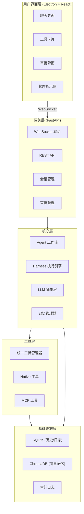

# Athena 技术规格文档

**版本：** v1.0
**最后更新：** 2026-07-30
**项目名称：** Athena — 自主 AI Agent 桌面应用
**技术栈：** Electron + React + FastAPI + LangChain

---

## 目录

1. [项目概述](#1-项目概述)
2. [技术栈选型](#2-技术栈选型)
3. [系统架构](#3-系统架构)
4. [核心模块设计](#4-核心模块设计)
   - 4.1 [LLM 抽象层](#41-llm-抽象层)
   - 4.2 [Harness 执行引擎](#42-harness-执行引擎)
   - 4.3 [统一工具管理器](#43-统一工具管理器)
   - 4.4 [HITL（Human-in-the-Loop）机制](#44-hitlhuman-in-the-loop机制)
   - 4.5 [记忆系统](#45-记忆系统)
   - 4.6 [子 Agent 并行执行](#46-子-agent-并行执行)
   - 4.7 [上下文压缩](#47-上下文压缩)
5. [数据模型](#5-数据模型)
6. [通信协议](#6-通信协议)
7. [错误恢复机制](#7-错误恢复机制)
   - 7.1 [LLM 调用失败](#71-llm-调用失败)
   - 7.2 [工具执行异常（含自愈路由器集成）](#72-工具执行异常)
   - 7.3 [会话中断恢复（含实现）](#73-会话中断恢复)
8. [安全体系](#8-安全体系)
9. [附录](#9-附录)

---

## 1. 项目概述

### 1.1 项目愿景

构建一个名为 Athena 的自主 AI Agent 桌面应用，它能够：

- 通过自然语言接收用户指令
- 自主规划、分解并执行复杂任务
- 支持工具调用（本地/远程）
- 提供实时、透明的执行过程可视化
- 在关键操作上支持人工介入（HITL）
- 具备状态持久化、可观测性和安全防护能力

### 1.2 核心设计哲学

采用 **Harness Engineering** 方法论，将"大脑"（LLM）与"外骨骼"（工程框架）解耦。用工程化的管理（Schema、审批、预算、状态）来驾驭不可靠的 AI 模型，确保 Agent 在真实世界中稳定、可控、可观测。

### 1.3 设计决策记录

| 决策项 | 结论 | 理由 |
|--------|------|------|
| LLM Provider | 抽象层，支持多 provider | 避免厂商锁定，支持国内外模型切换 |
| 认证方式 | 去掉 OAuth 2.1 | 本地优先应用，OAuth 过重 |
| 沙箱策略 | 风险分级（低/中/高） | 平衡安全与易用性 |
| 流式响应 | WebSocket + LangChain streaming | 复用现有连接，原生支持 |
| 工具并发 | asyncio.gather 并行执行 | 无依赖工具可并行，提升效率 |
| Agent 框架 | 自定义 Harness（不用 LangGraph） | Agent 循环是简单 while，非 DAG；自定义实现更易调试、无额外依赖、持久化不冲突 |

---

## 2. 技术栈选型

### 2.1 总览

| 层级 | 技术选型 | 职责 |
|------|----------|------|
| 用户界面 | Electron + React + Vite + TypeScript + Tailwind CSS | 跨平台桌面应用，渲染聊天界面、工具卡片、审批弹窗 |
| 后端 API 网关 | FastAPI (Python) | 管理 WebSocket 连接、路由请求、会话管理 |
| Agent 核心 | 自定义 Harness + LangChain | 自定义执行引擎（预算控制、事件推送）、工具调用、循环控制 |
| 数据持久化 | SQLite | 对话历史、执行日志、会话状态 |
| 向量记忆 | ChromaDB | 长期记忆、语义检索（RAG） |
| 前后端通信 | WebSocket | 双向实时通信，推送思考过程、工具事件、流式文本 |
| 工具管理 | UnifiedToolManager | 注册 Native/MCP 工具，统一 Schema，统一调用入口 |
| 安全 | 风险分级 + HITL 审批 | 输入验证、执行隔离、人工审批 |

### 2.2 核心依赖

**Python 后端：**
```
fastapi>=0.115.0
uvicorn[standard]>=0.30.0
websockets>=12.0
langchain>=0.3.0
langchain-openai>=0.2.0
langchain-anthropic>=0.2.0
langchain-community>=0.3.0
chromadb>=0.5.0
pydantic>=2.0
pydantic-settings>=2.0
aiosqlite>=0.20.0
structlog>=24.0.0
```

**前端：**
```
electron@30.x
react@18.x
vite@5.x
typescript@5.x
tailwindcss@3.x
lucide-react
react-markdown
```

---

## 3. 系统架构

### 3.1 六层架构



### 3.2 分层职责

| 层级 | 核心职责 |
|------|----------|
| 用户界面层 | 展示对话、工具卡片、审批弹窗；流式渲染思考过程；实时状态指示 |
| 网关层 | WebSocket 连接管理、会话隔离、REST API、审批路由 |
| 核心层 | Agent 工作流编排、Harness 执行循环、LLM 调用、记忆管理 |
| 工具层 | 统一工具注册与调用、Native 工具（本地高频）、MCP 工具（远程服务） |
| 基础设施层 | 数据持久化、向量存储、审计日志 |

### 3.3 标识符设计规范

#### 3.3.1 标识符定义

系统中存在两种核心标识符，必须严格区分使用：

| 标识符 | 用途 | 生命周期 | 唯一性范围 |
|--------|------|----------|------------|
| `session_id` | 标识一个用户会话 | 会话级别（长期） | 全局唯一 |
| `run_id` | 标识一次 Agent 运行 | 运行级别（短期） | 同一会话内唯一 |

#### 3.3.2 session_id 设计

**格式：** UUID v4

**示例：** `550e8400-e29b-41d4-a716-446655440000`

**生成规则：**
- 创建新会话时生成，整个会话生命周期内不变
- 由前端或后端生成，存储在 `sessions` 表的 `id` 字段
- 用于隔离不同会话的所有数据（消息、步骤、工具调用等）

#### 3.3.3 run_id 设计

**格式：** 日期格式字符串（YYYYMMDD），子 Agent 在主 run_id 基础上添加序号

**主 Agent run_id 示例：** `20260730`

**子 Agent run_id 格式：** `{主run_id}_{子agent序号}`

**子 Agent run_id 示例：**
- 子 Agent 1: `20260730_1`
- 子 Agent 2: `20260730_2`

**生成规则：**
- 每次用户消息触发一次完整的 Agent 运行时生成
- 同一天多次运行会产生相同的 run_id，此时通过时间戳或序号补充确保唯一性
- 建议实现：`run_id = f"{date}_{timestamp_milliseconds}"` 或使用递增序号

**run_id 生成器实现：**

```python
from datetime import datetime
from typing import Optional

class RunIdGenerator:
    """运行ID生成器。"""
    
    _counter: dict[str, int] = {}  # 按日期计数
    
    @classmethod
    def generate_main_run_id(cls) -> str:
        """生成主 Agent run_id。"""
        today = datetime.now().strftime("%Y%m%d")
        if today not in cls._counter:
            cls._counter[today] = 0
        cls._counter[today] += 1
        
        # 同一天多次运行时添加序号
        if cls._counter[today] == 1:
            return today
        return f"{today}_{cls._counter[today]}"
    
    @classmethod
    def generate_sub_run_id(cls, main_run_id: str, index: int) -> str:
        """生成子 Agent run_id。"""
        return f"{main_run_id}_{index}"
    
    @classmethod
    def reset_counter(cls) -> None:
        """重置计数器（测试用）。"""
        cls._counter.clear()
```

#### 3.3.4 标识符使用规范

**代码实现要求：**
- 所有数据模型必须明确区分 `session_id` 和 `run_id` 的用途
- `session_id` 用于查询会话级数据，`run_id` 用于查询单次运行的数据
- 不得在任何场景下混淆或互换使用这两个标识符

**数据库索引规范：**
- `sessions` 表主键: `id` (session_id)
- `steps` 表索引: `session_id`, `run_id`
- `tool_call` 表索引: `session_id`, `step_id`
- `messages` 表索引: `session_id`

**查询示例：**
```python
# 查询某会话的所有步骤
steps = await db.get_steps(session_id="session-uuid")

# 查询某次运行的所有步骤
run_steps = await db.get_steps_by_run(run_id="20260730")

# 查询某会话的最后一次运行
last_run = await db.get_last_run(session_id="session-uuid")
```

### 3.4 项目目录结构

> 当前实现已将工具声明统一到 `athena/core/tools/providers`，并将 SQLite、
> ChromaDB 实现统一下沉到 `athena/infrastructure`。`athena/db` 仅保留旧导入
> 兼容层。最新依赖规则和目录说明见 [architecture.md](architecture.md)。

```
athena/
├── __init__.py
├── main.py                      # FastAPI 应用入口
├── config/
│   ├── __init__.py
│   └── settings.py              # 配置管理（Pydantic Settings）
├── core/
│   ├── __init__.py
│   ├── agent/
│   │   ├── __init__.py
│   │   └── workflow.py          # Agent 工作流编排
│   ├── harness/
│   │   ├── __init__.py
│   │   ├── harness.py           # Harness 执行引擎
│   │   ├── budget.py            # 预算控制
│   │   └── error_handler.py     # 错误处理与重试
│   ├── llm/
│   │   ├── __init__.py
│   │   └── provider.py          # LLM 抽象层
│   ├── memory/
│   │   ├── __init__.py
│   │   ├── memory.py            # ChromaDB 记忆系统
│   │   ├── retrieval.py        # 混合检索管理器 (HybridRetrievalManager)
│   │   └── summarizer.py       # 对话摘要生成器 (ConversationSummarizer)
│   ├── compression/
│   │   ├── __init__.py
│   │   ├── compressor.py       # 上下文压缩器 (ContextCompressor)
│   │   ├── summarizer.py       # 增量摘要器 (IncrementalSummarizer)
│   │   └── pairer.py           # 消息配对器 (MessagePairer)
│   ├── tools/
│   │   ├── __init__.py
│   │   ├── base.py              # 工具基类
│   │   ├── manager.py           # 统一工具管理器
│   │   ├── builtin/
│   │   │   ├── __init__.py
│   │   │   ├── file_tools.py    # 文件操作工具
│   │   │   ├── shell_tools.py   # Shell 执行工具
│   │   │   └── registry.py      # 工具注册表
│   │   ├── sandbox/
│   │   │   ├── __init__.py
│   │   │   └── docker_sandbox.py # Docker 沙箱管理器
│   │   └── mcp/
│   │       └── __init__.py      # MCP 工具集成
├── db/
│   ├── __init__.py
│   └── database.py              # SQLite 数据库管理
├── gateway/
│   ├── __init__.py
│   ├── approval.py              # HITL 审批管理 (ApprovalManager)
│   ├── routes/
│   │   └── __init__.py          # REST API 路由
│   └── ws/
│       ├── __init__.py
│       └── manager.py           # WebSocket 连接管理
├── models/
│   ├── __init__.py
│   ├── message.py               # 消息模型
│   ├── session.py               # 会话模型
│   └── tool.py                  # 工具模型
├── schemas/
│   ├── __init__.py
│   └── events.py                # WebSocket 事件 Schema
└── utils/
    └── __init__.py              # 日志配置等工具函数

desktop/
├── package.json
├── tsconfig.json
├── electron.vite.config.ts
├── tailwind.config.js
├── index.html
├── electron/
│   ├── main.ts                  # Electron 主进程
│   └── preload.ts               # Preload 脚本（contextBridge）
└── src/
    ├── main.tsx                 # React 入口
    ├── App.tsx                  # 根组件
    ├── index.css                # 全局样式
    ├── types/
    │   └── index.ts             # TypeScript 类型定义
    ├── api/
    │   └── client.ts            # API 客户端
    ├── hooks/
    │   └── useWebSocket.ts      # WebSocket Hook
    ├── store/
    │   └── chatStore.ts         # 状态管理
    └── components/
        ├── Chat.tsx             # 聊天界面
        ├── MessageBubble.tsx    # 消息气泡
        ├── ToolCard.tsx         # 工具执行卡片
        ├── ApprovalDialog.tsx   # 审批弹窗
        └── Sidebar.tsx          # 侧边栏
```

---

## 4. 核心模块设计

### 4.1 LLM 抽象层

**设计目标：** 支持多 LLM Provider 的配置化切换，避免厂商锁定。

**支持的 Provider：**

| Provider | 模型示例 | 配置 |
|----------|----------|------|
| OpenAI | gpt-4o, gpt-4-turbo | `LLM_PROVIDER=openai` |
| Anthropic | claude-3-opus, claude-3-sonnet | `LLM_PROVIDER=anthropic` |
| DeepSeek | deepseek-chat, deepseek-coder | `LLM_PROVIDER=deepseek` |
| Ollama | llama3, mistral (本地) | `LLM_PROVIDER=ollama` |

**接口定义：**

```python
class LLMProvider:
    """统一的 LLM 调用接口。"""

    @property
    def model(self) -> BaseChatModel:
        """获取底层 LangChain 模型实例。"""

    async def ainvoke(self, messages: list[BaseMessage], **kwargs) -> Any:
        """异步调用模型。"""

    async def astream(self, messages: list[BaseMessage], **kwargs):
        """流式调用模型，返回 async generator。"""

    def bind_tools(self, tools: list) -> "LLMProvider":
        """绑定工具到模型，返回新的 provider 实例。"""
```

**配置方式：**

```env
LLM_PROVIDER=deepseek
LLM_MODEL=deepseek-chat
LLM_API_KEY=sk-xxx
LLM_BASE_URL=https://api.deepseek.com
LLM_TEMPERATURE=0.7
LLM_MAX_TOKENS=4096
```

### 4.2 Harness 执行引擎

**设计目标：** 稳定地执行单次 Agent 运行，防止无限循环，支持流式输出，完整记录执行日志。

**为什么不用 LangGraph：** Athena 的 Agent 循环是简单的 while 循环（LLM → 工具 → LLM → 结果），不是复杂的 DAG 工作流。自定义 Harness 的优势：
- 更易调试（直接断点，无图引擎中间层）
- 无额外依赖（仅需 langchain-core）
- 持久化统一（自定义 SQLite schema，不与 LangGraph SqliteSaver 冲突）
- 完全控制预算、事件推送、HITL 等逻辑

**核心职责：**

- 执行 LLM 调用（支持流式）
- 管理工具调用编排（并行执行无依赖的工具）
- 预算控制（maxTurns + retryBudget）
- 事件流式推送到前端
- **执行过程日志持久化到 SQLite**

**执行流程（含日志记录）：**

```
用户消息
    │
    ▼
┌─────────────────────────────────────────────────────────────┐
│  构建消息列表 (历史 + 记忆上下文)                            │
│  创建 run_id（本次运行的唯一标识，格式: YYYYMMDD）           │
│  初始化 step_counter = 0                                    │
└──────────┬──────────────────────────────────────────────────┘
           │
           ▼
┌──────────────────────────────────────────────────────────────┐
│◄─────────────────────────────────────────────────────────────│
│  Step 1: LLM 调用                                           │
│                                                              │
│  ┌─────────────────────────────────────────────────────────┐ │
│  │ 1. 创建 llm_call 类型 step 记录                         │ │
│  │    step_counter += 1                                    │ │
│  │    INSERT INTO steps (id, session_id, run_id,           │ │
│  │      step_number, step_type, status, started_at)        │ │
│  │    VALUES (step_id, session_id, run_id,                 │ │
│  │      step_counter, 'llm_call', 'running', now())       │ │
│  └────────────────────────┬────────────────────────────────┘ │
│                           │                                  │
│  ┌────────────────────────▼────────────────────────────────┐ │
│  │ 2. LLM 流式调用                                         │ │
│  │    - 推送 llm_call_start 事件到前端                      │ │
│  │    - 逐 token 推送 llm_token 事件                        │ │
│  │    - 记录 token 使用量                                   │ │
│  └────────────────────────┬────────────────────────────────┘ │
│                           │                                  │
│  ┌────────────────────────▼────────────────────────────────┐ │
│  │ 3. 更新 llm_call step 记录                              │ │
│  │    UPDATE steps SET status='completed',                  │ │
│  │      completed_at=now(), duration_ms=...,                │ │
│  │      llm_input_tokens=..., llm_output_tokens=...        │ │
│  │    WHERE id=step_id                                      │ │
│  └────────────────────────┬────────────────────────────────┘ │
│                           │                                  │
│  ┌────────────────────────▼────────────────────────────────┐ │
│  │ 4. 推送 llm_call_end 事件到前端                         │ │
│  └────────────────────────┬────────────────────────────────┘ │
│                           │                                  │
│                    ┌──────┴──────┐                           │
│                    │ 有工具调用？ │                           │
│                    └──────┬──────┘                           │
│                      Yes  │  No → 跳到「检查终止条件」        │
│                           │                                  │
│  ┌────────────────────────▼────────────────────────────────┐ │
│  │ 5. 对每个 tool_call 执行独立 step                        │ │
│  │    ┌──────────────────────────────────────────────────┐ │ │
│  │    │ 5a. 创建 tool_execution 类型 step                │ │ │
│  │    │    step_counter += 1                            │ │ │
│  │    │    INSERT INTO steps (id, session_id, run_id,    │ │ │
│  │    │      step_number, step_type, parent_step_id,     │ │ │
│  │    │      status, started_at)                         │ │ │
│  │    │    VALUES (step_id, session_id, run_id,          │ │ │
│  │    │      step_counter, 'tool_execution',             │ │ │
│  │    │      llm_step_id, 'running', now())              │ │ │
│  │    ├──────────────────────────────────────────────────┤ │ │
│  │    │ 5b. 创建 tool_call 记录                           │ │ │
│  │    │    INSERT INTO tool_call (id, session_id,        │ │ │
│  │    │      step_id, tool_name, arguments, status,      │ │ │
│  │    │      started_at)                                  │ │ │
│  │    │    VALUES (tc_id, session_id, step_id,           │ │ │
│  │    │      tool_name, arguments, 'running', now())     │ │ │
│  │    ├──────────────────────────────────────────────────┤ │ │
│  │    │ 5c. 推送 tool_call_start 事件到前端               │ │ │
│  │    ├──────────────────────────────────────────────────┤ │ │
│  │    │ 5d. 检查 require_approval?                        │ │ │
│  │    │    Yes → ApprovalManager.request_approval()       │ │ │
│  │    │    No  → 直接执行                                │ │ │
│  │    ├──────────────────────────────────────────────────┤ │ │
│  │    │ 5e. 执行工具                                      │ │ │
│  │    ├──────────────────────────────────────────────────┤ │ │
│  │    │ 5f. 更新 tool_call 记录                           │ │ │
│  │    │    UPDATE tool_call SET ... WHERE id=tc_id        │ │ │
│  │    ├──────────────────────────────────────────────────┤ │ │
│  │    │ 5g. 更新 tool_execution step 记录                 │ │ │
│  │    │    UPDATE steps SET status=..., duration_ms=...  │ │ │
│  │    │    WHERE id=step_id                               │ │ │
│  │    ├──────────────────────────────────────────────────┤ │ │
│  │    │ 5h. 推送 tool_call_end 事件到前端                 │ │ │
│  │    └──────────────────────────────────────────────────┘ │ │
│  └────────────────────────┬────────────────────────────────┘ │
│                           │                                  │
│  ┌────────────────────────▼────────────────────────────────┐ │
│  │ 6. 结果注入消息列表                                      │ │
│  │    messages.append(ToolMessage(...))                     │ │
│  │    budget.reset_retries()                                │ │
│  └────────────────────────┬────────────────────────────────┘ │
│                           │                                  │
│                           ▼                                  │
│  ┌─────────────────────────────────────────────────────────┐ │
│  │ 检查终止条件：                                           │ │
│  │ - budget.exceeded? → 结束                                │ │
│  │ - 需继续? → 回到 Step 1 (下一轮 LLM 调用)               │ │
│  └────────────────────────┬────────────────────────────────┘ │
└──────────────────────────────────────────────────────────────┘
           │
           ▼
┌─────────────────────────────────────────────────────────────┐
│  后处理                                                      │
│  - 保存 Agent 响应到 messages 表                             │
│  - 推送 stream_end 事件到前端                                │
└─────────────────────────────────────────────────────────────┘
```

**预算控制：**

```python
@dataclass
class Budget:
    max_turns: int = 20          # 最大 LLM 调用轮次
    retry_budget: int = 3        # 最大重试次数
    turn_count: int = 0          # 当前轮次计数
    retry_count: int = 0         # 当前重试计数

    def increment_turn(self) -> None:
        """递增轮次计数，超限则抛出 BudgetExceeded。"""

    def increment_retry(self) -> None:
        """递增重试计数，超限则抛出 BudgetExceeded。"""

    def reset_retries(self) -> None:
        """重置重试计数（工具调用成功后）。"""
```

**并行工具调用（含日志记录）：**

```python
async def _execute_tool_calls(self, tool_calls, session_id, step_id, db):
    """并行执行工具调用，同时记录每个工具的执行日志。"""

    async def _execute_and_log(tc):
        tc_id = str(uuid4())

        # 1. 记录工具调用开始
        await db.save_tool_call({
            "id": tc_id,
            "session_id": session_id,
            "step_id": step_id,
            "tool_name": tc["name"],
            "arguments": tc.get("args", {}),
            "status": "running",
            "started_at": datetime.now().isoformat(),
        })

        # 2. 推送事件到前端
        await self._emit(EventType.TOOL_CALL_START, {
            "session_id": session_id,
            "tool_call_id": tc_id,
            "tool_name": tc["name"],
            "arguments": tc.get("args", {}),
        })

        # 3. 执行工具
        start_time = time.time()
        try:
            result = await self._tool_manager.call_tool(tc["name"], tc.get("args", {}))
            status = "success"
            error_msg = None
            error_stack = None
        except Exception as e:
            result = None
            status = "failed"
            error_msg = str(e)
            error_stack = traceback.format_exc()

        duration_ms = (time.time() - start_time) * 1000

        # 4. 更新工具调用记录
        await db.update_tool_call(tc_id, {
            "raw_output": str(result) if result else None,
            "status": status,
            "completed_at": datetime.now().isoformat(),
            "duration_ms": duration_ms,
            "error_message": error_msg,
            "error_stack": error_stack,
        })

        # 5. 推送事件到前端
        await self._emit(EventType.TOOL_CALL_END, {
            "session_id": session_id,
            "tool_call_id": tc_id,
            "tool_name": tc["name"],
            "status": status,
            "output": str(result) if status == "success" else None,
            "error": error_msg,
            "duration_ms": duration_ms,
        })

        return tc_id, result, status, error_msg

    # 并行执行所有工具调用
    results = await asyncio.gather(
        *[_execute_and_log(tc) for tc in tool_calls],
        return_exceptions=True,
    )
    return results
```

**数据流向总结：**

```
Harness 执行
    │
    ├─► 推送 WebSocket 事件到前端（实时渲染）
    │
    └─► 写入 SQLite 日志（持久化）
         │
         ├─► steps 表: 每个 LLM 调用 / 工具执行步骤
         ├─► tool_call 表: 每次工具调用的完整记录
         └─► approval_logs 表: 审批决策记录
```

### 4.3 统一工具管理器

**设计原则：** 管理层统一（MCP 风格 Schema），执行层分离（Native / MCP）。

**工具类型：**

| 类型 | 适用场景 | 执行方式 | 示例 |
|------|----------|----------|------|
| Native 工具 | 高频、轻量、需共享状态 | 直接 Python 函数调用 | `read_file`, `exec_shell` |
| MCP 工具 | 外部服务、重型计算 | 通过 MCP 协议远程代理 | `github_create_issue` |

**工具 Schema 定义：**

```python
class ToolSchema(BaseModel):
    name: str                              # 工具名称
    description: str                       # 工具描述
    parameters: dict[str, Any]             # JSON Schema 参数定义
    require_approval: bool = False         # 是否需要 HITL 审批
    risk_level: str = "low"                # 风险等级: low/medium/high
```

**统一调用接口：**

```python
class UnifiedToolManager:
    def register_native(self, name, description, parameters, handler,
                        risk_level="low", require_approval=False):
        """注册 Native 工具。"""

    def register_mcp_tools(self, server_name, tool_defs, mcp_client):
        """注册 MCP 服务器的工具。"""

    async def call_tool(self, name: str, params: dict) -> Any:
        """统一工具调用入口。"""

    def get_langchain_tools(self) -> list[StructuredTool]:
        """转换为 LangChain 标准工具，用于 bind_tools。"""

    def require_approval(self, tool_name: str) -> bool:
        """检查工具是否需要审批。"""
```

**内置工具清单：**

| 工具名 | 风险等级 | 需审批 | 描述 |
|--------|----------|--------|------|
| `read_file` | low | ❌ | 读取文件内容 |
| `write_file` | medium | ✅ | 写入文件内容 |
| `list_directory` | low | ❌ | 列出目录内容 |
| `exec_shell` | high | ✅ | 执行 Shell 命令 |

### 4.4 HITL（Human-in-the-Loop）机制

#### 4.4.1 设计理念

HITL 是 Athena 安全体系的核心防线。其设计原则是：

- **默认安全：** 任何可能产生副作用的操作都应经过用户确认
- **最小打断：** 低风险操作自动执行，只在必要时请求审批
- **透明可见：** 审批请求必须展示完整的操作上下文（工具名、参数、预期影响）
- **超时保护：** 避免因用户无响应导致 Agent 挂起
- **可审计：** 所有审批决策（允许/拒绝/超时）都记录到审计日志

#### 4.4.2 审批触发条件

审批请求由工具的 `require_approval` 标志和 `risk_level` 共同决定：

| 风险等级 | require_approval | 执行行为 | 示例工具 |
|----------|-----------------|----------|----------|
| `low` | `false` | 直接执行，无需审批 | `read_file`, `list_directory` |
| `medium` | `true` | 请求用户审批 | `write_file`, `edit_file` |
| `high` | `true` | 请求用户审批 + 显示风险警告 | `exec_shell`, `delete_file` |

**审批判定逻辑：**

```python
async def call_tool(self, name: str, params: dict) -> Any:
    tool = self._tools[name]

    # 检查是否需要审批
    if tool.require_approval():
        approved = await self.approval_manager.request_approval(
            tool_name=name,
            arguments=params,
            risk_level=tool.risk_level,
        )
        if not approved:
            return ToolResult(
                status="denied",
                output="用户拒绝了该操作",
            )

    return await tool.execute(**params)
```

#### 4.4.3 审批请求数据结构

> **注意：** `ApprovalRequest` 的完整定义见 [4.4.4 审批请求数据结构](#444-审批管理器approvalmanager设计规范)，包含 `session_id` 和 `run_id` 字段。

**WebSocket 推送格式：**

```json
{
    "type": "approval_request",
    "session_id": "session-uuid",
    "data": {
        "approval_id": "approval-uuid",
        "tool_name": "exec_shell",
        "arguments": {
            "command": "rm -rf /tmp/cache"
        },
        "risk_level": "high",
        "timeout": 120,
        "description": "执行 Shell 命令: rm -rf /tmp/cache"
    }
}
```

#### 4.4.4 审批管理器（ApprovalManager）设计规范

##### 核心设计原则

ApprovalManager 采用**异步队列 + Future 等待**模式，确保审批请求的顺序处理和并发控制。

##### 类结构定义

```python
import asyncio
import uuid
from datetime import datetime
from typing import Any, Optional
from collections import deque

class ApprovalManager:
    """审批管理器 - 异步队列模式。
    
    核心功能：
    1. 维护一个异步队列，按顺序处理所有审批请求
    2. 通过 asyncio.Future 对象实现请求方的结果等待
    3. 并发控制：多个子Agent并发调用时，所有请求进入队列按顺序处理
    4. 防审批风暴：每个工具调用生成唯一approval_id，立即返回Future
    """
    
    def __init__(self, approval_timeout: int = 120):
        self._queue: deque[ApprovalRequest] = deque()
        self._processing: bool = False
        self._timeout = approval_timeout
        self._pending_futures: dict[str, asyncio.Future] = {}
        self._websocket_manager = None  # WebSocket管理器引用
    
    def set_websocket_manager(self, ws_manager):
        """设置WebSocket管理器。"""
        self._websocket_manager = ws_manager
    
    async def request_approval(
        self,
        tool_name: str,
        arguments: dict[str, Any],
        risk_level: str,
        session_id: str,
        run_id: str,
    ) -> ApprovalRequest:
        """请求审批 - 立即返回ApprovalRequest（含Future）。
        
        关键：此方法必须立即返回，不等待审批完成。
        调用方通过 await request.future 等待审批结果。
        """
        # 生成唯一审批ID
        approval_id = str(uuid.uuid4())
        
        # 创建Future对象
        future = asyncio.Future()
        
        # 创建审批请求
        request = ApprovalRequest(
            id=approval_id,
            tool_name=tool_name,
            arguments=arguments,
            risk_level=risk_level,
            timeout=self._timeout,
            created_at=datetime.now(),
            session_id=session_id,
            run_id=run_id,
            future=future,
            resolved=False,
            resolution="pending",
        )
        
        # 立即保存Future映射，防止审批风暴
        self._pending_futures[approval_id] = future
        
        # 添加到队列
        self._queue.append(request)
        
        # 如果队列空闲，开始处理
        if not self._processing:
            asyncio.create_task(self._process_queue())
        
        # 返回审批请求（含Future）
        return request
    
    async def respond_approval(
        self,
        approval_id: str,
        action: str,  # "allow" or "deny"
    ) -> None:
        """响应审批请求。"""
        if approval_id in self._pending_futures:
            future = self._pending_futures[approval_id]
            if not future.done():
                future.set_result(action == "allow")
            del self._pending_futures[approval_id]
    
    async def _process_queue(self) -> None:
        """处理审批队列 - 顺序处理每个请求。"""
        self._processing = True
        
        try:
            while self._queue:
                request = self._queue.popleft()
                
                # 推送审批请求到前端
                await self._push_approval_request(request)
                
                # 等待审批结果（带超时）
                try:
                    result = await asyncio.wait_for(
                        request.future,
                        timeout=request.timeout,
                    )
                    request.resolved = True
                    request.resolution = "approved" if result else "denied"
                except asyncio.TimeoutError:
                    request.resolved = True
                    request.resolution = "timeout"
                    if not request.future.done():
                        request.future.set_result(False)
                
                # 记录审批日志
                await self._log_approval(request)
                
                # 推送审批结果事件
                await self._push_approval_result(request)
                
        finally:
            self._processing = False
    
    async def _push_approval_request(self, request: ApprovalRequest) -> None:
        """推送审批请求到前端。"""
        if self._websocket_manager:
            await self._websocket_manager.send_to_session(
                request.session_id,
                {
                    "type": "approval_queue_status",
                    "session_id": request.session_id,
                    "data": {
                        "queue_length": len(self._queue) + 1,
                        "position": 1,  # 当前处理中的
                    }
                }
            )
            await self._websocket_manager.send_to_session(
                request.session_id,
                {
                    "type": "approval_request",
                    "session_id": request.session_id,
                    "data": {
                        "approval_id": request.id,
                        "tool_name": request.tool_name,
                        "arguments": request.arguments,
                        "risk_level": request.risk_level,
                        "timeout": request.timeout,
                    }
                }
            )
    
    async def _push_approval_result(self, request: ApprovalRequest) -> None:
        """推送审批结果到前端。"""
        if self._websocket_manager:
            await self._websocket_manager.send_to_session(
                request.session_id,
                {
                    "type": "approval_result",
                    "session_id": request.session_id,
                    "data": {
                        "approval_id": request.id,
                        "decision": request.resolution,
                    }
                }
            )
    
    async def _log_approval(self, request: ApprovalRequest) -> None:
        """记录审批日志（实现略）。"""
        pass
    
    def cancel_all_pending(self, session_id: str) -> None:
        """取消指定会话的所有待审批请求。"""
        # 从队列中移除该会话的请求
        self._queue = deque(
            req for req in self._queue 
            if req.session_id != session_id
        )
        # 取消所有相关Future
        futures_to_cancel = [
            (aid, fut) for aid, fut in self._pending_futures.items()
            if self._get_session_by_approval_id(aid) == session_id
        ]
        for aid, fut in futures_to_cancel:
            if not fut.done():
                fut.set_result(False)
            del self._pending_futures[aid]
    
    def _get_session_by_approval_id(self, approval_id: str) -> Optional[str]:
        """根据approval_id获取session_id（简化实现）。"""
        for req in self._queue:
            if req.id == approval_id:
                return req.session_id
        return None
```

##### 审批请求数据结构

```python
class ApprovalRequest:
    """审批请求的完整数据结构。"""

    id: str                          # 唯一请求 ID (UUID)
    tool_name: str                   # 工具名称
    arguments: dict[str, Any]        # 工具调用参数
    risk_level: str                  # 风险等级: low/medium/high
    timeout: int                     # 超时时间（秒）
    created_at: datetime             # 创建时间
    session_id: str                  # 所属会话ID
    run_id: str                      # 所属运行ID

    # 内部状态（ApprovalManager管理）
    future: asyncio.Future[bool]     # 阻塞 Future
    resolved: bool = False           # 是否已解决
    resolution: str = "pending"      # 解决方式: approved/denied/timeout
```

##### 使用示例

```python
# Agent执行工具前检查审批
async def execute_tool_with_approval(
    self, 
    tool_name: str, 
    params: dict,
    session_id: str,
    run_id: str,
) -> Any:
    tool = self._tools[tool_name]
    
    # 检查是否需要审批
    if tool.require_approval():
        # 立即获取审批请求（含Future）
        approval_request = await self._approval_manager.request_approval(
            tool_name=tool_name,
            arguments=params,
            risk_level=tool.risk_level,
            session_id=session_id,
            run_id=run_id,
        )
        
        # 等待审批结果（通过Future）
        approved = await approval_request.future
        
        if not approved:
            return ToolResult(
                status="denied",
                output="用户拒绝了该操作",
            )
    
    # 执行工具
    return await tool.execute(**params)
```

##### 并发控制策略

```
场景：3个子Agent同时请求审批

时间线：
t0: 子Agent-1调用request_approval() → 返回request_1 (Future_1)
t0: 子Agent-2调用request_approval() → 返回request_2 (Future_2)  
t0: 子Agent-3调用request_approval() → 返回request_3 (Future_3)

队列状态：[request_1, request_2, request_3]

处理流程：
1. ApprovalManager开始处理request_1
   - 推送approval_request到前端
   - await request_1.future（阻塞等待用户响应）
   
2. 用户响应request_1
   - ApprovalManager处理request_2
   - ...

3. 关键：子Agent-2和子Agent-3在request_1处理期间处于等待状态
   - 它们的request_approval()调用已立即返回
   - 它们的代码在await request.future处阻塞
   - 当request_1完成后，request_2开始处理
```

##### 防审批风暴措施

1. **唯一approval_id**：每个工具调用必须生成唯一的approval_id（UUID v4）
2. **立即返回Future**：`request_approval()`方法必须立即返回，不等待审批完成
3. **Future映射表**：`_pending_futures`字典维护approval_id到Future的映射
4. **顺序处理**：审批队列按FIFO顺序处理，同一时刻只处理一个请求
5. **超时保护**：每个审批请求都有超时限制，防止永久阻塞

#### 4.4.5 审批流程图

```
Agent 请求执行工具
        │
        ▼
┌───────────────────────┐
│ 检查 require_approval  │
└───────────┬───────────┘
            │
    ┌───────┴───────┐
    │               │
  false           true
    │               │
    ▼               ▼
┌────────┐   ┌────────────────────┐
│直接执行│   │调用request_approval │
└────────┘   │(立即返回Future)    │
              └──────────┬─────────┘
                         │
                         ▼
              ┌────────────────────┐
              │ 进入审批队列       │
              │ 推送approval_request│
              └──────────┬─────────┘
                         │
                         ▼
              ┌────────────────────┐
              │ await future       │
              │ (阻塞等待结果)     │
              └──────────┬─────────┘
                         │
            ┌────────────┼────────────┐
            │            │            │
          Allow        Deny        Timeout
            │            │            │
            ▼            ▼            ▼
    ┌──────────┐  ┌──────────┐  ┌──────────┐
    │执行工具  │  │返回拒绝  │  │返回超时  │
    │          │  │消息给    │  │错误给    │
    └────┬─────┘  │Agent     │  │Agent     │
         │        └────┬─────┘  └────┬─────┘
         │             │             │
         ▼             ▼             ▼
    ┌────────────────────────────────────┐
    │ 记录审计日志                        │
    │ (tool_name, decision, timestamp)   │
    └────────────────────────────────────┘
```

#### 4.4.5 审批超时策略

| 场景 | 行为 | Agent 收到的消息 |
|------|------|-----------------|
| 用户点击 Allow | 继续执行工具 | 正常工具结果 |
| 用户点击 Deny | 中断执行 | `"用户拒绝了该操作"` |
| 超时无响应 | 自动拒绝 | `"审批超时（120秒），操作已自动取消"` |
| 会话断开 | 取消所有待审批 | 每个请求返回 `"会话已断开，审批已取消"` |
| Agent 被中断 | 取消所有待审批 | 清理所有 pending 的 Future |

#### 4.4.6 前端审批弹窗设计

**弹窗组件结构：**

```typescript
interface ApprovalDialogProps {
    request: {
        approval_id: string
        tool_name: string
        arguments: Record<string, unknown>
        risk_level: 'low' | 'medium' | 'high'
        timeout: number
        description?: string
    }
    onApprove: () => void
    onDeny: () => void
}
```

**UI 元素：**

```
┌─────────────────────────────────────────┐
│  ⚠️  Approval Required                  │
│  This action requires your confirmation │
├─────────────────────────────────────────┤
│                                         │
│  Tool: exec_shell                       │
│  Risk: ■■■ HIGH                         │
│                                         │
│  Arguments:                             │
│  ┌───────────────────────────────────┐  │
│  │ {                                 │  │
│  │   "command": "rm -rf /tmp/cache"  │  │
│  │ }                                 │  │
│  └───────────────────────────────────┘  │
│                                         │
│  ⏱️  Timeout: 120s                      │
│                                         │
├─────────────────────────────────────────┤
│    [ ✕ Deny ]          [ ✓ Allow ]     │
└─────────────────────────────────────────┘
```

**交互规范：**

| 元素 | 说明 |
|------|------|
| 风险指示器 | 低风险=绿色，中风险=黄色，高风险=红色 |
| 参数展示 | JSON 格式化显示，可折叠/展开 |
| 倒计时 | 显示剩余审批时间，超时前 10 秒闪烁提醒 |
| 键盘快捷键 | `Enter` = Allow, `Escape` = Deny |
| 焦点管理 | 弹窗打开时自动获取焦点，阻止背景交互 |

#### 4.4.7 审批决策的 Agent 行为

Agent 收到审批结果后的行为模式：

**批准（Allow）：**
- Agent 正常接收工具执行结果
- 继续后续推理和工具调用

**拒绝（Deny）：**
```
Agent 收到: "用户拒绝了该操作"
    │
    ▼
Agent 推理: 用户拒绝了 exec_shell，尝试其他方式
    │
    ▼
可选策略:
  1. 向用户解释为什么需要这个操作，请求重新审批
  2. 尝试使用更低风险的替代方案
  3. 放弃当前任务，告知用户无法完成
```

**超时（Timeout）：**
```
Agent 收到: "审批超时（120秒），操作已自动取消"
    │
    ▼
Agent 推理: 用户可能不在电脑前，暂停当前任务
    │
    ▼
策略: 向用户说明情况，等待用户回来后继续
```

#### 4.4.8 批量审批

当 Agent 一次返回多个需要审批的工具调用时：

**方案 A：逐个审批（默认）**
```
Agent 返回: [tool_call_1, tool_call_2, tool_call_3]
    │
    ▼
依次弹出审批弹窗:
  1. tool_call_1 → 用户 Allow
  2. tool_call_2 → 用户 Deny
  3. tool_call_3 → 用户 Allow
    │
    ▼
执行: tool_call_1 ✓, tool_call_2 ✗ (跳过), tool_call_3 ✓
```

**方案 B：批量审批（可选）**
```
Agent 返回: [tool_call_1, tool_call_2, tool_call_3]
    │
    ▼
弹出批量审批弹窗:
┌────────────────────────────────────────┐
│  3 个操作需要审批                       │
│                                        │
│  ☑️ 1. read_file (low)     [自动]      │
│  ☑️ 2. write_file (medium) [需审批]    │
│  ☐ 3. exec_shell (high)   [需审批]    │
│                                        │
│         [ 全部拒绝 ]  [ 允许选中 ]     │
└────────────────────────────────────────┘
```

#### 4.4.9 审批历史与审计

所有审批决策记录到 `approval_logs` 表：

```sql
CREATE TABLE approval_logs (
    id TEXT PRIMARY KEY,
    session_id TEXT NOT NULL,
    tool_call_id TEXT NOT NULL,
    tool_name TEXT NOT NULL,
    arguments TEXT DEFAULT '{}',
    risk_level TEXT NOT NULL,
    decision TEXT NOT NULL,           -- approved/denied/timeout
    decision_time_ms REAL,            -- 用户响应耗时（毫秒）
    timestamp TEXT NOT NULL,
    FOREIGN KEY (session_id) REFERENCES sessions(id)
);
```

**审计查询示例：**

```python
# 查询某会话的所有审批记录
logs = await db.get_approval_logs(session_id="session-uuid")

# 查询被拒绝的高风险操作
high_risk_denials = [
    log for log in logs
    if log["risk_level"] == "high" and log["decision"] == "denied"
]
```

#### 4.4.10 配置参数

| 参数 | 默认值 | 说明 |
|------|--------|------|
| `APPROVAL_TIMEOUT` | 120 | 审批超时时间（秒） |
| `APPROVAL_BATCH_MODE` | `sequential` | 批量审批模式: `sequential` / `batch` |
| `APPROVAL_KEYBOARD_SHORTCUTS` | `true` | 是否启用键盘快捷键 |
| `APPROVAL_SOUND_ALERT` | `false` | 审批请求时是否播放提示音 |

#### 4.4.11 边界情况处理

| 场景 | 处理方式 |
|------|----------|
| 用户长时间无响应 | 超时自动拒绝，Agent 收到超时错误 |
| 用户关闭审批弹窗 | 视为拒绝，发送 deny 响应 |
| 网络断开 | WebSocket 断开触发会话清理，取消所有 pending 请求 |
| 多标签页同一会话 | 所有标签页都收到审批请求，任意一个响应即可 |
| Agent 运行被手动停止 | 取消所有 pending 的 ApprovalRequest |
| 审批请求堆积 | 前端队列显示，用户可逐个或批量处理 |
| 工具执行在审批期间超时 | 审批通过后重新检查工具超时，必要时报错 |

### 4.5 记忆系统

**设计目标：** 基于 ChromaDB 的长期记忆系统，支持语义检索、自动摘要和生命周期管理。

#### 4.5.1 记忆存储触发条件

| 触发方式 | 条件 | 说明 |
|----------|------|------|
| 自动提取 | 每条消息 | 实时从消息中提取事实和实体 |
| 阈值摘要 | `summary_threshold` 轮对话 | 调用 LLM 对近期对话摘要后存入 |
| 主动保存 | 用户/Agent 调用工具 | 通过 `save_memory` 命令主动保存 |
| 定时同步 | `sync_interval` 间隔 | 定期将新事实同步到 ChromaDB |

#### 4.5.2 检索系统实现（LLM提取+向量数据库+混合检索）

##### 技术架构

```
用户查询
    │
    ▼
┌─────────────────────────────────────────────────────────────┐
│                    混合检索管理器                            │
│              HybridRetrievalManager                          │
├─────────────────────────────────────────────────────────────┤
│                                                             │
│  ┌─────────────────────┐    ┌─────────────────────┐        │
│  │   LLM 提取器         │    │   关键词提取器       │        │
│  │   (语义理解)         │    │   (精确匹配)         │        │
│  └──────────┬──────────┘    └──────────┬──────────┘        │
│             │                           │                   │
│             ▼                           ▼                   │
│  ┌─────────────────────────────────────────────────────┐   │
│  │              向量检索 + 关键词检索                    │   │
│  │                                                     │   │
│  │  ┌─────────────────────┐    ┌─────────────────────┐ │   │
│  │  │   ChromaDB 向量检索  │    │   SQLite 关键词检索  │ │   │
│  │  │   (cosine similarity)│    │   (FTS5/LIKE)       │ │   │
│  │  └──────────┬──────────┘    └──────────┬──────────┘ │   │
│  │             │                           │           │   │
│  │             └───────────┬───────────────┘           │   │
│  │                         │                           │   │
│  │                         ▼                           │   │
│  │  ┌─────────────────────────────────────────────┐    │   │
│  │  │           结果融合与重排序                    │    │   │
│  │  │  - RRF (Reciprocal Rank Fusion)              │    │   │
│  │  │  - 时间衰减加权                               │    │   │
│  │  │  - 相关性过滤                                 │    │   │
│  │  └──────────────────┬──────────────────────────┘    │   │
│  │                     │                               │   │
│  └─────────────────────┼───────────────────────────────┘   │
│                         │                                   │
│                         ▼                                   │
│  ┌─────────────────────────────────────────────────────┐   │
│  │           上下文构建与注入                          │   │
│  │  - 格式化为 System Message                          │   │
│  │  - 控制 token 长度                                 │   │
│  │  - 注入到对话历史                                  │   │
│  └─────────────────────────────────────────────────────┘   │
│                                                             │
└─────────────────────────────────────────────────────────────┘
    │
    ▼
 注入到 LLM 系统提示词
```

##### 核心类实现

```python
from dataclasses import dataclass
from typing import Optional
import numpy as np

@dataclass
class SearchResult:
    """检索结果。"""
    content: str
    score: float
    source: str  # "vector" or "keyword"
    metadata: dict
    chunk_id: str

class HybridRetrievalManager:
    """混合检索管理器。
    
    采用LLM提取+向量数据库+混合检索的技术方案，
    实现高精度和高效率的记忆检索。
    """
    
    def __init__(
        self,
        llm_provider: LLMProvider,
        chroma_client: chromadb.Client,
        min_score: float = 0.7,
        top_k: int = 5,
        vector_weight: float = 0.6,
        keyword_weight: float = 0.4,
        rrf_k: int = 60,
    ):
        self._llm = llm_provider
        self._chroma = chroma_client
        self._min_score = min_score
        self._top_k = top_k
        self._vector_weight = vector_weight
        self._keyword_weight = keyword_weight
        self._rrf_k = rrf_k
    
    async def retrieve(
        self,
        query: str,
        session_id: str,
        filter_params: Optional[dict] = None,
    ) -> list[SearchResult]:
        """执行混合检索。
        
        Args:
            query: 用户查询
            session_id: 会话ID
            filter_params: 过滤参数
            
        Returns:
            排序后的检索结果列表
        """
        # 1. LLM查询理解与扩展
        expanded_query = await self._expand_query(query)
        
        # 2. 向量检索
        vector_results = await self._vector_search(
            expanded_query, session_id, filter_params
        )
        
        # 3. 关键词检索
        keyword_results = await self._keyword_search(
            query, session_id, filter_params
        )
        
        # 4. 结果融合
        fused_results = self._reciprocal_rank_fusion(
            vector_results, keyword_results
        )
        
        # 5. 过滤与排序
        filtered_results = [
            r for r in fused_results 
            if r.score >= self._min_score
        ][:self._top_k]
        
        # 6. 应用时间衰减
        for result in filtered_results:
            result.score *= self._calculate_temporal_decay(result.metadata)
        
        # 7. 按分数排序
        filtered_results.sort(key=lambda x: x.score, reverse=True)
        
        return filtered_results
    
    async def _expand_query(self, query: str) -> str:
        """使用LLM扩展查询，提升检索召回率。"""
        prompt = f"""
        请将以下用户查询扩展为更完整的搜索语句，
        提取关键实体和意图，返回扩展后的查询。
        
        原查询: {query}
        
        扩展查询:
        """
        response = await self._llm.ainvoke([
            HumanMessage(content=prompt)
        ])
        return response.content.strip()
    
    async def _vector_search(
        self,
        query: str,
        session_id: str,
        filter_params: Optional[dict],
    ) -> list[SearchResult]:
        """向量检索。"""
        # 获取集合
        collection = self._chroma.get_or_create_collection(
            name=f"memory_{session_id}",
            embedding_function=self._get_embedding_function(),
        )
        
        # 构建过滤条件
        where_filter = {"session_id": session_id}
        if filter_params:
            where_filter.update(filter_params)
        
        # 执行向量检索
        results = collection.query(
            query_texts=[query],
            n_results=self._top_k * 2,  # 获取更多结果用于融合
            where=where_filter,
            include=["documents", "metadatas", "distances"],
        )
        
        # 转换为SearchResult
        search_results = []
        for i, (doc_id, doc, metadata, distance) in enumerate(zip(
            results["ids"][0],
            results["documents"][0],
            results["metadatas"][0],
            results["distances"][0],
        )):
            # 转换距离为相似度分数
            score = 1.0 - (distance / 2.0)  # 假设距离范围[0, 2]
            search_results.append(SearchResult(
                content=doc,
                score=score * self._vector_weight,
                source="vector",
                metadata=metadata,
                chunk_id=doc_id,
            ))
        
        return search_results
    
    async def _keyword_search(
        self,
        query: str,
        session_id: str,
        filter_params: Optional[dict],
    ) -> list[SearchResult]:
        """关键词检索。"""
        # 提取关键词
        keywords = self._extract_keywords(query)
        
        # 从ChromaDB获取所有文档元数据进行关键词匹配
        collection = self._chroma.get_collection(
            name=f"memory_{session_id}"
        )
        
        all_data = collection.get(
            where={"session_id": session_id},
            include=["documents", "metadatas"],
        )
        
        # 关键词匹配
        results = []
        for i, (doc_id, doc, metadata) in enumerate(zip(
            all_data["ids"],
            all_data["documents"],
            all_data["metadatas"],
        )):
            score = self._calculate_keyword_score(doc, keywords)
            if score > 0:
                results.append(SearchResult(
                    content=doc,
                    score=score * self._keyword_weight,
                    source="keyword",
                    metadata=metadata,
                    chunk_id=doc_id,
                ))
        
        # 按分数排序
        results.sort(key=lambda x: x.score, reverse=True)
        return results[:self._top_k]
    
    def _extract_keywords(self, query: str) -> list[str]:
        """从查询中提取关键词。"""
        # 简单实现：按空格和标点分割
        import re
        keywords = re.findall(r'\w+', query.lower())
        # 移除停用词
        stop_words = {'the', 'a', 'an', 'is', 'are', 'was', 'were', 
                     'be', 'been', 'being', 'have', 'has', 'had',
                     'do', 'does', 'did', 'will', 'would', 'could',
                     'should', 'may', 'might', 'can', 'shall'}
        return [k for k in keywords if k not in stop_words and len(k) > 1]
    
    def _calculate_keyword_score(
        self, 
        document: str, 
        keywords: list[str]
    ) -> float:
        """计算关键词匹配分数。"""
        doc_lower = document.lower()
        score = 0.0
        
        for keyword in keywords:
            if keyword in doc_lower:
                # 精确匹配加分
                score += 0.5
                # 检查是否完整词匹配
                import re
                if re.search(r'\b' + keyword + r'\b', doc_lower):
                    score += 0.3
                # 词频加成
                frequency = doc_lower.count(keyword)
                score += min(frequency * 0.1, 0.2)
        
        return min(score, 1.0)
    
    def _reciprocal_rank_fusion(
        self,
        vector_results: list[SearchResult],
        keyword_results: list[SearchResult],
    ) -> list[SearchResult]:
        """倒数排名融合(RRF)。
        
        RRF_score = sum(1/(k + rank)) for each result
        """
        # 构建排名映射
        scores: dict[str, float] = {}
        content_map: dict[str, SearchResult] = {}
        
        # 向量检索排名
        for rank, result in enumerate(vector_results, 1):
            if result.chunk_id not in scores:
                scores[result.chunk_id] = 0.0
                content_map[result.chunk_id] = result
            scores[result.chunk_id] += 1.0 / (self._rrf_k + rank)
        
        # 关键词检索排名
        for rank, result in enumerate(keyword_results, 1):
            if result.chunk_id not in scores:
                scores[result.chunk_id] = 0.0
                content_map[result.chunk_id] = result
            scores[result.chunk_id] += 1.0 / (self._rrf_k + rank)
        
        # 构建最终结果
        fused_results = []
        for chunk_id, rrf_score in scores.items():
            result = content_map[chunk_id]
            result.score = rrf_score
            fused_results.append(result)
        
        return fused_results
    
    def _calculate_temporal_decay(self, metadata: dict) -> float:
        """计算时间衰减因子。"""
        from datetime import datetime, timedelta
        
        created_at = metadata.get("created_at")
        if not created_at:
            return 1.0
        
        try:
            created_time = datetime.fromisoformat(created_at)
            age_days = (datetime.now() - created_time).days
            ttl_days = 90  # 可配置
            decay = max(0.1, 1.0 - (age_days / ttl_days))
            return decay
        except (ValueError, TypeError):
            return 1.0
    
    def _get_embedding_function(self):
        """获取嵌入函数。"""
        # 使用配置的嵌入模型
        return self._chroma.get_embedding_function()


class MemoryRetrievalService:
    """记忆检索服务 - 对外接口。"""
    
    def __init__(self, retrieval_manager: HybridRetrievalManager):
        self._manager = retrieval_manager
    
    async def get_relevant_memories(
        self,
        user_message: str,
        session_id: str,
        max_tokens: int = 2000,
    ) -> str:
        """获取相关记忆并格式化为系统提示。
        
        Args:
            user_message: 用户消息
            session_id: 会话ID
            max_tokens: 最大token数
            
        Returns:
            格式化的记忆内容
        """
        # 执行检索
        results = await self._manager.retrieve(
            query=user_message,
            session_id=session_id,
        )
        
        if not results:
            return ""
        
        # 格式化为记忆上下文
        memory_parts = ["[相关记忆]"]
        total_tokens = 0
        
        for result in results:
            # 估算token数（粗略估算：4字符=1token）
            content_tokens = len(result.content) // 4
            
            if total_tokens + content_tokens > max_tokens:
                break
            
            memory_parts.append(f"- {result.content}")
            total_tokens += content_tokens
        
        if len(memory_parts) > 1:
            memory_parts.append("[/相关记忆]")
            return "\n".join(memory_parts)
        
        return ""
```

##### 检索流程示例

```
用户输入: "我之前提到过的项目技术栈是什么？"
    │
    ▼
┌─────────────────────────────────────────────────────────┐
│ 1. LLM查询扩展                                          │
│    原查询 → "用户之前提到的项目技术栈相关信息"           │
└─────────────────────────┬───────────────────────────────┘
                          │
                          ▼
┌─────────────────────────────────────────────────────────┐
│ 2. 向量检索 (ChromaDB)                                  │
│    提取与"技术栈"语义相似的记忆                        │
│    返回: [Python, FastAPI, React, SQLite]              │
└─────────────────────────┬───────────────────────────────┘
                          │
                          ▼
┌─────────────────────────────────────────────────────────┐
│ 3. 关键词检索                                           │
│    提取关键词: ["项目", "技术栈"]                       │
│    精确匹配包含这些词的记忆                            │
│    返回: ["项目使用Python和FastAPI", "技术栈包括React"]  │
└─────────────────────────┬───────────────────────────────┘
                          │
                          ▼
┌─────────────────────────────────────────────────────────┐
│ 4. RRF融合                                              │
│    综合向量检索和关键词检索结果                          │
│    按融合分数排序                                       │
└─────────────────────────┬───────────────────────────────┘
                          │
                          ▼
┌─────────────────────────────────────────────────────────┐
│ 5. 时间衰减                                             │
│    较新的记忆权重更高                                   │
│    较旧的记忆逐渐降权                                   │
└─────────────────────────┬───────────────────────────────┘
                          │
                          ▼
┌─────────────────────────────────────────────────────────┐
│ 6. 结果格式化                                           │
│    格式化为System Message                               │
│    注入到对话历史中                                     │
└─────────────────────────────────────────────────────────┘
```

##### 配置参数

| 参数 | 默认值 | 说明 |
|------|--------|------|
| `VECTOR_WEIGHT` | 0.6 | 向量检索权重 |
| `KEYWORD_WEIGHT` | 0.4 | 关键词检索权重 |
| `RRF_K` | 60 | RRF融合参数 |
| `RETRIEVAL_TOP_K` | 5 | 检索结果数量 |
| `RETRIEVAL_MIN_SCORE` | 0.7 | 最小相关性分数 |
| `MEMORY_MAX_TOKENS` | 2000 | 记忆注入最大token数 |

#### 4.5.3 记忆生命周期管理

**时间衰减 (Temporal Decay)：**

```python
# 检索阶段通过排名算法实现"软遗忘"
age_days = (now - created_at).days
temporal_factor = max(0.1, 1.0 - (age_days / ttl_days))
adjusted_score = original_score * temporal_factor
```

**相关性衰减 (Relevance Decay)：**

- 定期降低旧事实的相关性分数
- 长时间未被访问的记忆逐渐降权

**后台维护 (Background Maintenance)：**

| 操作 | 触发条件 | 说明 |
|------|----------|------|
| 过期清理 | 定时任务 | 删除超过 TTL 的非固定记忆 |
| 低相关性清理 | 定时任务 | 删除相关性分数 < 0.1 的记忆 |
| 存储压缩 | 定期 | 优化 ChromaDB 存储 |

**TTL 与固定 (Pinning)：**

```python
class MemoryMetadata:
    created_at: datetime       # 创建时间
    last_accessed: datetime    # 最后访问时间
    access_count: int          # 访问次数
    relevance_score: float     # 相关性分数 (0-1)
    pinned: bool               # 是否固定（不被清理）
    expires_at: datetime       # 过期时间
```

**配置参数：**

| 参数 | 默认值 | 说明 |
|------|--------|------|
| `SUMMARY_THRESHOLD` | 10 | 触发摘要的对话轮数 |
| `MEMORY_SYNC_INTERVAL` | 900 | 同步间隔（秒） |
| `MEMORY_MIN_SCORE` | 0.7 | 最小相关性阈值 |
| `MEMORY_TTL_DAYS` | 90 | 记忆生存天数 |

#### 4.5.4 记忆自动提取逻辑

设计了触发条件，但"如何从消息中提取事实"需要明确定义。

**提取策略：使用 LLM 结构化输出**

```python
class Fact(BaseModel):
    """提取的事实/实体。"""
    subject: str           # 主体
    predicate: str         # 关系/属性
    object: str            # 客体/值
    confidence: float      # 置信度 (0-1)
    category: str          # 分类: preference/fact/entity/event

class FactExtractor:
    """从对话消息中提取事实和实体。"""

    EXTRACTION_PROMPT = """
    从以下消息中提取事实和实体，返回 JSON 数组。
    每个事实包含: subject, predicate, object, confidence, category

    消息: {message}
    """

    async def extract(self, message: str, session_id: str) -> list[Fact]:
        """使用 LLM 从消息中提取事实。"""
        response = await self._llm.ainvoke([
            HumanMessage(content=self.EXTRACTION_PROMPT.format(message=message))
        ])
        facts = parse_structured_output(response.content)

        # 存入 ChromaDB
        for fact in facts:
            await self._memory.add_memory(
                content=f"{fact.subject} {fact.predicate} {fact.object}",
                session_id=session_id,
                metadata={"category": fact.category, "confidence": fact.confidence},
            )
        return facts
```

**提取触发时机：**

| 时机 | 实现方式 |
|------|----------|
| 每条用户消息 | 在 `AgentWorkflow.process_message()` 中，保存消息后异步提取 |
| 阈值摘要 | 对话轮数达到 `summary_threshold` 时，调用 LLM 对近期对话生成摘要 |
| Agent 工具调用 | Agent 可调用 `save_memory` 工具主动保存重要信息 |

**阈值摘要实现：**

```python
class ConversationSummarizer:
    """对话摘要生成器。"""

    SUMMARY_PROMPT = """
    请对以下对话进行摘要，提取关键信息和决策：

    {conversation}

    返回格式：
    - 关键事实列表
    - 用户偏好
    - 未完成的任务
    """

    async def summarize_if_needed(self, session_id: str, turn_count: int):
        """达到阈值时生成摘要。"""
        if turn_count % self.summary_threshold != 0:
            return

        messages = await self._db.get_messages(session_id, limit=self.summary_threshold * 2)
        conversation = "\n".join(f"{m['role']}: {m['content']}" for m in messages)

        summary = await self._llm.ainvoke([
            HumanMessage(content=self.SUMMARY_PROMPT.format(conversation=conversation))
        ])

        await self._memory.add_memory(
            content=summary.content,
            session_id=session_id,
            metadata={"type": "summary", "turn_count": turn_count},
        )
```

### 4.6 子 Agent 并行执行

**设计目标：** 支持将复杂任务分解为独立子任务，并行执行后汇总结果。

**适用场景：**

- "同时查询 A 和 B，然后对比"
- "并行执行这 3 个文件操作"
- "分头搜索不同来源，汇总结果"

**架构设计：**

```
主 Agent (Harness)
    │
    ├─► 识别可并行的子任务
    │
    ├─► spawn_sub_agent(task_1)  ──► 子 Harness 1 ──► 结果 1
    ├─► spawn_sub_agent(task_2)  ──► 子 Harness 2 ──► 结果 2
    └─► spawn_sub_agent(task_3)  ──► 子 Harness 3 ──► 结果 3
    │
    ▼ (asyncio.gather 等待全部完成)
    │
    汇总结果 → 继续主 Agent 推理
```

**接口定义：**

```python
class SubAgentManager:
    """子 Agent 管理器。"""

    def __init__(self, llm: LLMProvider, tool_manager: UnifiedToolManager):
        self._llm = llm
        self._tool_manager = tool_manager

    async def spawn(
        self,
        task: str,
        session_id: str,
        allowed_tools: list[str] | None = None,
        max_turns: int = 5,
    ) -> SubAgentResult:
        """创建子 Agent 执行独立任务。

        Args:
            task: 子任务描述。
            session_id: 父会话 ID（用于日志关联）。
            allowed_tools: 允许子 Agent 使用的工具列表（默认继承父 Agent）。
            max_turns: 子 Agent 最大轮次（默认 5，低于主 Agent）。

        Returns:
            SubAgentResult 包含执行结果和元数据。
        """
        # 创建子 Harness（独立预算，共享工具）
        sub_harness = Harness(
            llm=self._llm,
            tool_manager=self._get_filtered_manager(allowed_tools),
            settings=HarnessSettings(max_turns_per_run=max_turns),
        )

        result = await sub_harness.run(
            messages=[{"role": "user", "content": task}],
            session_id=session_id,
            system_prompt="You are a sub-agent. Complete the assigned task and return the result.",
        )

        return SubAgentResult(
            task=task,
            content=result["content"],
            turn_count=result["turn_count"],
            tool_results=result.get("tool_results", []),
        )

    async def parallel(
        self,
        tasks: list[str],
        session_id: str,
        allowed_tools: list[str] | None = None,
    ) -> list[SubAgentResult]:
        """并行执行多个子任务。"""
        results = await asyncio.gather(
            *[self.spawn(task, session_id, allowed_tools) for task in tasks],
            return_exceptions=True,
        )
        return [r for r in results if isinstance(r, SubAgentResult)]


class SubAgentResult(BaseModel):
    """子 Agent 执行结果。"""
    task: str
    content: str
    turn_count: int
    tool_results: list[str] = []
```

**预算隔离：**

| 维度 | 主 Agent | 子 Agent |
|------|----------|----------|
| max_turns | 20 | 5（默认） |
| 工具集 | 全部 | 可限制 |
| 审批 | HITL | 继承父 Agent |
| 日志 | 独立 run_id | 关联父 session_id |

**与主 Agent 集成：**

主 Agent 可通过 LLM 推理决定何时 spawn 子 Agent。Harness 在检测到 LLM 返回 `spawn_sub_agents` 工具调用时，调用 `SubAgentManager.parallel()` 执行。

### 4.7 上下文压缩

**设计目标：** 当对话历史超过 LLM 上下文窗口时，自动压缩以避免 `CONTEXT_OVERFLOW` 错误。采用增量摘要机制和 ToolMessage 配对逻辑，确保消息完整性和压缩效率。

#### 4.7.1 核心设计原则

1. **增量摘要机制**：维护一个持续更新的摘要缓冲区，每次压缩时只摘要新增的旧消息并与已有摘要合并，避免重复处理
2. **ToolMessage 配对保护**：确保 assistant 消息和对应的 tool 消息作为原子单元处理，不破坏消息配对关系
3. **智能保留策略**：基于对话轮次而非固定条数决定保留范围，确保完整的对话上下文

> **设计参考：** 本节实现参考 `athena/core/graph/nodes/summarize.py` 中的设计理念与架构模式，采用增量摘要和消息配对的核心思路，确保上下文压缩的设计一致性。

#### 4.7.2 触发条件与检测

```python
class ContextSizeChecker:
    """上下文大小检测器。"""

    def __init__(self, max_context_tokens: int = 128000, threshold: float = 0.8):
        self._max_tokens = max_context_tokens
        self._threshold = threshold

    async def should_compress(self, messages: list[dict]) -> bool:
        """检查是否需要压缩。
        
        Returns:
            True 表示需要压缩（超过阈值）
        """
        total_tokens = sum(
            self._estimate_tokens(m.get("content", "")) 
            for m in messages
        )
        return total_tokens > self._max_tokens * self._threshold

    def _estimate_tokens(self, text: str) -> int:
        """粗略估算 token 数（4 字符 ≈ 1 token）。"""
        return len(text) // 4
```

#### 4.7.3 ToolMessage 配对逻辑

**问题背景：** 直接按条数截断消息会破坏 assistant-tool 消息对的完整性，导致 LLM 无法正确理解对话上下文。

**配对规则：**
```
一个完整的对话轮次（turn）包含：
┌─────────────────────────────────────┐
│ user: 用户消息                       │ ← 起点
│ assistant: LLM 响应（含/不含工具调用）│
│ [tool: 工具结果]                     │ ← 可选，有工具调用时存在
│ [assistant: LLM 对工具结果的响应]    │ ← 可选，工具结果后的继续推理
└─────────────────────────────────────┘
```

**配对检测算法：**

```python
class MessagePairer:
    """消息配对器 - 识别完整的对话轮次。"""

    def identify_turns(self, messages: list[dict]) -> list[list[dict]]:
        """将消息列表分割为完整的对话轮次。
        
        Returns:
            轮次列表，每个轮次是一个消息列表
        """
        turns: list[list[dict]] = []
        current_turn: list[dict] = []
        
        i = 0
        while i < len(messages):
            msg = messages[i]
            role = msg.get("role", "")
            
            if role == "system" and not current_turn:
                # 系统消息单独处理，不纳入任何轮次
                turns.append([msg])
                i += 1
                continue
                
            if role == "user" and current_turn:
                # 新的用户消息开始，保存当前轮次
                turns.append(current_turn)
                current_turn = []
            
            current_turn.append(msg)
            
            # 检查是否形成完整轮次
            if self._is_turn_complete(current_turn):
                turns.append(current_turn)
                current_turn = []
            
            i += 1
        
        # 处理剩余消息
        if current_turn:
            turns.append(current_turn)
        
        return turns

    def _is_turn_complete(self, turn: list[dict]) -> bool:
        """判断当前轮次是否完整。
        
        完整轮次的条件：
        1. 以 user 消息开始
        2. 以 assistant 消息结束（非工具调用消息）
        3. 或者轮次中所有 assistant 消息的工具调用都已对应 tool 消息
        """
        if len(turn) < 2:
            return False
        
        last_msg = turn[-1]
        last_role = last_msg.get("role", "")
        
        # 如果最后一条是 assistant 消息且没有待处理的工具调用，则轮次完整
        if last_role == "assistant":
            tool_calls = last_msg.get("tool_calls", [])
            if not tool_calls:
                return True
        
        # 如果最后一条是 tool 消息，检查是否还有后续需要 LLM 处理的
        if last_role == "tool":
            # 检查是否所有 tool_call_id 都已对应
            tool_call_ids_in_turn = set()
            tool_result_ids = set()
            
            for msg in turn:
                if msg.get("role") == "assistant":
                    for tc in msg.get("tool_calls", []):
                        tool_call_ids_in_turn.add(tc.get("id", ""))
                if msg.get("role") == "tool":
                    tool_result_ids.add(msg.get("tool_call_id", ""))
            
            if tool_call_ids_in_turn and tool_call_ids_in_turn.issubset(tool_result_ids):
                # 所有工具调用都已有结果，轮次完整
                return True
        
        return False

    def get_recent_turns(
        self, 
        turns: list[list[dict]], 
        keep_count: int
    ) -> tuple[list[list[dict]], list[list[dict]]]:
        """分离旧轮次和最近轮次。
        
        Args:
            turns: 完整轮次列表
            keep_count: 保留的最近轮次数
            
        Returns:
            (旧轮次列表, 最近轮次列表)
        """
        if len(turns) <= keep_count:
            return [], turns
        
        # 分离系统消息和对话轮次
        system_turns = [t for t in turns if t[0].get("role") == "system"]
        dialogue_turns = [t for t in turns if t[0].get("role") != "system"]
        
        # 保留最近的 keep_count 个对话轮次
        recent = dialogue_turns[-keep_count:]
        old = dialogue_turns[:-keep_count]
        
        return old, system_turns + recent
```

#### 4.7.4 增量摘要机制

**设计思路：**
- 维护 `_summary_buffer` 存储历史摘要
- 每次压缩时，将旧轮次消息与已有摘要一起送入 LLM 生成新的合并摘要
- 避免重复摘要相同内容，保持摘要紧凑

**增量摘要流程图：**

```
第一次压缩:
  旧轮次 [turn1, turn2, turn3]
      │
      ▼
  LLM 摘要 → summary_v1
      │
      ▼
  summary_buffer = summary_v1

第二次压缩:
  旧轮次 [turn4, turn5] + summary_buffer(summary_v1)
      │
      ▼
  LLM 合并摘要 → summary_v2 (更新后的完整摘要)
      │
      ▼
  summary_buffer = summary_v2
```

**增量摘要实现：**

```python
class IncrementalSummarizer:
    """增量摘要生成器。
    
    维护持续更新的摘要缓冲区，每次压缩时只处理新增内容。
    """
    
    SUMMARY_PROMPT = """
    你需要将以下对话历史压缩为简洁的摘要。
    
    {existing_summary_section}
    
    新增对话内容：
    {new_messages}
    
    摘要要求：
    - 合并历史摘要和新增内容，生成完整摘要
    - 保留用户的核心需求和决策
    - 保留所有工具调用的关键结果
    - 保留未完成的任务和待处理事项
    - 保留重要的代码片段和配置信息
    - 压缩到尽可能简洁，同时保持信息完整性
    """

    def __init__(self, llm: LLMProvider, max_summary_tokens: int = 2000):
        self._llm = llm
        self._max_summary_tokens = max_summary_tokens
        self._summary_buffer: str = ""  # 累积的摘要缓冲区
        self._summarized_turns: int = 0  # 已摘要的轮次数

    async def update_summary(
        self,
        old_turns: list[list[dict]],
    ) -> str:
        """增量更新摘要。
        
        将旧轮次消息与已有摘要合并，生成新的完整摘要。
        
        Args:
            old_turns: 需要摘要的旧轮次列表
            
        Returns:
            更新后的完整摘要文本
        """
        if not old_turns:
            return self._summary_buffer
        
        # 构建新增对话内容
        new_content = self._format_turns_for_summary(old_turns)
        
        # 构建提示词
        existing_section = ""
        if self._summary_buffer:
            existing_section = f"历史摘要：\n{self._summary_buffer}\n\n"
        
        prompt = self.SUMMARY_PROMPT.format(
            existing_summary_section=existing_section,
            new_messages=new_content,
        )
        
        # 调用 LLM 生成合并摘要
        response = await self._llm.ainvoke([
            HumanMessage(content=prompt)
        ])
        
        # 更新摘要缓冲区
        self._summary_buffer = response.content
        self._summarized_turns += len(old_turns)
        
        return self._summary_buffer

    def _format_turns_for_summary(self, turns: list[list[dict]]) -> str:
        """将轮次格式化为摘要输入。"""
        formatted = []
        for i, turn in enumerate(turns, 1):
            turn_content = []
            for msg in turn:
                role = msg.get("role", "")
                content = msg.get("content", "")
                tool_calls = msg.get("tool_calls", [])
                
                if role == "user":
                    turn_content.append(f"用户: {content}")
                elif role == "assistant":
                    if tool_calls:
                        calls_desc = "; ".join(
                            f"{tc['name']}({json.dumps(tc.get('args', {}), ensure_ascii=False)})"
                            for tc in tool_calls
                        )
                        turn_content.append(f"助手: {content}\n  调用工具: {calls_desc}")
                    else:
                        turn_content.append(f"助手: {content}")
                elif role == "tool":
                    turn_content.append(f"工具结果 [{msg.get('tool_call_id', '')}]: {content[:200]}")
            
            formatted.append(f"--- 轮次 {i} ---\n" + "\n".join(turn_content))
        
        return "\n\n".join(formatted)

    def get_summary(self) -> str:
        """获取当前摘要。"""
        return self._summary_buffer

    def reset(self) -> None:
        """重置摘要（新会话开始时调用）。"""
        self._summary_buffer = ""
        self._summarized_turns = 0
```

#### 4.7.5 完整压缩器实现

```python
class ContextCompressor:
    """上下文压缩器。
    
    核心特性：
    1. 增量摘要：维护摘要缓冲区，增量更新避免重复处理
    2. ToolMessage 配对：按对话轮次压缩，不破坏消息对
    3. 智能保留：基于完整轮次而非固定条数决定保留范围
    """

    def __init__(
        self,
        llm: LLMProvider,
        max_context_tokens: int = 128000,
        compression_threshold: float = 0.8,
        keep_recent_turns: int = 3,
        max_summary_tokens: int = 2000,
    ):
        self._llm = llm
        self._size_checker = ContextSizeChecker(max_context_tokens, compression_threshold)
        self._pairer = MessagePairer()
        self._summarizer = IncrementalSummarizer(llm, max_summary_tokens)
        self._keep_recent_turns = keep_recent_turns

    async def compress(self, messages: list[dict]) -> list[dict]:
        """压缩消息列表。
        
        完整压缩流程：
        1. 检查是否需要压缩
        2. 识别完整对话轮次
        3. 分离旧轮次和最近轮次
        4. 增量更新摘要
        5. 构建压缩后的消息列表
        
        Args:
            messages: 原始消息列表
            
        Returns:
            压缩后的消息列表
        """
        # 1. 检查是否需要压缩
        if not await self._size_checker.should_compress(messages):
            return messages
        
        # 2. 识别完整对话轮次（ToolMessage 配对）
        turns = self._pairer.identify_turns(messages)
        
        if len(turns) <= self._keep_recent_turns + 1:
            return messages  # 轮次数不足以压缩
        
        # 3. 分离旧轮次和最近轮次
        old_turns, recent_turns = self._pairer.get_recent_turns(
            turns, self._keep_recent_turns
        )
        
        if not old_turns:
            return messages
        
        # 4. 增量更新摘要
        updated_summary = await self._summarizer.update_summary(old_turns)
        
        # 5. 构建压缩后的消息列表
        compressed_messages = self._rebuild_messages(
            updated_summary, recent_turns
        )
        
        # 发送压缩完成事件
        await self._emit_compression_event(messages, compressed_messages)
        
        return compressed_messages

    def _rebuild_messages(
        self,
        summary: str,
        recent_turns: list[list[dict]],
    ) -> list[dict]:
        """重建压缩后的消息列表。
        
        Args:
            summary: 更新后的完整摘要
            recent_turns: 保留的最近轮次
            
        Returns:
            压缩后的扁平消息列表
        """
        # 构建摘要系统消息
        summary_msg = {
            "role": "system",
            "content": f"[对话历史摘要]\n{summary}",
            "metadata": {
                "type": "conversation_summary",
                "is_incremental": True,
            }
        }
        
        # 展平最近轮次
        recent_messages = []
        for turn in recent_turns:
            recent_messages.extend(turn)
        
        return [summary_msg] + recent_messages

    async def _emit_compression_event(
        self,
        original: list[dict],
        compressed: list[dict],
    ) -> None:
        """发送压缩事件（可选实现）。"""
        original_tokens = sum(
            len(m.get("content", "")) // 4 for m in original
        )
        compressed_tokens = sum(
            len(m.get("content", "")) // 4 for m in compressed
        )
        saved_percent = (1 - compressed_tokens / max(original_tokens, 1)) * 100
        
        # 事件数据（供 Harness 推送）
        event_data = {
            "original_tokens": original_tokens,
            "compressed_tokens": compressed_tokens,
            "saved_percent": round(saved_percent, 1),
            "summarized_turns": self._summarizer._summarized_turns,
        }
        # 实际推送由调用方（Harness）处理
```

#### 4.7.6 压缩流程示例

```
原始消息列表（15 条，5 个完整轮次）:
┌─────────────────────────────────────┐
│ [System] system prompt              │ ← 保留
│                                     │
│ 轮次1:                              │
│ [User] 帮我读取配置文件             │
│ [Assistant] 我来读取... [调用read]  │
│ [Tool] config.json内容              │
│                                     │
│ 轮次2:                              │
│ [Assistant] 端口是8000              │
│ [User] 修改为9000                   │
│ [Assistant] 我来修改... [调用write] │
│ [Tool] 写入成功                     │
│                                     │
│ 轮次3:                              │
│ [Assistant] 已修改端口              │
│ [User] 重启服务                     │
│ [Assistant] 正在重启... [调用exec]  │
│ [Tool] 服务已启动                   │
│                                     │
│ 轮次4:                              │
│ [Assistant] 重启完成                │
│ [User] 检查日志                     │
│ [Assistant] 正在检查... [调用read]  │
│ [Tool] 日志内容...                  │
│                                     │
│ 轮次5 (最近):                       │
│ [Assistant] 日志显示正常            │
│ [User] 总结一下当前状态             │
│ [Assistant] 当前服务运行正常...     │ ← 保留最近3轮
└─────────────────────────────────────┘

压缩过程:
1. 识别 5 个完整轮次
2. 保留最近 3 轮（轮次3、4、5）
3. 摘要旧轮次（轮次1、2）
4. 生成增量摘要（与已有摘要合并）

压缩后:
┌─────────────────────────────────────┐
│ [System] system prompt              │
│ [System] [对话历史摘要]              │ ← 增量摘要
│   轮次1: 用户请求读取配置，读取成功 │
│   轮次2: 用户请求修改端口为9000    │
│   ...                               │
│                                     │
│ [Assistant] 正在重启...             │ ← 轮次3开始
│ [Tool] 服务已启动                   │
│ [Assistant] 重启完成                │
│ [User] 检查日志                     │
│ [Assistant] 正在检查...             │
│ [Tool] 日志内容...                  │
│ [Assistant] 日志显示正常            │
│ [User] 总结一下当前状态             │
│ [Assistant] 当前服务运行正常...     │ ← 轮次5结束
└─────────────────────────────────────┘
```

#### 4.7.7 与记忆系统的集成

压缩生成的摘要可同时存入记忆系统，形成双重保障：

```python
class IntegratedCompressionManager:
    """集成压缩管理器 - 与记忆系统协同工作。"""

    def __init__(
        self,
        compressor: ContextCompressor,
        memory_manager: MemoryManager,
    ):
        self._compressor = compressor
        self._memory = memory_manager

    async def compress_with_memory_save(
        self,
        messages: list[dict],
        session_id: str,
    ) -> list[dict]:
        """压缩并保存摘要到记忆系统。"""
        # 执行压缩
        compressed = await self._compressor.compress(messages)
        
        # 如果发生了压缩，将摘要存入记忆
        if len(compressed) < len(messages):
            summary_msg = compressed[0]  # 摘要系统消息
            if summary_msg.get("metadata", {}).get("type") == "conversation_summary":
                await self._memory.add_memory(
                    content=summary_msg["content"],
                    session_id=session_id,
                    metadata={
                        "type": "compression_summary",
                        "session_id": session_id,
                        "timestamp": datetime.now().isoformat(),
                    }
                )
        
        return compressed
```

#### 4.7.8 配置参数

| 参数 | 默认值 | 说明 |
|------|--------|------|
| `max_context_tokens` | 128000 | 最大上下文 token 数 |
| `compression_threshold` | 0.8 | 触发压缩的阈值（80%） |
| `keep_recent_turns` | 3 | 保留的最近对话轮次数 |
| `max_summary_tokens` | 2000 | 摘要最大 token 数 |
| `summary_incremental` | true | 是否启用增量摘要 |
| `save_summary_to_memory` | true | 是否将摘要存入记忆系统 |

#### 4.7.9 边界情况处理

| 场景 | 处理方式 |
|------|----------|
| 首次压缩（无已有摘要） | 将旧轮次全部摘要作为初始摘要 |
| 摘要已达最大 token 限制 | 在提示词中强调简洁，必要时压缩旧摘要 |
| 工具调用跨多个轮次 | 按 assistant-tool 配对处理，确保配对完整 |
| system 消息包含重要指令 | 始终保留所有 system 消息在消息列表开头 |
| 压缩后仍然超限 | 减少 `keep_recent_turns` 数量，或触发多轮压缩 |
| 摘要生成失败 | 降级为简单截断策略，保留更多消息 |

---

## 5. 数据模型

### 5.1 SQLite 表结构

#### sessions 表

```sql
CREATE TABLE sessions (
    id TEXT PRIMARY KEY,
    title TEXT NOT NULL DEFAULT 'New Session',
    created_at TEXT NOT NULL,
    updated_at TEXT NOT NULL,
    metadata TEXT DEFAULT '{}'
);
```

#### messages 表

```sql
CREATE TABLE messages (
    id TEXT PRIMARY KEY,
    session_id TEXT NOT NULL,
    role TEXT NOT NULL,               -- user/assistant/system/tool
    content TEXT NOT NULL DEFAULT '',
    tool_calls TEXT DEFAULT '[]',     -- JSON 数组
    tool_call_id TEXT,                -- 工具响应消息关联的调用 ID
    metadata TEXT DEFAULT '{}',
    timestamp TEXT NOT NULL,
    FOREIGN KEY (session_id) REFERENCES sessions(id)
);

CREATE INDEX idx_messages_session ON messages(session_id);
CREATE INDEX idx_messages_timestamp ON messages(timestamp);
```

#### tool_call 表（工具调用记录）

存储每次工具调用的完整信息，包括输入参数和原始输出。

```sql
CREATE TABLE tool_call (
    id TEXT PRIMARY KEY,                    -- 工具调用 ID (UUID)
    session_id TEXT NOT NULL,               -- 所属会话
    step_id TEXT NOT NULL,                  -- 所属步骤 ID
    tool_name TEXT NOT NULL,                -- 工具名称
    arguments TEXT DEFAULT '{}',            -- 工具输入参数 (JSON)
    raw_output TEXT,                        -- 工具原始输出（未处理）
    status TEXT NOT NULL,                   -- pending/running/success/failed/denied/timeout
    started_at TEXT NOT NULL,               -- 调用开始时间
    completed_at TEXT,                      -- 调用结束时间
    duration_ms REAL DEFAULT 0,             -- 耗时（毫秒）
    error_message TEXT,                     -- 错误信息
    error_stack TEXT,                       -- 错误堆栈
    FOREIGN KEY (session_id) REFERENCES sessions(id),
    FOREIGN KEY (step_id) REFERENCES steps(id)
);

CREATE INDEX idx_tool_call_session ON tool_call(session_id);
CREATE INDEX idx_tool_call_step ON tool_call(step_id);
CREATE INDEX idx_tool_call_status ON tool_call(status);
```

**字段说明：**

| 字段 | 类型 | 说明 |
|------|------|------|
| `id` | TEXT | 工具调用唯一 ID |
| `session_id` | TEXT | 所属会话 ID |
| `step_id` | TEXT | 所属步骤 ID（一个步骤可包含多个工具调用） |
| `tool_name` | TEXT | 工具名称，如 `read_file`, `exec_shell` |
| `arguments` | TEXT | JSON 格式的工具输入参数 |
| `raw_output` | TEXT | 工具执行的原始输出（未截断、未格式化） |
| `status` | TEXT | 执行状态枚举 |
| `started_at` | TEXT | ISO 8601 格式的开始时间 |
| `completed_at` | TEXT | ISO 8601 格式的结束时间 |
| `duration_ms` | REAL | 执行耗时（毫秒） |
| `error_message` | TEXT | 错误摘要信息 |
| `error_stack` | TEXT | 完整错误堆栈（用于调试） |

#### steps 表（执行步骤记录）

存储 Agent 执行过程中的每个步骤。**步骤定义规范**：一次 LLM 调用计为一个独立 step，一次工具执行同样计为一个独立 step。每个 step 都有唯一编号，按执行顺序递增。

```sql
CREATE TABLE steps (
    id TEXT PRIMARY KEY,                    -- 步骤 ID (UUID)
    session_id TEXT NOT NULL,               -- 所属会话
    run_id TEXT NOT NULL,                   -- 所属运行 ID（一次 Agent 运行）
    step_number INTEGER NOT NULL,           -- 步骤序号（全局递增，从 1 开始）
    step_type TEXT NOT NULL,                -- 步骤类型: llm_call/tool_execution
    parent_step_id TEXT,                    -- 父步骤 ID（LLM调用产生的工具执行步骤引用LLM调用步骤）
    status TEXT NOT NULL,                   -- pending/running/completed/failed
    started_at TEXT NOT NULL,               -- 步骤开始时间
    completed_at TEXT,                      -- 步骤结束时间
    duration_ms REAL DEFAULT 0,             -- 步骤耗时（毫秒）
    llm_input_tokens INTEGER DEFAULT 0,     -- LLM 输入 token 数（仅 llm_call 类型有效）
    llm_output_tokens INTEGER DEFAULT 0,    -- LLM 输出 token 数（仅 llm_call 类型有效）
    error_message TEXT,                     -- 步骤级错误信息
    metadata TEXT DEFAULT '{}',             -- 额外元数据 (JSON)
    FOREIGN KEY (session_id) REFERENCES sessions(id)
);

CREATE INDEX idx_steps_session ON steps(session_id);
CREATE INDEX idx_steps_run ON steps(run_id);
CREATE INDEX idx_steps_number ON steps(step_number);
CREATE INDEX idx_steps_parent ON steps(parent_step_id);
```

**字段说明：**

| 字段 | 类型 | 说明 |
|------|------|------|
| `id` | TEXT | 步骤唯一 ID |
| `session_id` | TEXT | 所属会话 ID |
| `run_id` | TEXT | 所属运行 ID（一次用户消息触发的完整 Agent 运行） |
| `step_number` | INTEGER | 步骤全局序号，从 1 开始递增。每个 LLM 调用和每个工具执行都是独立 step |
| `step_type` | TEXT | `llm_call`（LLM 推理）或 `tool_execution`（单个工具执行） |
| `parent_step_id` | TEXT | 父步骤 ID。工具执行步骤引用产生它的 LLM 调用步骤 |
| `status` | TEXT | 步骤执行状态 |
| `started_at` | TEXT | ISO 8601 格式的开始时间 |
| `completed_at` | TEXT | ISO 8601 格式的结束时间 |
| `duration_ms` | REAL | 步骤耗时（毫秒） |
| `llm_input_tokens` | INTEGER | 本次 LLM 调用的输入 token 数（仅 llm_call 类型有效） |
| `llm_output_tokens` | INTEGER | 本次 LLM 调用的输出 token 数（仅 llm_call 类型有效） |
| `error_message` | TEXT | 步骤级错误摘要 |
| `metadata` | TEXT | JSON 格式的额外元数据 |

**步骤计数规则：**
- 每个 LLM 调用 = 1 个 `llm_call` 类型 step
- 每个工具调用 = 1 个 `tool_execution` 类型 step
- `step_number` 在同一 `run_id` 范围内全局递增
- 工具执行 step 的 `parent_step_id` 指向产生该工具调用的 LLM 调用 step

**示例执行序列：**
```
step 1: llm_call (LLM第一次调用)
step 2: tool_execution (read_file, parent_step_id=step1_id)
step 3: tool_execution (exec_shell, parent_step_id=step1_id)
step 4: llm_call (LLM第二次调用)
step 5: llm_call (LLM第三次调用，无工具调用，直接返回结果)
```

#### approval_logs 表（审批记录）

```sql
CREATE TABLE approval_logs (
    id TEXT PRIMARY KEY,
    session_id TEXT NOT NULL,
    tool_call_id TEXT NOT NULL,
    tool_name TEXT NOT NULL,
    arguments TEXT DEFAULT '{}',
    risk_level TEXT NOT NULL,
    decision TEXT NOT NULL,           -- approved/denied/timeout
    decision_time_ms REAL,            -- 用户响应耗时（毫秒）
    timestamp TEXT NOT NULL,
    FOREIGN KEY (session_id) REFERENCES sessions(id)
);

CREATE INDEX idx_approval_logs_session ON approval_logs(session_id);
```

### 5.2 Pydantic 模型

```python
from datetime import datetime
from enum import StrEnum
from typing import Any
from pydantic import BaseModel, Field


# --- 消息模型 ---

class MessageRole(StrEnum):
    USER = "user"
    ASSISTANT = "assistant"
    SYSTEM = "system"
    TOOL = "tool"

class Message(BaseModel):
    id: str
    session_id: str
    role: MessageRole
    content: str = ""
    tool_calls: list[dict[str, Any]] = Field(default_factory=list)
    tool_call_id: str | None = None
    metadata: dict[str, Any] = Field(default_factory=dict)
    timestamp: datetime


# --- 会话模型 ---

class Session(BaseModel):
    id: str
    title: str = "New Session"
    created_at: datetime
    updated_at: datetime
    metadata: dict[str, Any] = Field(default_factory=dict)


# --- 工具模型 ---

class ToolSchema(BaseModel):
    name: str
    description: str
    parameters: dict[str, Any] = Field(default_factory=dict)
    require_approval: bool = False
    risk_level: str = "low"      # low/medium/high


# --- 执行步骤模型 ---

class StepType(StrEnum):
    LLM_CALL = "llm_call"              # LLM调用步骤
    TOOL_EXECUTION = "tool_execution"   # 单个工具执行步骤

class StepStatus(StrEnum):
    PENDING = "pending"
    RUNNING = "running"
    COMPLETED = "completed"
    FAILED = "failed"

class Step(BaseModel):
    """Agent 执行过程中的一个步骤。
    
    步骤定义规范：
    - 一次 LLM 调用 = 一个 llm_call 类型 step
    - 一次工具执行 = 一个 tool_execution 类型 step
    - step_number 在同一 run_id 范围内全局递增
    - 工具执行步骤的 parent_step_id 指向产生它的 LLM 调用步骤
    """
    id: str
    session_id: str
    run_id: str                          # 本次 Agent 运行的 ID
    step_number: int                     # 步骤全局序号（从 1 开始递增）
    step_type: StepType
    parent_step_id: str | None = None    # 父步骤ID（工具执行步骤引用LLM调用步骤）
    status: StepStatus = StepStatus.PENDING
    started_at: datetime
    completed_at: datetime | None = None
    duration_ms: float = 0
    llm_input_tokens: int = 0            # 仅 llm_call 类型有效
    llm_output_tokens: int = 0           # 仅 llm_call 类型有效
    error_message: str | None = None
    metadata: dict[str, Any] = Field(default_factory=dict)


# --- 工具调用模型 ---

class ToolCallStatus(StrEnum):
    PENDING = "pending"
    RUNNING = "running"
    SUCCESS = "success"
    FAILED = "failed"
    DENIED = "denied"
    TIMEOUT = "timeout"

class ToolCallRecord(BaseModel):
    """单次工具调用的完整记录。"""
    id: str
    session_id: str
    step_id: str                         # 所属步骤 ID
    tool_name: str
    arguments: dict[str, Any] = Field(default_factory=dict)
    raw_output: str | None = None        # 工具原始输出
    status: ToolCallStatus = ToolCallStatus.PENDING
    started_at: datetime
    completed_at: datetime | None = None
    duration_ms: float = 0
    error_message: str | None = None
    error_stack: str | None = None       # 完整错误堆栈


# --- 审批记录模型 ---

class ApprovalDecision(StrEnum):
    APPROVED = "approved"
    DENIED = "denied"
    TIMEOUT = "timeout"

class ApprovalLog(BaseModel):
    """审批决策记录。"""
    id: str
    session_id: str
    tool_call_id: str
    tool_name: str
    arguments: dict[str, Any] = Field(default_factory=dict)
    risk_level: str
    decision: ApprovalDecision
    decision_time_ms: float = 0          # 用户响应耗时
    timestamp: datetime
```

---

## 6. 通信协议

### 6.1 WebSocket 消息格式

所有 WebSocket 消息均为 JSON 格式，包含 `type` 字段标识消息类型。

#### 6.1.1 客户端 → 服务器事件

| type | 字段 | 说明 |
|------|------|------|
| `user_command` | `command: string`, `session_id: string` | 发送用户消息 |
| `approval_response` | `approval_id: string`, `action: "allow" \| "deny"` | 审批响应 |
| `approval_cancel` | `approval_id: string` | 取消审批请求 |
| `session_stop` | `session_id: string` | 停止当前会话执行 |
| `session_resume` | `session_id: string` | 恢复中断的会话 |
| `memory_save` | `content: string`, `category: string` | 主动保存记忆 |
| `ping` | — | 心跳检测 |

#### 6.1.2 服务器 → 客户端事件（按功能分类）

##### 会话生命周期事件

| type | 字段 | 说明 | 触发条件 |
|------|------|------|----------|
| `session_start` | `session_id`, `run_id` | 会话执行开始 | 用户发送消息 |
| `session_complete` | `session_id`, `run_id` | 会话执行完成 | Agent 返回最终结果 |
| `session_interrupted` | `session_id`, `reason` | 会话被中断 | 用户停止/系统异常 |
| `session_recovered` | `session_id`, `recover_point` | 会话恢复完成 | 中断后恢复执行 |
| `stream_start` | `session_id`, `run_id` | 流式输出开始 | 开始处理用户消息 |
| `stream_end` | `session_id`, `run_id`, `content` | 流式输出结束 | Agent 回复完成 |

##### LLM 调用事件

| type | 字段 | 说明 | 触发条件 |
|------|------|------|----------|
| `llm_call_start` | `session_id`, `run_id`, `step_number` | LLM 调用开始 | 开始一次 LLM 推理 |
| `llm_token` | `content`, `step_number`, `index` | LLM 流式 token | 逐 token 推送 |
| `llm_call_end` | `session_id`, `run_id`, `step_number`, `input_tokens`, `output_tokens` | LLM 调用结束 | 单次 LLM 调用完成 |

##### 工具执行事件

| type | 字段 | 说明 | 触发条件 |
|------|------|------|----------|
| `tool_call_start` | `tool_call_id`, `step_number`, `tool_name`, `arguments` | 工具调用开始 | 开始执行工具 |
| `tool_call_end` | `tool_call_id`, `step_number`, `tool_name`, `status`, `output`, `error` | 工具调用结束 | 工具执行完成 |
| `tool_call_skipped` | `tool_call_id`, `tool_name`, `reason` | 工具调用被跳过 | 审批被拒绝/超时 |

##### 审批生命周期事件

| type | 字段 | 说明 | 触发条件 |
|------|------|------|----------|
| `approval_queue_status` | `queue_length`, `position` | 审批队列状态 | 请求进入队列时 |
| `approval_request` | `approval_id`, `tool_name`, `arguments`, `risk_level`, `timeout` | 审批请求推送 | 需要用户审批的工具调用 |
| `approval_processing` | `approval_id` | 审批正在处理 | 开始等待用户响应 |
| `approval_result` | `approval_id`, `decision`, `response_time_ms` | 审批结果 | 用户响应/超时 |
| `approval_timeout` | `approval_id`, `timeout` | 审批超时 | 超时未响应 |

##### 子 Agent 生命周期事件

| type | 字段 | 说明 | 触发条件 |
|------|------|------|----------|
| `sub_agent_spawned` | `sub_agent_id`, `parent_run_id`, `task`, `allowed_tools` | 子 Agent 创建 | 父 Agent 派生子任务 |
| `sub_agent_start` | `sub_agent_id`, `sub_run_id` | 子 Agent 开始执行 | 子 Agent 开始运行 |
| `sub_agent_progress` | `sub_agent_id`, `step_number`, `description` | 子 Agent 执行进度 | 子 Agent 每步执行 |
| `sub_agent_complete` | `sub_agent_id`, `content`, `turn_count` | 子 Agent 执行完成 | 子 Agent 返回结果 |
| `sub_agent_failed` | `sub_agent_id`, `error` | 子 Agent 执行失败 | 子 Agent 异常退出 |

##### 记忆系统事件

| type | 字段 | 说明 | 触发条件 |
|------|------|------|----------|
| `memory_extracted` | `session_id`, `facts_count`, `categories` | 记忆提取完成 | 从消息中提取事实 |
| `memory_summary_start` | `session_id`, `turn_count` | 记忆摘要开始 | 触发阈值摘要 |
| `memory_summary_complete` | `session_id`, `summary_length` | 记忆摘要完成 | 摘要生成完成 |
| `memory_search_start` | `session_id`, `query` | 记忆检索开始 | 执行语义搜索 |
| `memory_search_complete` | `session_id`, `results_count` | 记忆检索完成 | 检索完成 |
| `memory_saved` | `session_id`, `memory_id`, `category` | 记忆保存完成 | 新记忆入库 |

##### 上下文压缩事件

| type | 字段 | 说明 | 触发条件 |
|------|------|------|----------|
| `context_compress_start` | `session_id`, `current_tokens`, `max_tokens` | 上下文压缩开始 | token 超阈值 |
| `context_compress_complete` | `session_id`, `original_tokens`, `compressed_tokens`, `saved_percent` | 上下文压缩完成 | 压缩完成 |
| `context_summary_saved` | `session_id`, `summary_offset`, `message_count` | 压缩摘要已保存 | 摘要持久化 |

##### 恢复与错误事件

| type | 字段 | 说明 | 触发条件 |
|------|------|------|----------|
| `recovery_start` | `session_id`, `reason` | 会话恢复开始 | 检测到中断需恢复 |
| `recovery_step` | `session_id`, `step`, `description` | 恢复执行步骤 | 执行恢复动作 |
| `recovery_complete` | `session_id`, `status` | 恢复完成 | 恢复成功/失败 |
| `error` | `error_code`, `error_message`, `details`, `recoverable` | 错误信息 | 任何异常 |
| `error_recovered` | `error_code`, `recovery_strategy` | 错误已恢复 | 自愈成功 |

##### 系统事件

| type | 字段 | 说明 | 触发条件 |
|------|------|------|----------|
| `budget_exceeded` | `session_id`, `budget_type`, `limit` | 预算超限 | 超过最大轮次/重试 |
| `safety_warning` | `level`, `message`, `action` | 安全警告 | 高风险操作提示 |
| `ping` | — | 心跳检测 | 客户端发起 |
| `pong` | `server_time` | 心跳响应 | 服务端响应 |
| `system_notice` | `level`, `message` | 系统通知 | 维护/更新提醒 |

#### 6.1.3 通用消息格式

```json
{
    "type": "event_name",
    "session_id": "session-uuid",
    "run_id": "20260730",
    "timestamp": "2026-07-30T12:00:00.000Z",
    "data": {
        // 事件特定字段
    }
}
```

### 6.2 REST API

| 方法 | 路径 | 说明 |
|------|------|------|
| GET | `/health` | 健康检查 |
| GET | `/api/sessions` | 获取会话列表 |
| POST | `/api/sessions` | 创建新会话 |
| GET | `/api/sessions/{id}/messages` | 获取会话消息历史 |
| POST | `/api/sessions/{id}/approval/{approval_id}` | 审批响应（REST 备选） |
| GET | `/api/memory/stats` | 获取记忆系统统计 |
| POST | `/api/memory/cleanup` | 触发记忆清理 |

### 6.3 流式响应流程

#### 6.3.1 基础对话流程

```
客户端                          服务器
  │                               │
  │── user_command ──────────────>│
  │                               │
  │<── session_start ────────────│  创建 run_id，开始执行
  │<── stream_start ─────────────│
  │                               │
  │<── memory_search_start ──────│  检索相关记忆
  │<── memory_search_complete ───│
  │                               │
  │<── llm_call_start ───────────│  LLM第1次调用 (step 1)
  │<── llm_token ("你") ─────────│  (逐 token 推送)
  │<── llm_token ("好") ─────────│
  │<── llm_token ("，") ─────────│
  │<── llm_call_end ─────────────│
  │                               │
  │<── tool_call_start ──────────│  执行工具 (step 2)
  │<── tool_call_end ────────────│
  │                               │
  │<── llm_call_start ───────────│  LLM第2次调用 (step 3)
  │<── llm_token ("这是") ───────│
  │<── llm_token ("结果") ───────│
  │<── llm_call_end ─────────────│
  │                               │
  │<── memory_extracted ──────────│  提取新事实记忆
  │                               │
  │<── stream_end ───────────────│
  │<── session_complete ─────────│
  │                               │
```

#### 6.3.2 含审批的工具调用流程

```
客户端                          服务器
  │                               │
  │<── tool_call_start ──────────│  需要审批的工具
  │                               │
  │<── approval_queue_status ────│  进入审批队列
  │<── approval_request ─────────│  推送审批请求
  │                               │
  │── approval_response(allow) ──>│  用户批准
  │                               │
  │<── approval_result ──────────│  审批完成
  │<── tool_call_end ────────────│  继续执行
  │                               │
  │  ── 或 ──                     │
  │                               │
  │── approval_response(deny) ───>│  用户拒绝
  │                               │
  │<── approval_result ──────────│  拒绝结果
  │<── tool_call_skipped ────────│  工具被跳过
  │                               │
  │  ── 或 ──                     │
  │                               │
  │<── approval_timeout ─────────│  超时未响应
  │<── tool_call_skipped ────────│  超时跳过
  │                               │
```

#### 6.3.3 子 Agent 并行执行流程

```
客户端                          服务器
  │                               │
  │<── sub_agent_spawned ────────│  父Agent派生子Agent
  │<── sub_agent_start ──────────│  子Agent开始执行
  │<── sub_agent_progress ───────│  子Agent执行中...
  │                               │
  │  (多个子Agent并行)            │
  │<── sub_agent_spawned ────────│  子Agent 2
  │<── sub_agent_start ──────────│
  │<── sub_agent_progress ───────│
  │                               │
  │<── sub_agent_complete ────────│  子Agent 1完成
  │<── sub_agent_complete ────────│  子Agent 2完成
  │                               │
  │<── llm_call_start ───────────│  父Agent汇总结果
  │<── llm_token ...              │
  │<── llm_call_end ─────────────│
  │                               │
```

#### 6.3.4 上下文压缩流程

```
客户端                          服务器
  │                               │
  │                               │  (检测到token超阈值)
  │<── context_compress_start ───│  开始压缩
  │<── memory_search_start ──────│  搜索摘要相关内容
  │<── memory_search_complete ───│
  │<── context_compress_complete │  压缩完成
  │<── context_summary_saved ─────│  摘要已保存
  │                               │
  │<── llm_call_start ───────────│  使用压缩后上下文继续
  │                               │
```

---

## 7. 错误恢复机制

### 7.1 LLM 调用失败

#### 错误分类

| 错误类别 | 说明 | 应对策略 |
|----------|------|----------|
| TRANSIENT | 网络超时、连接重置 | 可重试 |
| RATE_LIMITED | API 限流（429） | 需冷却等待 |
| CONTEXT_OVERFLOW | 上下文超长 | 需压缩上下文 |
| MODEL_MISBEHAVIOR | 模型返回无效格式 | 切换模型 |
| PERMANENT | 无效 API Key、计费问题 | 不可恢复，快速失败 |

#### 重试策略（指数退避）

```python
class RetryConfig:
    max_attempts: int = 3        # 最大重试次数
    min_delay_ms: int = 2000     # 最小延迟 2 秒
    max_delay_ms: int = 30000    # 最大延迟 30 秒
    jitter: float = 0.1          # 10% 随机抖动
    timeout_ms: int = 60000      # 总超时 60 秒
```

**各错误类别的重试配置：**

| 错误类别 | 最大重试 | 最小延迟 | 最大延迟 |
|----------|----------|----------|----------|
| TRANSIENT | 3 | 2s | 30s |
| RATE_LIMITED | 5 | 5s | 60s |
| CONTEXT_OVERFLOW | 0 | — | — |
| MODEL_MISBEHAVIOR | 1 | 1s | 5s |
| PERMANENT | 0 | — | — |
| TOOL_ERROR | 2 | 1s | 10s |

#### 多级故障转移

```
重试失败
    │
    ▼
阶段 1: 同模型，换账号
(适用于 RATE_LIMITED / TRANSIENT)
    │
    ▼ (失败)
阶段 2: 换模型，同任务
(切换到 fallbacks 配置中的下一优先级模型)
    │
    ▼ (失败)
阶段 3: 安全模式
(移除工具调用权限，仅使用最简提示词，返回友好错误)
```

### 7.2 工具执行异常

#### 自愈工具路由器

在工具失败时，先查 Fallback 路由表进行确定性恢复，只有无可行的 Fallback 时才将错误返回给 LLM。

**Fallback 路由表：**

```yaml
routes:
  - tool: web_fetch
    on: [timeout, http_5xx, network_error]
    fallback: retry
    retryStrategy: { maxAttempts: 1, backoffMs: 2000 }

  - tool: web_fetch
    on: [http_403, http_404, content_empty]
    fallback: alternate
    alternateTool: browser
    transformParams: { action: "navigate", url: "{{params.url}}" }

  - tool: exec
    on: [timeout]
    fallback: retry
    retryStrategy: { maxAttempts: 1, adjustParams: { timeout: "{{params.timeout * 2}}" } }

  - tool: exec
    on: [permission_denied]
    fallback: escalate
```

**路由动作类型：**

| 动作 | 说明 |
|------|------|
| `retry` | 重试同一工具（可附带参数调整） |
| `alternate` | 尝试不同工具（带参数转换） |
| `escalate` | 返回错误给 LLM（当前默认行为） |
| `passthrough` | 原样透传结果（用于"空结果"等非真正失败） |

**熔断器 (Circuit Breaker)：**

- 跟踪每个工具的失败率
- 当失败率超过阈值（默认 80%）时，熔断器打开
- 后续调用直接路由到 Fallback，避免重复打击已损坏的工具

#### 集成到 Harness 执行流程

自愈路由器需要集成到 `Harness._execute_single_tool()` 中，在工具失败时自动尝试恢复：

```python
class Harness:
    def __init__(self, ...):
        ...
        self._error_handler = ToolErrorHandler()
        self._register_default_routes()

    def _register_default_routes(self):
        """注册默认的 Fallback 路由。"""
        self._error_handler.register_fallback(
            tool_name="exec_shell",
            on_errors=["timeout"],
            action="retry",
            max_retries=1,
            param_transform={"timeout": lambda t: t * 2},
        )
        self._error_handler.register_fallback(
            tool_name="exec_shell",
            on_errors=["permission_denied"],
            action="escalate",
        )

    async def _execute_single_tool(self, tc: dict, session_id: str) -> Any:
        """执行单个工具，失败时尝试自愈。"""
        tool_name = tc["name"]
        params = tc.get("args", {})
        last_error = None

        for attempt in range(2):  # 最多重试 1 次
            try:
                result = await asyncio.wait_for(
                    self._tool_manager.call_tool(tool_name, params),
                    timeout=self._settings.tool_timeout,
                )
                self._error_handler.record_result(tool_name, success=True)
                return result
            except Exception as e:
                last_error = e
                self._error_handler.record_result(tool_name, success=False)

                # 检查熔断器
                if self._error_handler.is_circuit_open(tool_name):
                    raise

                # 查找 Fallback 路由
                fallback = self._error_handler.get_fallback(tool_name, e)
                if fallback is None:
                    raise  # 无 Fallback，直接抛出

                action = fallback["action"]
                if action == "retry":
                    # 调整参数后重试
                    if fallback.get("param_transform"):
                        for key, transform in fallback["param_transform"].items():
                            if key in params:
                                params[key] = transform(params[key])
                    continue
                elif action == "alternate":
                    # 尝试替代工具
                    alt_tool = fallback["alternate_tool"]
                    return await self._tool_manager.call_tool(alt_tool, params)
                elif action == "passthrough":
                    return f"[工具 {tool_name} 返回空结果]"
                else:  # escalate
                    raise

        raise last_error
```

### 7.3 会话中断恢复

#### 7.3.1 中断场景分类

| 场景 | 严重程度 | 恢复难度 | 说明 |
|------|----------|----------|------|
| 用户主动停止 | 低 | 简单 | 发送停止信号，Harness 优雅退出 |
| 网络断开 (WS 断连) | 低 | 简单 | 会话状态已持久化，重连后继续 |
| LLM 调用超时 | 中 | 中等 | 步骤标记为 failed，可重试 |
| 工具执行超时/异常 | 中 | 中等 | 工具可能有副作用，需检查状态 |
| 服务端进程崩溃 | 高 | 困难 | 内存态丢失（流式 token、Future） |
| 服务端优雅重启 | 中 | 中等 | draining 机制可等待完成 |
| 待审批时进程中断 | 高 | 困难 | asyncio.Future 丢失，需通知用户 |

#### 7.3.2 状态持久化时机与问题

**当前持久化时机：**

```
用户消息 ──► 存入 messages 表
    │
    ▼
Harness 执行循环
    │
    ├─► Turn 1 开始 ──► INSERT INTO steps (status='running')
    │   │
    │   ├─► LLM 调用 ──► 逐 token 推送 (不持久化)
    │   │
    │   ├─► LLM 返回 ──► UPDATE steps (status='completed', tokens)
    │   │
    │   ├─► 有 tool_calls?
    │   │   │
    │   │   ├─► tool_1 开始 ──► INSERT INTO tool_call (status='running')
    │   │   ├─► tool_1 结束 ──► UPDATE tool_call (status, output, duration)
    │   │   ├─► tool_2 开始 ──► INSERT INTO tool_call (status='running')
    │   │   └─► tool_2 结束 ──► UPDATE tool_call (status, output, duration)
    │   │
    │   └─► 结果注入消息列表 ──► 存入 messages 表
    │
    ▼
Turn 2 ...
    │
    ▼
最终回复 ──► 存入 messages 表
```

**存在的问题：**

| 问题 | 场景 | 影响 |
|------|------|------|
| LLM 流式 token 不持久化 | LLM 输出一半时崩溃 | 重启后丢失部分输出，可能重复执行 |
| 工具执行非原子性 | write_file 写一半时崩溃 | 文件状态不一致 |
| 审批状态纯内存 | 等待审批时崩溃 | asyncio.Future 丢失，用户无感知 |
| 消息列表恢复不完整 | assistant 消息未保存时崩溃 | 不知道从哪里恢复 |

#### 7.3.3 问题详解与解决方案

**问题 1：LLM 流式输出中断**

```
LLM 正在输出: "已将端口号从 8000 修改"
                                    ↑ 此时进程崩溃
```

**问题：** 流式 token 没有持久化，中断后丢失。重启后从 messages 表恢复，最后一条是用户消息，Agent 会**重复执行**该轮。

**解决方案：** LLM 调用完成后立即保存 assistant 消息（可标记为 `partial`）：

```python
async def _run_llm_turn(self, messages, session_id, step_id):
    full_content = ""
    async for chunk in model.astream(messages):
        full_content += chunk.content
        await self._emit_token(chunk.content)

    # LLM 调用完成后立即持久化
    await self._db.save_message(session_id, {
        "role": "assistant",
        "content": full_content,
        "metadata": {"step_id": step_id, "partial": False},
    })

    return full_content
```

**问题 2：工具执行中途中断**

```
tool_call: write_file (status='running')
    │
    ├─► 文件已写入一半 ← 进程崩溃
```

**问题：** 工具执行不是原子操作，可能留下不一致状态。

**解决方案：** 按工具类型制定恢复策略：

| 工具类型 | 中断后状态 | 恢复策略 |
|----------|-----------|----------|
| `read_file` | 无副作用 | 安全重试 |
| `write_file` | 文件可能部分写入 | 检查文件状态，决定重试或跳过 |
| `exec_shell` | 命令可能部分执行 | 标记为 `interrupted`，通知用户确认 |
| MCP 工具 | 未知 | 标记为 `unknown`，通知用户 |

```python
async def _handle_interrupted_tool(self, tool_call: dict):
    """处理中断的工具调用。"""
    tool_name = tool_call["tool_name"]

    if tool_name == "read_file":
        # 只读操作，安全重试
        return "retry"
    elif tool_name == "write_file":
        # 检查文件是否已正确写入
        args = json.loads(tool_call["arguments"])
        file_path = Path(args["path"])
        if file_path.exists():
            content = file_path.read_text()
            if content == args["content"]:
                return "skip"  # 已正确写入
        return "retry"
    elif tool_name == "exec_shell":
        # 不确定状态，通知用户
        return "notify_user"
    else:
        return "notify_user"
```

**问题 3：待审批时中断**

```
approval_request (status='pending')
    │
    ├─► asyncio.Future 等待中 ← 进程崩溃
```

**问题：** `asyncio.Future` 是内存态，进程重启后丢失。用户不知道有操作在等待审批。

**解决方案：** 重启后检测未完成的审批并通知用户：

```python
async def _check_pending_approvals(self, session_id: str):
    """检查中断时的待审批请求。"""
    # 查找 status='running' 但无对应 approval_log 的 tool_call
    running_tools = await self._db.query_tool_calls(
        session_id=session_id, status="running"
    )

    for tc in running_tools:
        approval = await self._db.query_approval(tool_call_id=tc["id"])
        if not approval:
            # 审批中断，通知用户
            await self._notify_user(session_id, {
                "type": "approval_interrupted",
                "tool_name": tc["tool_name"],
                "arguments": json.loads(tc["arguments"]),
                "message": f"上次中断在等待审批：{tc['tool_name']}",
            })
```

**问题 4：消息列表的恢复一致性**

```
messages 表中的消息序列:
[0] user: "帮我读取配置并修改端口"
[1] assistant: "我来读取配置文件"     ← Turn 1 完成
[2] tool: "port: 8000"               ← tool_call 完成
[3] assistant: "端口是 8000，我来修改" ← Turn 2 进行中...
    ↑ 此时崩溃，这条消息可能未保存
```

**解决方案：** 恢复时根据最后一条消息的角色判断恢复起点：

```python
def _determine_resume_point(self, messages: list[dict]) -> str:
    """判断恢复起点。"""
    if not messages:
        return "none"

    last_msg = messages[-1]
    role = last_msg["role"]

    if role == "user":
        # 用户消息未得到响应，重新执行 Agent
        return "re_run_agent"
    elif role == "assistant" and last_msg.get("tool_calls"):
        # LLM 返回了工具调用但未执行，重新执行工具
        return "re_execute_tools"
    elif role == "tool":
        # 工具结果未被 LLM 处理，重新调用 LLM
        return "re_run_llm"
    elif role == "assistant":
        # 正常完成，无需恢复
        return "none"
    else:
        return "re_run_agent"
```

#### 7.3.4 sessions 表扩展

为支持中断恢复，`sessions` 表增加状态字段：

```sql
CREATE TABLE sessions (
    id TEXT PRIMARY KEY,
    title TEXT NOT NULL DEFAULT 'New Session',
    status TEXT NOT NULL DEFAULT 'idle',  -- idle/running/interrupted/recovering/failed
    run_id TEXT,                          -- 当前运行 ID，关联 steps 表
    created_at TEXT NOT NULL,
    updated_at TEXT NOT NULL,
    metadata TEXT DEFAULT '{}'
);
```

**状态流转：**

```
idle ──► running ──► idle (正常完成)
  │         │
  │         ▼
  │     interrupted ──► recovering ──► idle (恢复成功)
  │                         │
  │                         ▼
  └───────────────────── failed (恢复失败)
```

#### 7.3.5 优雅重启

```python
class GracefulShutdown:
    """优雅关闭管理器。"""

    DRAINING_TIMEOUT = 300  # 5 分钟

    async def shutdown(self, active_sessions: list[str]):
        """优雅关闭流程。"""
        # 1. 停止接受新工作
        self._accepting = False

        # 2. 为活跃会话标记 interrupted
        for session_id in active_sessions:
            await self._db.update_session(session_id, status="interrupted")

        # 3. 等待活跃任务完成（最多 5 分钟）
        deadline = time.time() + self.DRAINING_TIMEOUT
        while active_sessions and time.time() < deadline:
            await asyncio.sleep(1)
            active_sessions = [s for s in active_sessions if self._is_active(s)]

        # 4. 强制终止剩余任务
        for session_id in active_sessions:
            await self._force_cancel(session_id)
```

#### 7.3.6 中断检测机制

- **准入时标记：** 写入用户消息后、执行模型调用前，标记会话为 `running`
- **关闭时标记：** draining 期间，为活跃运行标记 `interrupted`
- **启动时扫描：** 扫描仍为 `running` 或 `interrupted` 状态的会话

#### 7.3.7 自动恢复完整实现

```python
class SessionRecovery:
    """会话恢复管理器。"""

    MAX_RECOVERY_RETRIES = 3

    async def recover_on_startup(self):
        """启动时恢复中断的会话。"""
        # 1. 扫描中断的会话
        interrupted = await self._db.query_sessions(
            status=["running", "interrupted"]
        )

        for session in interrupted:
            session_id = session["id"]
            try:
                await self._recover_session(session_id)
            except Exception as e:
                logger.error(f"Failed to recover session {session_id}: {e}")
                await self._db.update_session(session_id, status="idle")

    async def _recover_session(self, session_id: str):
        """恢复单个会话。"""
        # 1. 检查待审批请求
        await self._check_pending_approvals(session_id)

        # 2. 检查中断的工具调用
        running_tools = await self._db.query_tool_calls(
            session_id=session_id, status="running"
        )
        for tc in running_tools:
            strategy = await self._handle_interrupted_tool(tc)
            if strategy == "notify_user":
                await self._notify_user(session_id, {
                    "message": f"工具 {tc['tool_name']} 执行中断，状态未知",
                })

        # 3. 判断恢复起点
        messages = await self._db.get_messages(session_id)
        resume_point = self._determine_resume_point(messages)

        if resume_point == "none":
            await self._db.update_session(session_id, status="idle")
            return

        # 4. 标记为恢复中
        await self._db.update_session(session_id, status="recovering")

        # 5. 构造恢复系统消息
        recovery_prompt = (
            "[系统] 你的上一轮执行被重启中断。"
            "请从现有对话历史继续，不要重复已完成的工作。"
        )

        # 6. 重新触发 Agent 运行（带重试）
        for attempt in range(self.MAX_RECOVERY_RETRIES):
            try:
                await self._agent_workflow.process_message(
                    session_id=session_id,
                    user_message=recovery_prompt,
                    is_recovery=True,
                )
                await self._db.update_session(session_id, status="idle")
                return
            except Exception as e:
                if attempt < self.MAX_RECOVERY_RETRIES - 1:
                    await asyncio.sleep(2 ** attempt)  # 指数退避
                else:
                    await self._db.update_session(session_id, status="failed")

    def _determine_resume_point(self, messages: list[dict]) -> str:
        """判断恢复起点。"""
        if not messages:
            return "none"

        last_msg = messages[-1]
        role = last_msg["role"]

        if role == "user":
            return "re_run_agent"
        elif role == "assistant" and last_msg.get("tool_calls"):
            return "re_execute_tools"
        elif role == "tool":
            return "re_run_llm"
        elif role == "assistant":
            return "none"
        return "re_run_agent"

    async def _check_pending_approvals(self, session_id: str):
        """检查中断时的待审批请求。"""
        running_tools = await self._db.query_tool_calls(
            session_id=session_id, status="running"
        )
        for tc in running_tools:
            approval = await self._db.query_approval(tool_call_id=tc["id"])
            if not approval:
                await self._notify_user(session_id, {
                    "type": "approval_interrupted",
                    "tool_name": tc["tool_name"],
                    "arguments": json.loads(tc["arguments"]),
                    "message": f"上次中断在等待审批：{tc['tool_name']}",
                })

    async def _handle_interrupted_tool(self, tool_call: dict) -> str:
        """处理中断的工具调用。"""
        tool_name = tool_call["tool_name"]

        if tool_name == "read_file":
            return "retry"
        elif tool_name == "write_file":
            args = json.loads(tool_call["arguments"])
            file_path = Path(args["path"])
            if file_path.exists() and file_path.read_text() == args["content"]:
                return "skip"
            return "retry"
        else:
            return "notify_user"

    async def _notify_user(self, session_id: str, data: dict):
        """通知用户。"""
        await self._ws_manager.send_to_session(session_id, {
            "type": "system_message",
            "session_id": session_id,
            **data,
        })
```

#### 7.3.8 当前设计的不足与改进方向

| 不足 | 影响 | 建议改进 |
|------|------|----------|
| LLM 流式 token 不持久化 | 中断后丢失部分输出 | LLM 调用完成后立即保存 assistant 消息 |
| 工具执行非原子性 | 中断后状态不一致 | 增加工具执行的幂等性检查 |
| 审批状态纯内存 | 中断后审批丢失 | 重启后检测并通知用户 |
| 无恢复起点判断逻辑 | 不知道从哪里恢复 | 实现 `_determine_resume_point()` |
| 无中断原因记录 | 无法区分正常结束和异常中断 | steps 表增加 `interrupted` 状态 |
| 记忆提取可能遗漏 | 异步提取中断后丢失事实 | 恢复时重新提取最后一条消息的记忆 |

---

## 8. 安全体系

### 8.1 风险分级执行

#### 分级策略

| 风险等级 | 示例工具 | 执行方式 |
|----------|----------|----------|
| Low | `read_file`, `list_directory` | 直接执行，无需审批 |
| Medium | `write_file`, `edit_file` | 需要用户审批 |
| High | `exec_shell`, `delete_file` | 需要用户审批 + Docker 沙箱隔离 |

#### Docker 沙箱策略（分阶段实施）

**Phase 1-3（当前）：直接执行 + HITL 审批**

```
用户批准 → 直接在宿主机执行
         → 审计日志记录完整输入/输出
```

适用于本地开发环境，依赖 HITL 审批作为安全防线。

**Phase 4（可选）：Docker 沙箱隔离 - docker-py 实现**

#### 8.1.1 设计概述

使用 `docker-py` 库实现完整的 Docker 沙箱管理，包括文件输入、命令执行、容器生命周期管理和状态管理。

#### 8.1.2 核心类实现

```python
import docker
from docker.errors import APIError, ContainerError
from typing import Optional
from pathlib import Path
import re

class DockerSandboxManager:
    """Docker 沙箱管理器 - 使用 docker-py 实现。"""
    
    # 容器作用域枚举
    SCOPE_SESSION = "session"      # 会话级容器
    SCOPE_AGENT = "agent"          # Agent级容器
    SCOPE_SHARED = "shared"        # 共享级容器
    
    def __init__(
        self,
        image: str = "athena-sandbox:latest",
        network_disabled: bool = True,
        memory_limit: str = "256m",
        cpu_limit: float = 0.5,
        workspace_path: str = "/workspace",
    ):
        self._client = docker.from_env()
        self._image = image
        self._network_disabled = network_disabled
        self._memory_limit = memory_limit
        self._cpu_limit = cpu_limit
        self._workspace_path = workspace_path
        
        # 容器映射表：scope_key -> container_id
        self._containers: dict[str, str] = {}
        # 路径白名单（仅允许挂载这些路径下的文件）
        self._allowed_paths: list[str] = []
    
    def configure_allowed_paths(self, paths: list[str]) -> None:
        """配置允许的挂载路径白名单。"""
        self._allowed_paths = [str(Path(p).resolve()) for p in paths]
    
    def _validate_path(self, file_path: str) -> bool:
        """验证路径是否安全（防路径遍历）。"""
        resolved = Path(file_path).resolve()
        
        # 检查路径遍历
        if '..' in file_path:
            return False
        
        # 检查是否在允许的路径范围内
        for allowed_path in self._allowed_paths:
            if str(resolved).startswith(allowed_path):
                return True
        
        return False
    
    def _get_scope_key(
        self,
        scope: str,
        session_id: str,
        run_id: Optional[str] = None,
    ) -> str:
        """生成容器作用域键。"""
        if scope == self.SCOPE_SESSION:
            return f"session_{session_id}"
        elif scope == self.SCOPE_AGENT:
            return f"agent_{session_id}_{run_id}"
        else:  # shared
            return "shared_default"
    
    def _ensure_container(
        self,
        scope: str,
        session_id: str,
        run_id: Optional[str] = None,
        bind_mounts: Optional[dict[str, str]] = None,
    ) -> docker.models.containers.Container:
        """确保指定作用域的容器存在且运行。"""
        scope_key = self._get_scope_key(scope, session_id, run_id)
        
        # 检查容器是否已存在
        if scope_key in self._containers:
            container_id = self._containers[scope_key]
            try:
                container = self._client.containers.get(container_id)
                if container.status != 'running':
                    container.start()
                return container
            except APIError:
                # 容器已不存在，创建新的
                del self._containers[scope_key]
        
        # 创建新容器
        container_kwargs = {
            "image": self._image,
            "detach": True,
            "network_disabled": self._network_disabled,
            "mem_limit": self._memory_limit,
            "cpus": self._cpu_limit,
            "working_dir": self._workspace_path,
        }
        
        # 添加 bind mount
        volumes = {}
        if bind_mounts:
            for host_path, container_path in bind_mounts.items():
                if self._validate_path(host_path):
                    volumes[host_path] = {
                        "bind": container_path,
                        "mode": "ro",  # 只读模式
                    }
        container_kwargs["volumes"] = volumes
        
        container = self._client.containers.run(**container_kwargs)
        self._containers[scope_key] = container.id
        
        return container
    
    async def execute_command(
        self,
        command: str,
        session_id: str,
        run_id: Optional[str] = None,
        scope: str = SCOPE_SESSION,
        input_files: Optional[list[dict[str, str]]] = None,
        timeout: int = 30,
    ) -> dict:
        """在沙箱中执行命令。
        
        Args:
            command: 要执行的命令
            session_id: 会话ID
            run_id: 运行ID（可选）
            scope: 容器作用域
            input_files: 要挂载的输入文件列表 [{"host_path": ..., "container_path": ...}]
            timeout: 超时时间（秒）
            
        Returns:
            {"exit_code": int, "stdout": str, "stderr": str}
        """
        # 构建 bind mounts
        bind_mounts = {}
        if input_files:
            for file_spec in input_files:
                host_path = file_spec["host_path"]
                container_path = file_spec.get(
                    "container_path", 
                    f"{self._workspace_path}/{Path(host_path).name}"
                )
                if self._validate_path(host_path):
                    bind_mounts[host_path] = container_path
        
        # 确保容器存在
        container = self._ensure_container(
            scope=scope,
            session_id=session_id,
            run_id=run_id,
            bind_mounts=bind_mounts,
        )
        
        # 在容器中执行命令
        # 使用 exec_run 方法执行命令并获取输出
        result = container.exec_run(
            cmd=f"sh -c {command}",
            demux=False,  # 合并stdout和stderr
            detach=False,
        )
        
        return {
            "exit_code": result.exit_code,
            "stdout": result.output.decode("utf-8") if isinstance(result.output, bytes) else str(result.output),
            "stderr": "",  # demux=False时stderr合并到stdout
        }
    
    def cleanup_container(
        self,
        scope: str,
        session_id: str,
        run_id: Optional[str] = None,
        force: bool = False,
    ) -> None:
        """清理指定作用域的容器。"""
        scope_key = self._get_scope_key(scope, session_id, run_id)
        
        if scope_key in self._containers:
            container_id = self._containers.pop(scope_key)
            try:
                container = self._client.containers.get(container_id)
                container.remove(force=force)
            except APIError:
                pass
    
    def cleanup_session_containers(self, session_id: str) -> None:
        """清理指定会话的所有容器。"""
        keys_to_remove = [
            key for key in self._containers.keys()
            if session_id in key
        ]
        for key in keys_to_remove:
            container_id = self._containers.pop(key)
            try:
                container = self._client.containers.get(container_id)
                container.remove(force=True)
            except APIError:
                pass
    
    def health_check(self) -> dict:
        """检查所有容器的健康状态。"""
        statuses = {}
        for scope_key, container_id in self._containers.items():
            try:
                container = self._client.containers.get(container_id)
                statuses[scope_key] = {
                    "id": container_id,
                    "status": container.status,
                    "healthy": container.status == "running",
                }
            except APIError:
                statuses[scope_key] = {
                    "id": container_id,
                    "status": "not_found",
                    "healthy": False,
                }
        return statuses
    
    def rebuild_container(
        self,
        scope: str,
        session_id: str,
        run_id: Optional[str] = None,
    ) -> docker.models.containers.Container:
        """重建容器（手动重建机制）。"""
        # 先清理旧容器
        self.cleanup_container(scope, session_id, run_id, force=True)
        
        # 创建新容器
        return self._ensure_container(
            scope=scope,
            session_id=session_id,
            run_id=run_id,
        )
```

#### 8.1.3 路径安全过滤机制

```python
class PathSecurityFilter:
    """路径安全过滤器 - 防止路径遍历攻击。"""
    
    def __init__(self, allowed_roots: list[str]):
        self._allowed_roots = [
            str(Path(root).resolve()) for root in allowed_roots
        ]
    
    def validate(self, path: str) -> tuple[bool, str]:
        """验证路径是否安全。
        
        Returns:
            (is_valid, reason)
        """
        # 检查路径遍历字符
        if '..' in path.split('/'):
            return False, "Path traversal detected"
        
        # 检查绝对路径
        resolved = Path(path).resolve()
        
        # 检查是否在允许的根目录下
        for root in self._allowed_roots:
            try:
                resolved.relative_to(root)
                return True, "Valid path"
            except ValueError:
                continue
        
        return False, "Path not in allowed directories"
    
    def sanitize(self, path: str) -> str:
        """净化路径，移除危险字符。"""
        # 移除路径遍历
        clean_path = str(Path(path).resolve())
        
        # 确保不以 / 开头（相对路径）
        if clean_path.startswith('/'):
            clean_path = clean_path[1:]
        
        return clean_path
```

#### 8.1.4 容器生命周期管理

**作用域映射：**

| 作用域 | 生命周期 | 使用场景 |
|--------|----------|----------|
| `session` | 会话期间 | 会话级持久环境，跨多次运行复用 |
| `agent` | 单次运行期间 | 单次Agent运行的临时环境 |
| `shared` | 应用生命周期 | 全局共享的基础环境 |

**定时检查机制：**

```python
class SandboxHealthChecker:
    """沙箱健康检查器 - 定时检查与手动重建结合。"""
    
    def __init__(self, manager: DockerSandboxManager, check_interval: int = 300):
        self._manager = manager
        self._check_interval = check_interval  # 5分钟
        self._running = False
        self._task = None
    
    async def start(self) -> None:
        """启动定时检查。"""
        self._running = True
        while self._running:
            try:
                statuses = self._manager.health_check()
                for scope_key, status in statuses.items():
                    if not status["healthy"]:
                        logger.warning(
                            f"Unhealthy container detected: {scope_key}"
                        )
                await asyncio.sleep(self._check_interval)
            except Exception as e:
                logger.error(f"Health check failed: {e}")
                await asyncio.sleep(self._check_interval)
    
    def stop(self) -> None:
        """停止定时检查。"""
        self._running = False
    
    async def force_rebuild(
        self,
        scope: str,
        session_id: str,
        run_id: Optional[str] = None,
    ) -> dict:
        """强制重建指定容器。"""
        container = self._manager.rebuild_container(
            scope=scope,
            session_id=session_id,
            run_id=run_id,
        )
        return {
            "container_id": container.id,
            "status": container.status,
        }
```

#### 8.1.5 使用示例

```python
# 初始化沙箱管理器
sandbox = DockerSandboxManager(
    image="athena-sandbox:latest",
    memory_limit="256m",
    cpu_limit=0.5,
)

# 配置允许的路径
sandbox.configure_allowed_paths([
    "/home/user/projects",
    "/home/user/workspace",
])

# 在会话级容器中执行命令
result = await sandbox.execute_command(
    command="ls -la /workspace",
    session_id="session-uuid",
    run_id="20260730",
    scope=DockerSandboxManager.SCOPE_SESSION,
)

# 带文件输入执行
result = await sandbox.execute_command(
    command="cat /workspace/input.txt | grep 'keyword'",
    session_id="session-uuid",
    input_files=[
        {
            "host_path": "/home/user/projects/data/input.txt",
            "container_path": "/workspace/input.txt",
        }
    ],
)

# 检查容器健康状态
health = sandbox.health_check()

# 手动重建容器
rebuilt = await sandbox.force_rebuild(
    scope=DockerSandboxManager.SCOPE_AGENT,
    session_id="session-uuid",
    run_id="20260730_1",
)

# 清理会话的所有容器
sandbox.cleanup_session_containers("session-uuid")
```

#### 8.1.6 沙箱配置

```env
# Docker 沙箱配置
SANDBOX_ENABLED=false                    # 是否启用沙箱
SANDBOX_IMAGE=athena-sandbox:latest     # 沙箱镜像
SANDBOX_NETWORK_DISABLED=true            # 是否禁用网络
SANDBOX_MEMORY_LIMIT=256m                # 内存限制
SANDBOX_CPU_LIMIT=0.5                    # CPU限制
SANDBOX_WORKSPACE_PATH=/workspace       # 工作目录
SANDBOX_CHECK_INTERVAL=300              # 健康检查间隔（秒）
SANDBOX_ALLOWED_PATHS=/home/user/projects,/home/user/workspace  # 允许的路径
```

### 8.2 安全措施总览

| 层面 | 措施 | 实现方式 |
|------|------|----------|
| 输入验证 | 防注入、防路径遍历 | 严格校验参数，拒绝 `..` 和绝对路径外访问 |
| 执行隔离 | Docker 沙箱（可选） | 高风险命令可配置走沙箱执行 |
| HITL | 高风险操作人工确认 | `require_approval` + `asyncio.Future` 阻塞 |
| 审计日志 | 全链路记录 | 记录每次工具调用的输入/输出/时间/状态 |
| 预算控制 | 防无限循环 | `maxTurnsPerRun` + `retryBudget` |

### 8.3 审计日志

Athena 通过三张表记录完整的执行过程和审计信息：

| 表名 | 记录内容 | 写入时机 |
|------|----------|----------|
| `steps` | 每个执行步骤（LLM 调用/工具执行） | 步骤开始和结束时 |
| `tool_call` | 每次工具调用的完整记录 | 工具调用开始和结束时 |
| `approval_logs` | 每次审批决策 | 审批响应时 |

**tool_call 记录示例：**

```json
{
    "id": "tc-uuid",
    "session_id": "session-uuid",
    "step_id": "step-uuid",
    "tool_name": "exec_shell",
    "arguments": {"command": "ls -la"},
    "raw_output": "total 48\ndrwxr-xr-x...",
    "status": "success",
    "started_at": "2026-07-30T12:00:00",
    "completed_at": "2026-07-30T12:00:00.123",
    "duration_ms": 123.45,
    "error_message": null,
    "error_stack": null
}
```

**steps 记录示例：**

```json
{
    "id": "step-uuid",
    "session_id": "session-uuid",
    "run_id": "run-uuid",
    "step_number": 1,
    "step_type": "llm_call",
    "status": "completed",
    "started_at": "2026-07-30T12:00:00",
    "completed_at": "2026-07-30T12:00:01.500",
    "duration_ms": 1500.0,
    "llm_input_tokens": 1024,
    "llm_output_tokens": 256,
    "error_message": null,
    "metadata": {}
}
```

---

## 9. 附录

### 9.1 环境变量配置

```env
# --- LLM Provider ---
LLM_PROVIDER=openai              # openai/anthropic/deepseek/ollama
LLM_MODEL=gpt-4o
LLM_API_KEY=sk-xxx
LLM_BASE_URL=                    # 自定义端点
LLM_TEMPERATURE=0.7
LLM_MAX_TOKENS=4096

# --- Server ---
HOST=127.0.0.1
PORT=8000
DEBUG=true

# --- Database ---
SQLITE_DB_PATH=./data/athena.db
CHROMADB_PATH=./data/chromadb

# --- Harness ---
MAX_TURNS_PER_RUN=20
RETRY_BUDGET=3
TOOL_TIMEOUT=60
APPROVAL_TIMEOUT=120

# --- Memory ---
SUMMARY_THRESHOLD=10
MEMORY_SYNC_INTERVAL=900
MEMORY_MIN_SCORE=0.7
MEMORY_TTL_DAYS=90

# --- Context Compression ---
MAX_CONTEXT_TOKENS=128000
COMPRESSION_THRESHOLD=0.8
KEEP_RECENT_TURNS=3
MAX_SUMMARY_TOKENS=2000
SUMMARY_INCREMENTAL=true
SAVE_SUMMARY_TO_MEMORY=true

# --- Docker Sandbox ---
SANDBOX_ENABLED=false
SANDBOX_IMAGE=athena-sandbox:latest
SANDBOX_NETWORK_DISABLED=true
SANDBOX_MEMORY_LIMIT=256m
SANDBOX_CPU_LIMIT=0.5
SANDBOX_WORKSPACE_PATH=/workspace
SANDBOX_CHECK_INTERVAL=300
SANDBOX_ALLOWED_PATHS=/home/user/projects,/home/user/workspace
```

### 9.2 开发命令

```bash
# 后端
pip install -e ".[dev]"
uvicorn athena.main:app --reload --port 8000

# 前端
cd electron
npm install
npm run dev

# 测试
pytest
pytest --cov=athena
```

### 9.3 FAQ

**Q1：为什么不直接把所有工具注册为 MCP Server？**

A：高频工具（如 `read_file`）如果走 MCP 进程隔离，延迟从 0.1ms 飙升到 50ms+，且状态管理复杂。采用"管理层统一（MCP 风格）+ 执行层分离（Native/MCP）"。

**Q2：用户看到的"思考过程"是 LLM 生成的吗？**

A：不是。工具卡片、状态灯等过程信息是后端 Harness 根据执行日志生成的事件流，由前端渲染的工程界面，LLM 从未见过这些内容。

**Q3：HITL 超时如何处理？**

A：默认 120 秒超时，超时后自动拒绝执行，并返回超时错误给 Agent，Agent 可据此向用户解释。

**Q4：如何保证多轮对话的状态一致性？**

A：使用 SQLite 持久化所有消息和执行日志，每个会话通过 `session_id` 隔离，支持断点续传。

**Q5：记忆系统如何避免信息过时？**

A：通过三重机制——时间衰减（旧记忆逐渐降权）、相关性衰减（长期未访问的记忆降权）、TTL 过期（超过生存期自动清理），同时支持 `pinned` 标记保护重要记忆。

**Q6：为什么不用 LangGraph 构建 Agent 工作流？**

A：Athena 的 Agent 循环是简单的 while 循环（LLM → 工具 → LLM → 结果），不是复杂的 DAG。自定义 Harness 的优势：
- **更易调试**：直接断点，无图引擎中间层的抽象开销
- **更少依赖**：仅需 langchain-core，不引入 langgraph 及其依赖链
- **持久化统一**：自定义 SQLite schema（messages/steps/tool_call），不与 LangGraph SqliteSaver 冲突
- **完全控制**：预算控制、事件推送、HITL 等逻辑直接实现，无需通过框架的 callbacks/config 桥接

如果未来需要复杂的多 Agent DAG 编排，可以将 Harness 作为 LangGraph 的一个节点接入。
