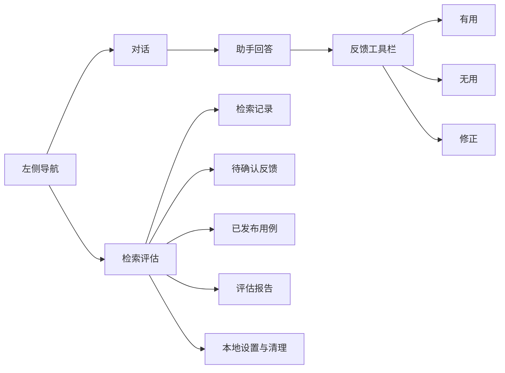
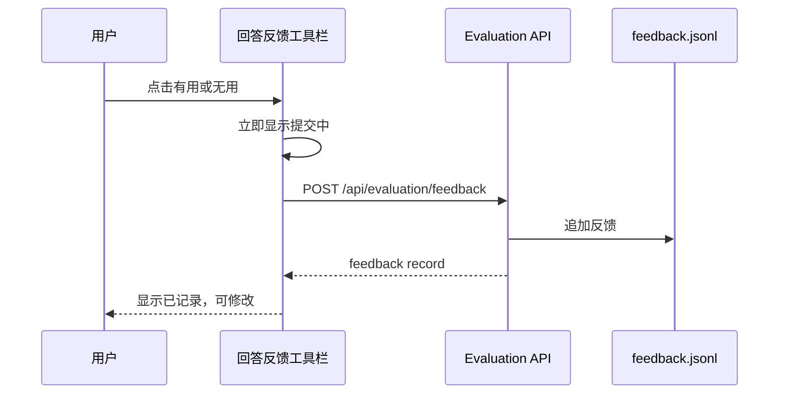
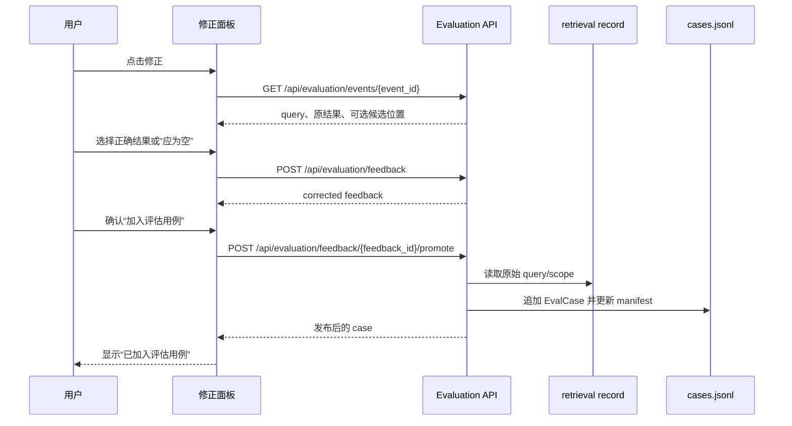

# Athena 个人助手检索评估前端技术方案

## 1. 目标

本文为 [个人助手检索评估技术方案](personal-retrieval-evaluation-plan.md) 定义桌面端功能入口和前后端契约。

Athena 的评估交互必须服务于一个人：帮助用户快速标记“这次回答是否基于正确检索结果”，必要时指出正确的记忆或文件位置，并把已确认的问题回流为可重复执行的评估用例。它不是人工标注平台，不需要任务分派、多人审核、权限控制或运营看板。

前端只提供两类入口：

1. 聊天回答下的即时反馈，用于记录本次回答是否有用，以及必要的修正。
2. 导航栏中的“检索评估”工作台，用于回顾本地记录、补充修正、发布 EvalCase、查看离线评估报告和清理本地数据。

## 2. 现有前端约束

当前桌面端使用 Electron、React 18、TypeScript、Zustand、Tailwind 和 Lucide 图标：

| 现有位置 | 作用 | 接入点 |
| --- | --- | --- |
| `desktop/src/components/MessageBubble.tsx` | 渲染单条回答 | 添加紧凑反馈工具栏 |
| `desktop/src/components/Chat.tsx` | 聊天历史与会话交互 | 在运行完成后刷新回答的评估上下文 |
| `desktop/src/api/client.ts` | REST 客户端 | 增加 evaluation API |
| `desktop/src/types/index.ts` | 前端数据类型 | 增加检索事件、反馈和报告类型 |
| `desktop/src/store/chatStore.ts` | 会话级状态 | 只缓存当前会话的反馈状态 |
| `desktop/src/components/NavRail.tsx` | 主导航 | 增加“检索评估”入口 |
| `desktop/src/components/pages/PageView.tsx` | 管理页面分发 | 增加 `EvaluationView` |
| `desktop/src/components/pages/SettingsView.tsx` | 只读设置展示 | 展示记录开关、采样率和数据目录 |

当前 `Message` 已有 `run_id`，但没有 `retrieval_event_ids`；WebSocket 事件也只带 `run_id`。一次 Agent run 可包含零次、一次或多次检索，因此前端不能根据回答文字、工具调用名称或最近时间猜测要反馈哪一次检索。后端必须显式提供回答与检索事件的关联。

## 3. 信息架构



### 3.1 聊天内入口

对每条“已完成且具有可评价检索事件”的助手回答，在时间戳下方显示三个 icon 按钮：

| 按钮 | 图标 | 行为 |
| --- | --- | --- |
| 有用 | `ThumbsUp` | 提交 `accepted`；不打断聊天 |
| 无用 | `ThumbsDown` | 提交 `rejected`；允许附加简短备注 |
| 修正 | `PencilLine` | 打开修正面板，选择正确结果或标记“应为空” |

按钮应使用 Lucide 图标，并以 `title` / `aria-label` 提供含义；不使用带大段文字的胶囊按钮。提交后以小型状态图标显示“已记录”，允许用户在同一回答上更新自己的反馈。

不显示反馈工具栏的情况：

- 用户消息、系统消息和工具消息。
- 流式输出中的助手消息。
- 回答没有关联检索事件。
- 后端明确标记事件不可记录，例如本地记录关闭且用户未主动触发反馈。

### 3.2 检索评估工作台

在 `NavRail` 新增 `ChartNoAxesCombined` 图标，对应 `AppView = "evaluation"`。页面采用现有管理页布局：248px 左侧上下文栏，右侧工作区，不创建嵌套卡片。

左侧使用分段导航：

```text
记录
反馈
用例
报告
设置
```

右侧视图职责：

| 页面 | 用户目的 | 核心内容 |
| --- | --- | --- |
| 记录 | 回顾真实检索 | query、来源、结果摘要、耗时、反馈状态 |
| 反馈 | 找到未解决问题 | `rejected`、待补充的 `corrected`、筛选与补全 |
| 用例 | 管理可重放金标 | 已发布 EvalCase、来源事件、数据集版本、过期状态 |
| 报告 | 判断改动效果 | 最近 run/compare 报告、整体与 `user-corrected` 指标、逐 case 差异 |
| 设置 | 管理本地记录 | 开关、采样率、数据目录、记录数量、清空操作 |

## 4. 关键用户流程

### 4.1 轻量反馈



`accepted` 和没有备注的 `rejected` 必须是一键完成操作。网络失败时恢复可点击状态并显示非阻塞错误，不影响当前回答内容、会话状态或继续对话。

### 4.2 修正并回流用例



修正面板是一个紧凑 drawer 或 modal，不在聊天气泡中塞入表单。字段按来源自适应：

| 字段 | memory | file | 说明 |
| --- | --- | --- | --- |
| 正确结果 | 选择 memory 条目 | 选择文件结果或手动填写 locator | 必填，除非应为空 |
| 应为空 | 支持 | 支持 | 选中后隐藏正确结果 |
| 相关性 | 默认 3，可调整为 1-3 | 默认 3，可调整为 1-3 | 用于 EvalCase gain |
| 备注 | 可选 | 可选 | 保存为用户说明/rationale |
| 立即重试 | 支持 | 支持 | 是新请求，不修改旧回答 |

手动填写 locator 时仅展示当前源类型对应字段：PDF 的 page，Excel 的 sheet/rows，代码的 path/lines。输入前端只做基本范围校验；实际 alias、locator 和数据集完整性由后端负责校验。

### 4.3 从工作台补充历史反馈

用户可能先点击“无用”，之后才知道正确位置。反馈页必须允许打开一条 `rejected` 记录并转换为 `corrected`，然后再发布为 EvalCase。

`rejected` 不允许直接“发布为用例”：它只说明当前结果错误，不能证明正确标准答案。页面应明确展示“需要指定正确结果或标记应为空”这一状态，而不是将其设计成错误弹窗。

### 4.4 查看报告

报告页面不在桌面端执行 `prepare`、`run` 或管理 Git 版本。它只读取后端已经生成的 report/compare 结果，避免把完整离线运行控制、路径选择和耗时任务塞进常用 UI。

最小展示：

- 报告时间、dataset version、snapshot、模型、应用版本。
- 总体 Hit@K、Recall@K、MRR、定位准确率、P95 延迟。
- baseline 与 candidate 的绝对差值。
- `user-corrected` 标签的单独指标和逐 case 结果。
- 退化 case 列表，点击后跳转到关联 EvalCase 或原检索记录。

离线运行仍通过 CLI 或后续单独的“运行评估”命令完成；这是个人工具中的低频开发动作，不应影响聊天主路径。

## 5. 前后端数据契约

### 5.1 回答必须携带可评价检索事件

扩展前端 `Message`，并在历史消息 API 和 WebSocket 的回答完成事件中提供：

```ts
interface RetrievalReference {
  event_id: string
  source: "memory" | "file"
  status: "recorded" | "available_on_feedback"
  result_count: number
}

interface Message {
  // existing fields
  retrieval_events?: RetrievalReference[]
}
```

语义：

- 一个回答可以关联多个 `retrieval_events`。
- `recorded` 表示已命中采样并写入 `retrieval-records.jsonl`。
- `available_on_feedback` 表示当前未采样，但用户反馈后后端能补写完整记录。
- 无检索行为的回答省略字段或返回空数组。

反馈工具栏默认对一个回答关联的全部事件提交同一反馈。当回答关联多个事件时，修正面板要求用户选择具体事件，避免把“文件结果错误”的反馈错误归到“记忆检索”。

后端可在 `SESSION_COMPLETE` / `STREAM_END` 的 data 中提供 `assistant_message_id` 和 `retrieval_events`，也必须将相同关系持久化到消息历史读取结果中，防止刷新页面后入口消失。

### 5.2 REST API

采用 REST 处理低频、可重试的评估操作；不要为反馈增加新的 WebSocket 客户端事件。

| 方法与路径 | 用途 | 请求/响应要点 |
| --- | --- | --- |
| `GET /api/evaluation/events` | 分页查询本地检索记录 | `session_id`、`source`、`feedback_status`、`limit`、`cursor` |
| `GET /api/evaluation/events/{event_id}` | 查询一条可修正记录 | 返回 query、scope、results、trace、feedback |
| `POST /api/evaluation/feedback` | 创建或更新反馈 | `event_id`、`rating`、`correct_result_ids`、`expect_empty`、`gain`、`comment` |
| `GET /api/evaluation/feedback` | 查询反馈列表 | `status`、`rating`、`session_id`、分页参数 |
| `POST /api/evaluation/feedback/{feedback_id}/promote` | 发布为 EvalCase | 可选 `case_id`、`labels`；返回 case/dataset version |
| `GET /api/evaluation/cases` | 列出已发布用例 | `label`、`source`、`status`、分页参数 |
| `GET /api/evaluation/reports` | 列出报告元数据 | `kind=run|comparison`、分页参数 |
| `GET /api/evaluation/reports/{report_id}` | 查询完整报告 | 返回 JSON report 与关联文件信息 |
| `GET /api/evaluation/settings` | 获取评估设置及统计 | record enabled、sample rate、目录、counts |
| `PATCH /api/evaluation/settings` | 更新本地记录设置 | 仅允许 `record_enabled`、`record_sample_rate` |
| `DELETE /api/evaluation/records` | 清空本地评估数据 | 必须显式指定 `records`、`feedback`、`cases`、`reports` 中的目标 |

`POST /feedback` 的请求示例：

```json
{
  "event_id": "evt_20260821_001",
  "rating": "corrected",
  "correct_result_ids": ["chunk-042"],
  "expect_empty": false,
  "gain": 3,
  "comment": "正确位置是环境配置段"
}
```

响应必须返回完整 `FeedbackRecord`，包括 `feedback_id`、当前状态、关联 `event_id` 和是否已可发布。前端不能自行推导“可以发布”的规则。

### 5.3 前端 TypeScript 类型

建议在 `desktop/src/types/index.ts` 添加：

```ts
export type FeedbackRating = "accepted" | "rejected" | "corrected"

export interface RetrievalEventSummary {
  event_id: string
  session_id: string
  run_id?: string
  source: "memory" | "file"
  query: string
  created_at: string
  result_count: number
  total_duration_ms?: number
  feedback?: FeedbackRecord
}

export interface FeedbackRecord {
  feedback_id: string
  event_id: string
  rating: FeedbackRating
  correct_result_ids: string[]
  expect_empty: boolean | null
  gain: 1 | 2 | 3 | null
  comment: string | null
  created_at: string
  promoted_case_id?: string | null
}

export interface EvaluationCaseSummary {
  case_id: string
  source_event_id: string
  source: "memory" | "file"
  labels: string[]
  dataset_version: string
  status: "active" | "stale"
  created_at: string
}
```

本地状态只缓存当前聊天中已提交的 `feedback_id` 和 `rating`，以便即时更新。记录、用例和报告列表由 `EvaluationView` 自行请求和刷新，避免把低频管理数据永久放入全局聊天 store。

## 6. 组件设计

```text
desktop/src/components/
├── MessageBubble.tsx
├── evaluation/
│   ├── AnswerFeedbackToolbar.tsx
│   ├── CorrectionDialog.tsx
│   ├── RetrievalRecordList.tsx
│   ├── RetrievalRecordDetail.tsx
│   ├── FeedbackList.tsx
│   ├── CaseList.tsx
│   ├── ReportSummary.tsx
│   └── EvaluationSettingsPanel.tsx
└── pages/
    └── EvaluationView.tsx
```

### 6.1 `AnswerFeedbackToolbar`

输入：`retrievalEvents`、现有反馈状态、`onSubmit`。职责仅限渲染按钮和提交状态，不负责加载记录详情或构造 EvalCase。

状态：

| 状态 | 呈现 |
| --- | --- |
| 未反馈 | 上/下/修正三个 icon 按钮 |
| 提交中 | 对应按钮显示 spinner，其他按钮禁用 |
| 已接受 | 上按钮高亮，提供“修改反馈” |
| 已拒绝 | 下按钮高亮，提供“补充修正” |
| 已修正 | 铅笔按钮高亮，显示“已加入用例”或“可加入用例” |
| 请求失败 | 恢复可点状态，在工具栏附近显示简短错误 |

### 6.2 `CorrectionDialog`

打开时按 `event_id` 拉取详情，以后端返回的 `results` 为主要候选，而不是重新执行检索。它必须支持：

- 从原结果中选中正确条目。
- 对 file 填写或修改 locator。
- 对 memory 选择记忆条目。
- 勾选“应为空”。
- 输入可选说明。
- 保存修正；保存成功后显示“加入评估用例”命令。
- 用户显式要求时以补充条件重新检索。

不得在打开对话框时自动运行新的检索、自动改写聊天回答或自动发布用例。

### 6.3 `EvaluationView`

页面应复用 `ViewShell`、`Toolbar`、`SectionCard`、`DataTable`、`FilterRow` 与既有空状态样式。记录和反馈采用表格，详情显示在右侧主列或 drawer，不使用连续嵌套 card。

记录列表列建议为：时间、query、来源、结果数、耗时、反馈、操作。query 可以单行截断；详情页再展示完整文本和结果正文。

报告页优先使用小型统计行和可扫描表格：指标、baseline、candidate、delta。它不需要营销式大图或复杂仪表盘。

### 6.4 删除与清理

本地数据可以被清理，但这是破坏性操作。页面必须：

- 将“清空记录”“清空反馈”“清空用例”“清空报告”拆为独立操作。
- 在确认对话框中显示准确影响范围。
- 默认不勾选 `cases`，防止误删已确认的金标数据。
- 成功后刷新当前列表和统计，不静默删除。

## 7. 交互与错误处理规则

| 场景 | 前端行为 |
| --- | --- |
| 回答仍在流式输出 | 不显示反馈工具栏 |
| 回答没有检索事件 | 不显示反馈工具栏，不显示错误 |
| 一条回答关联多个事件 | 轻反馈可应用到全部；修正必须先选择一个事件 |
| 记录未采样 | 用户提交反馈时后端补写记录；前端不要求用户理解采样差异 |
| 用户选择 `rejected` | 不自动创建 EvalCase |
| 用户选择 `corrected` 但未给结果且未选应为空 | 禁用保存并就地提示缺失字段 |
| 发布用例失败 | 保留反馈为 `corrected`，显示错误和重试按钮 |
| locator 已失效 | 标记用例为 `stale`，允许编辑/重新确认，不静默删除 |
| 后端不可用 | 显示可重试错误；回答及聊天连接继续工作 |
| 刷新或切换会话 | 从消息历史和 evaluation API 恢复反馈状态 |

## 8. 实施顺序

### 阶段一：事件关联与一键反馈

1. 后端为回答持久化 `retrieval_events`，并在历史消息与完成事件中返回。
2. 前端增加类型、`apiClient.submitFeedback()` 和 `AnswerFeedbackToolbar`。
3. 在 `MessageBubble` 中为符合条件的助手消息显示工具栏。
4. 覆盖 accepted/rejected、加载、失败和刷新后恢复状态。

完成标准：用户可以在回答下记录“有用/无用”，刷新会话后状态仍存在。

### 阶段二：修正和用例回流

1. 实现 `CorrectionDialog` 和单事件详情 API。
2. 实现 `corrected`、`expect_empty`、locator 校验和 `promote` 操作。
3. 在结果成功后显示已发布 case/dataset version。

完成标准：用户能从一条回答选择正确结果或“应为空”，并将其发布为 EvalCase，无需编辑 JSONL。

### 阶段三：评估工作台

1. 增加 `evaluation` AppView、导航项和 `EvaluationView`。
2. 实现记录、反馈、用例和报告的读取页面。
3. 实现设置和分目标清理确认。

完成标准：用户可以离开聊天页回顾问题、补充反馈、查看已发布用例和比较报告。

### 阶段四：可选体验优化

- 从报告退化 case 跳转到记录/用例详情。
- 在 SessionDetailView 中显示会话的评估记录数和未解决反馈数。
- 为常用过滤提供最近 7 天、仅 rejected、仅未发布等快捷项。

这些优化不阻塞最小闭环。

## 9. 前端测试

| 范围 | 验证点 |
| --- | --- |
| `MessageBubble` | 仅满足条件的完成助手回答显示反馈按钮 |
| 反馈工具栏 | accepted/rejected 正确提交、禁用重复提交、失败后可重试 |
| 多事件回答 | 修正操作要求选择一个 event |
| 修正对话框 | 正确结果与 `expect_empty` 互斥；缺字段不能提交 |
| 发布 | 成功显示 case；失败保留 corrected 状态 |
| 历史恢复 | `getMessages()` 返回 retrieval events 后仍显示反馈状态 |
| 工作台 | 筛选、分页、空状态、错误状态和刷新行为正确 |
| 清理 | 确认前不发送 DELETE；成功后刷新统计 |
| 无障碍 | 每个图标按钮均有 `title` 和 `aria-label`；键盘可关闭 dialog |
| 类型检查 | `npm run typecheck` 通过 |

## 10. 最终取舍

前端不承担检索正确性判断，也不把一条用户点踩直接转换成标准答案。它提供足够短的路径，让用户从“这次不对”走到“正确结果是什么”再到“把这个问题加入回归测试”。

最终体验应是：日常聊天只有三个低干扰反馈图标；当需要回顾和改进检索时，用户在“检索评估”页面获得清晰的本地记录、待解决问题、已发布用例和报告，而不需要进入多人审核或实验运营系统。
