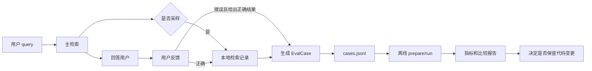
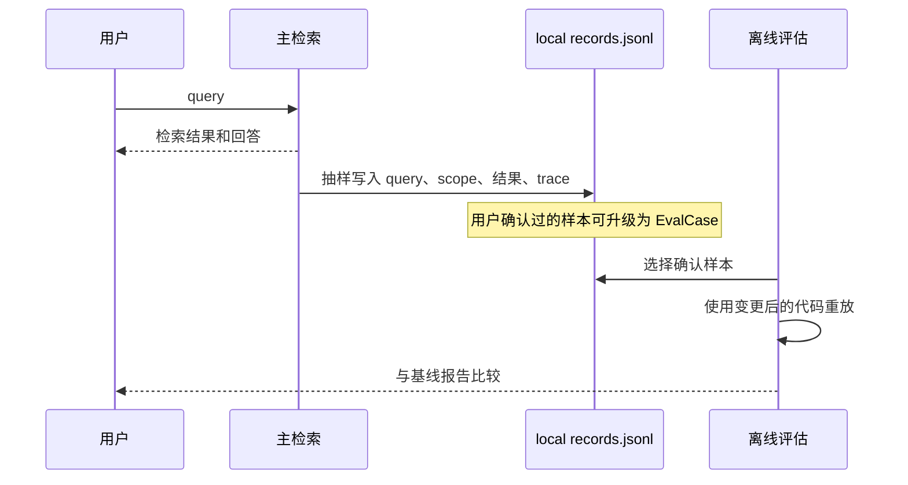
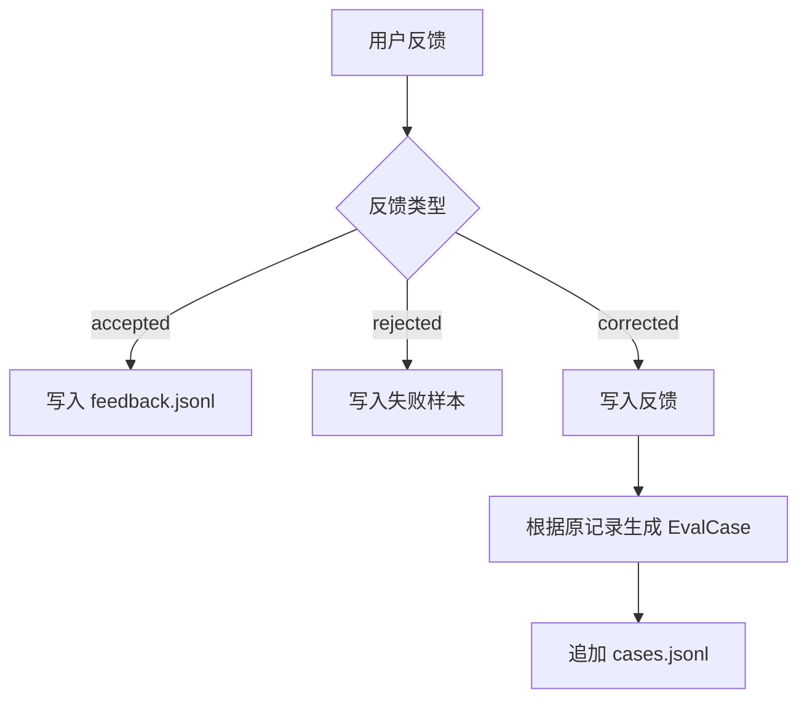

# Athena 个人助手检索评估技术方案

## 1. 目标与边界

Athena 是单用户、本地优先的个人助手。检索评估系统的目的不是建设多租户的质量运营平台，而是把真实使用中出现的检索问题沉淀为可重复运行的评估用例，并在修改检索代码、模型或配置后验证效果。

本方案取代多用户 Shadow/审核方案中的复杂默认流程，遵循以下原则：

- 本地保存原始 query、结果和必要正文，不执行默认脱敏或匿名化。
- 用户本人是评估数据的唯一确认者，不需要双人标注、仲裁和审批队列。
- 线上只做轻量采样记录；代码变更后的比较主要在离线环境重放完成。
- 用户反馈不会直接修改当前生产索引或检索逻辑；它先沉淀为评估用例，再用于验证后续改动。
- 保留 `record_access=False`，保证评估和可选 Shadow 检索不会改变记忆访问计数或 TTL。
- 数据集和索引版本继续由 snapshot/report 元数据管理，不传入生产检索方法。

不在本方案范围内：多用户权限、审核工作台、跨机器共享事件库、加密存储、自动发布、复杂采样告警和 CI 强制门禁。这些能力可以在 Athena 未来变成多人产品时再引入。

## 2. 最小闭环



核心区分如下：

| 环节 | 职责 | 是否影响当前回答 |
| --- | --- | --- |
| 主检索 | 为用户返回结果 | 是 |
| 采样记录 | 保存真实请求、结果和 trace | 否 |
| 用户反馈 | 判断本次结果是否有用，并可指出正确结果 | 仅在用户主动要求重试时影响 |
| EvalCase 回流 | 将已确认的问题变成标准答案 | 否 |
| 离线评估 | 对比旧、新检索实现的质量和延迟 | 否 |

## 3. 为什么采用“记录后离线重放”

现有 `ShadowRetrievalRunner` 会在一次用户请求后再异步运行候选检索。该模式适合实时 A/B 实验，但对单用户 Athena 不是默认必需：它增加额外模型调用、队列、并发和超时管理，却不能在没有标准答案时判断哪一套检索更正确。

默认方案改为记录真实请求，在代码变更后离线重放：



这样可以回答两个不同的问题：

- 未标注样本：新旧版本的行为是否变化，例如 Top-1、结果集合、空结果和延迟是否变化。
- 用户确认样本：新旧版本的准确率是否变化，例如 Hit@K、Recall@K、MRR、定位准确率是否变化。

只有第二类样本具备标准答案，才能称为“准确率比较”。

## 4. 本地数据模型

建议将运行记录、用户反馈和正式评估数据分开保存：

```text
<evaluation-data-dir>/
├── retrieval-records.jsonl   # 采样的线上检索记录
├── feedback.jsonl            # 用户评价和修正
├── cases.jsonl               # 已确认、可重放的评估用例
├── manifest.json              # cases.jsonl 的版本和摘要
└── reports/                   # 离线 run/compare 输出
```

默认情况下，`<evaluation-data-dir>` 可以是 Athena 数据目录下的 `evaluation/`。它必须和用户会话消息、生产 SQLite 数据库、文件附件目录分开，便于查看、备份和清空。

### 4.1 检索记录

每次命中采样时，写入一条 `retrieval_record`。它是诊断资料和潜在评估样本，不是自动金标。

```json
{
  "type": "retrieval_record",
  "event_id": "evt_20260821_001",
  "created_at": "2026-08-21T10:20:30+08:00",
  "query": "项目配置文件在哪里？",
  "scope": {
    "source": "file",
    "session_id": "session-123",
    "file_id": "file-456"
  },
  "results": [
    {
      "id": "chunk-001",
      "rank": 1,
      "score": 0.91,
      "locator": {"path": "config/settings.py", "start_line": 10, "end_line": 40},
      "content": "..."
    }
  ],
  "trace": {
    "selected_ids": ["chunk-001"],
    "fallback_reason": null,
    "total_duration_ms": 48.2,
    "stage_durations_ms": []
  },
  "runtime": {
    "application_revision": "git-sha-or-local-version",
    "model": "configured-model",
    "index_version": "local-index-at-20260821"
  }
}
```

字段要求：

- `event_id`：一次真实检索的稳定标识，反馈必须通过它关联记录。
- `query`、`scope`：用于离线重放。scope 必须是主请求已经完成权限和范围判断后的实际范围。
- `results`：保存 ID、rank、score、locator 和正文。正文只保存在本地个人数据目录。
- `trace`：保存结构化检索诊断信息；不要求把 trace 作为生产检索方法参数传入。
- `runtime`：记录足以解释差异的轻量元数据。无需建立复杂的版本服务。

### 4.2 用户反馈

反馈只有三种状态：

| `rating` | 含义 | 能否直接成为金标 |
| --- | --- | --- |
| `accepted` | 用户认为当前结果有用 | 可以作为弱正样本；用户确认后可发布 |
| `rejected` | 用户认为结果无用或错误 | 不能单独推导正确答案 |
| `corrected` | 用户指出正确的结果、文件位置或应为空 | 可以直接生成 EvalCase |

推荐数据格式：

```json
{
  "type": "feedback",
  "feedback_id": "fb_20260821_001",
  "event_id": "evt_20260821_001",
  "rating": "corrected",
  "correct_result_ids": ["chunk-042"],
  "expect_empty": false,
  "comment": "正确位置是 config/settings.py 的环境配置段",
  "created_at": "2026-08-21T10:22:00+08:00"
}
```

`correct_result_ids` 可以为空：当用户确认“这个问题本来就不应返回任何结果”时，设置 `expect_empty=true` 即可。

### 4.3 正式 EvalCase

从用户确认的反馈生成 `EvalCase`。正式用例仍复用现有 `cases.jsonl` 协议，使其可直接进入 `prepare`、`run`、`compare` 和 `gate`。

```json
{
  "case_id": "feedback-evt_20260821_001",
  "query": "项目配置文件在哪里？",
  "scope": {
    "source": "file",
    "attachment_aliases": ["project-config"]
  },
  "relevant": [
    {
      "document_alias": "project-config",
      "locator": {"path": "config/settings.py", "start_line": 10, "end_line": 40},
      "quote_sha256": null,
      "gain": 3,
      "rationale": "用户确认的正确位置"
    }
  ],
  "labels": ["user-corrected", "file"],
  "annotation": {
    "status": "approved",
    "annotator_ids": ["owner"],
    "reviewed_at": "2026-08-21T10:22:00+08:00",
    "source": "user-feedback",
    "annotation_version": "1"
  }
}
```

`rejected` 但没有正确结果的反馈保留在 `feedback.jsonl`，用于回顾和后续补充，不自动进入 `cases.jsonl`。这样避免把“有问题”误当成“已经知道正确答案”。

## 5. 线上流程

### 5.1 创建统一检索事件

所有需要记录或反馈的检索，都先在应用编排层创建 `event_id`：

```text
请求进入
  -> 解析并校验 scope
  -> event_id
  -> 主检索
  -> 返回用户结果
  -> 可选记录 retrieval_record
```

`event_id` 应由主请求创建并贯穿记录和反馈。不要依赖 query hash 关联事件；同一个 query 在不同范围或不同时间可能有不同语义和结果。

### 5.2 采样记录

采样可以从非常简单的配置开始：

```toml
[evaluation]
record_enabled = true
record_sample_rate = 0.1
```

行为约定：

- `record_enabled=false` 时不创建任何额外记录。
- 命中采样时，主检索返回后追加一行 JSONL。
- 记录失败不得影响回答；仅写一条本地日志。
- 不创建后台队列，不增加第二次检索，不等待额外模型调用。
- 用户主动提交反馈时，即使该请求未被采样，也应补写该事件的完整记录。

采样率不是质量指标。它只是控制样本积累速度和本地磁盘占用。

### 5.3 用户反馈与可选重试

用户界面可提供“有用”“无用”“指出正确位置”三个操作。提交反馈后：



用户希望立刻继续解决问题时，可以提供显式“重新检索”操作。它是一次新的生产请求，可以基于用户补充的关键词、指定文件或指定记忆执行；反馈记录本身不应在后台自动改写当前回答。

## 6. 离线评估流程

正式评估继续使用当前流程：

```text
manifest.json + cases.jsonl
  -> athena.evaluation.cli prepare
  -> athena.evaluation.cli run
  -> report.json / report.md
  -> 可选 compare
  -> 可选 gate
```

当检索代码、模型、参数或索引策略改变时：

1. 固定目标 `cases.jsonl` 和对应数据快照。
2. 用变更前版本运行并保存 baseline report。
3. 用变更后版本在同一数据集和快照上运行。
4. 比较整体指标、按来源分组指标、逐 case 结果和延迟。
5. 优先检查用户反馈生成的 `user-corrected` 用例是否恢复正确。

报告 metadata 应继续记录 `dataset_id`、`dataset_version`、`snapshot_id`、`index_version`、模型和应用版本。这些是报告层追溯信息，不是 `retrieve()` 或 `search_file()` 的生产参数。

### 6.1 可重复性限制

个人助手的数据会持续变化。一个历史 query 的比较只有在相同或可追溯的数据状态下才有意义。

简化策略：

- 正式 `EvalCase` 使用稳定 alias 和 locator，不使用临时 `chunk_id` 作为标准答案。
- 每次 `prepare` 生成的 snapshot manifest 记录数据集和索引状态。
- 记录样本中的 `runtime.index_version` 和创建时间仅用于诊断；正式比较以 `prepare` 的 snapshot 为准。
- 文件或记忆被删除、移动或大幅改写后，旧 case 可以标记为过期，而不是试图自动修复。

## 7. 与当前模块的对应关系

| 当前模块 | 个人助手方案中的职责 | 改造方向 |
| --- | --- | --- |
| `evaluation/runtime.py` | 离线评估运行时 | 保持现状；继续把 trace 摘要放入 `RetrievalOutcome` |
| `evaluation/executor.py` | 执行 EvalCase | 保持现状 |
| `evaluation/report.py` | 生成离线报告 | 保持 metadata 和指标；不再强制过滤个人本地数据 |
| `evaluation/storage.py` | 本地 JSONL 存储 | 改为通用追加存储，不调用 `sanitize_event()` |
| `evaluation/feedback.py` | 写入用户评价 | 由 `FeedbackTask` 改为 `FeedbackRecord`，保存 raw query 引用、rating、correct_result_ids 和 comment |
| `evaluation/annotation.py` | 从用户确认发布 EvalCase | 增加单用户 `publish_feedback_case()`；不要求两人 `Label` 或 `arbitrate()` |
| `evaluation/shadow.py` | 可选实时 A/B 观察 | 默认不接入；保留给需要同时试运行候选检索的场景 |
| `evaluation/redaction.py` | 多用户安全策略 | 不进入个人助手默认数据路径；可保留为未来可选能力 |
| `config/settings.py` | 评估配置 | 新增轻量 record 配置，Shadow 配置保持默认关闭 |
| `main.py` / `runtime.py` | 应用依赖注入 | 注入本地记录器和反馈服务；不把评估参数加到核心检索方法 |

当前 `FeedbackService` 会调用 `redact_request()`，而 `JsonlEventStore` 会调用 `sanitize_event()`；两者都会阻止保存 query 和正文。因此它们不能直接满足本方案，需要调整其数据契约。

## 8. 推荐的实现结构

新增一个应用层服务，避免让 memory/file 核心检索接口承担评估逻辑：

```text
athena/evaluation/
├── recorder.py       # 采样和 retrieval_record 写入
├── feedback.py       # 用户反馈记录和校验
├── promotion.py      # Feedback + retrieval_record -> EvalCase
├── storage.py        # 本地 JSONL append/read
├── shadow.py         # 可选，默认不启用
└── ...现有离线评估模块

athena/runtime.py
└── RuntimeContainer
    ├── evaluation_recorder
    └── evaluation_feedback
```

建议的接口如下：

```python
class RetrievalRecorder:
    def should_record(self) -> bool: ...

    def record(
        self,
        *,
        event_id: str,
        query: str,
        scope: dict[str, object],
        results: list[dict[str, object]],
        trace: dict[str, object],
        runtime: dict[str, object],
    ) -> None: ...


class FeedbackService:
    def submit(
        self,
        *,
        event_id: str,
        rating: Literal["accepted", "rejected", "corrected"],
        correct_result_ids: list[str] | None = None,
        expect_empty: bool | None = None,
        comment: str | None = None,
    ) -> FeedbackRecord: ...


class CasePromotionService:
    def publish(self, feedback_id: str) -> EvalCase: ...
```

这些服务只能在主检索编排结束后调用。`HybridRetrievalManager.retrieve()` 和 `FileIntelligenceRuntime.search_file()` 保持其当前核心职责：接收 query/scope，返回检索结果，必要时发出 trace；除 `record_access` 外不增加评估控制参数。

## 9. 实施阶段

### 阶段一：本地记录

1. 将 `JsonlEventStore` 改为本地通用 JSONL 存储。
2. 新增 `RetrievalRecorder` 和 `retrieval-records.jsonl` schema。
3. 在应用编排层生成 `event_id`，在主检索完成后按采样率记录结果和 trace。
4. 增加“关闭记录”和“清空评估数据”的本地设置。

验收：关闭时没有额外 I/O；开启时记录失败不影响回答；记录可通过 `event_id` 完整定位一次检索。

### 阶段二：用户反馈

1. 前端或 API 提供 `accepted`、`rejected`、`corrected`。
2. 将反馈写入 `feedback.jsonl`，并关联已有记录。
3. 对未采样但收到反馈的请求补写检索记录。
4. 提供用户主动重试的入口，但不自动重写当前回答。

验收：用户可以从一条检索结果提交反馈；反馈不会改变记忆访问统计、索引或已有回答。

### 阶段三：用例回流

1. 实现 `CasePromotionService`。
2. 将 `corrected` 或明确的 `expect_empty` 反馈转换为 `EvalCase`。
3. 追加 `cases.jsonl` 并更新 `manifest.json` 的 case count、版本和内容摘要。
4. 在界面或 CLI 中展示“已回流/待补充”的状态。

验收：一条用户确认的反馈可以在不人工编辑 JSONL 的情况下进入 `prepare/run`。

### 阶段四：版本比较

1. 为 baseline/candidate 报告补充应用版本和模型元数据。
2. 针对 `user-corrected` 标签单独展示指标。
3. 保留 `compare` 和 `gate`，但将 gate 作为本地决策辅助，而不是默认 CI 阻断条件。

验收：一次检索改动可在固定 cases/snapshot 上得到清晰的“哪些用户问题变好或变差”报告。

### 阶段五：可选 Shadow

只有当需要在日常使用中同时观察两套实现时才接入 `ShadowRetrievalRunner`。接入仍必须满足：

- Shadow 不进入用户回答。
- Memory Shadow 调用 `record_access=False`。
- 不触发文件解析、索引或其他写操作。
- 超时、异常和队列满不影响主请求。
- 事件使用主请求已创建的 `event_id`。

## 10. 测试清单

| 场景 | 预期结果 |
| --- | --- |
| 关闭记录 | 没有记录文件写入、没有额外检索调用 |
| 命中采样 | 一条完整 `retrieval_record` 被追加，包含 query、scope、结果和 trace |
| 记录失败 | 用户仍获得正常回答 |
| `accepted` 反馈 | 反馈与 event_id 关联，原记录不被修改 |
| `rejected` 反馈 | 保存失败信号，但不自动创建错误的 EvalCase |
| `corrected` 反馈 | 生成包含正确 alias/locator 的 EvalCase |
| `expect_empty=true` | 生成已确认的负向 EvalCase |
| 生成用例后 | `manifest.json` 数量、版本和 hash 与 `cases.jsonl` 一致 |
| 离线评估 | `record_access=False` 时 memory access 统计不变化 |
| 数据源变化 | 旧 case 能被明确报告为 binding/locator 失效，而不是静默通过 |
| 可选 Shadow | 未启用时不产生第二次检索；启用失败不影响主请求 |

## 11. 取舍总结

本方案刻意不引入下列复杂度：

| 不采用的机制 | 原因 |
| --- | --- |
| 默认脱敏、哈希关联 | Athena 的评估数据仅供本地单用户使用，raw query 对重放和理解问题更有价值 |
| 双人标注与仲裁 | 用户本人是标准答案确认者，不存在多人意见冲突 |
| 实时 Shadow 默认开启 | 离线重放已经覆盖代码变更验证，且成本和实现复杂度更低 |
| 数据库任务系统 | 本地 JSONL 足以支持顺序追加、查看和备份 |
| 自动根据一次反馈修改检索 | 一次反馈是信号，不应未经用户确认改写系统行为 |
| 强制 CI gate | 个人项目更适合将报告作为发布决策依据 |

保留的最小必要机制是：稳定事件 ID、原始检索记录、用户确认、EvalCase 回流、隔离快照、离线重放和指标报告。它们构成一个足够可靠、可理解且维护成本低的个人助手检索评估闭环。
