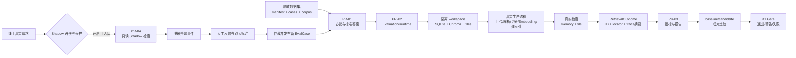
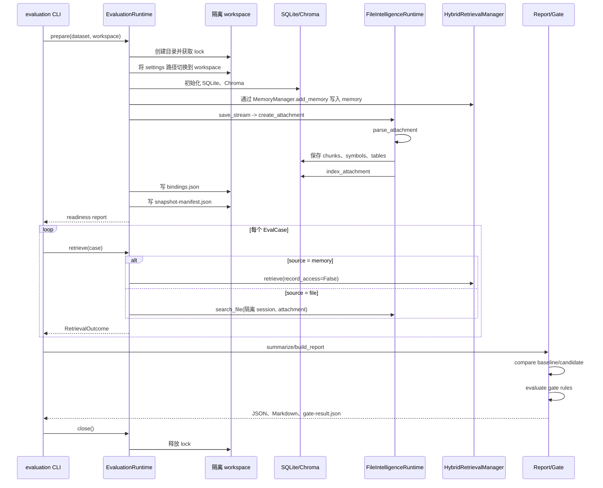
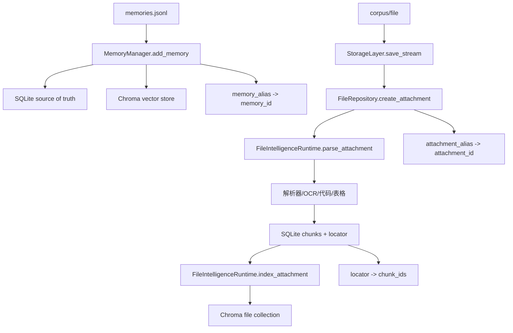
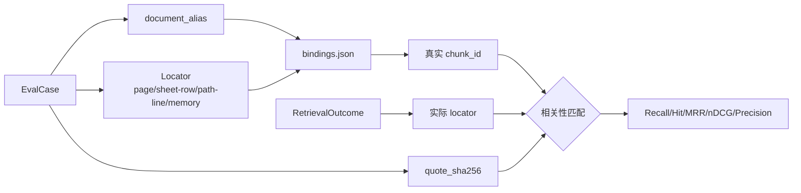
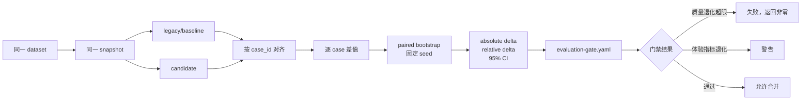
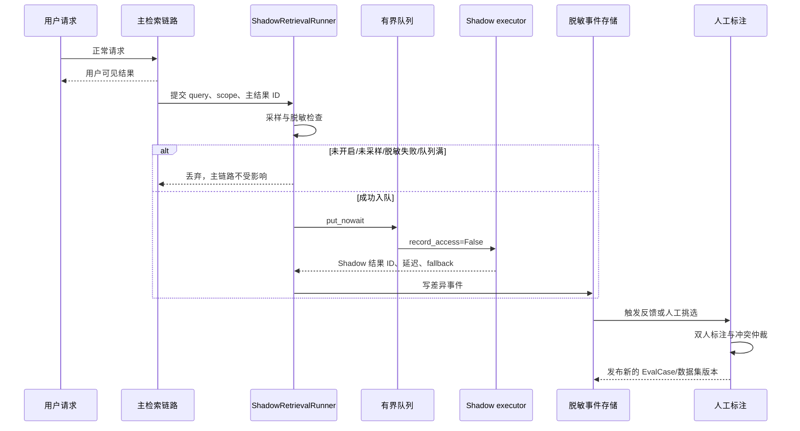
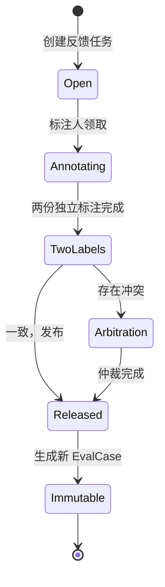
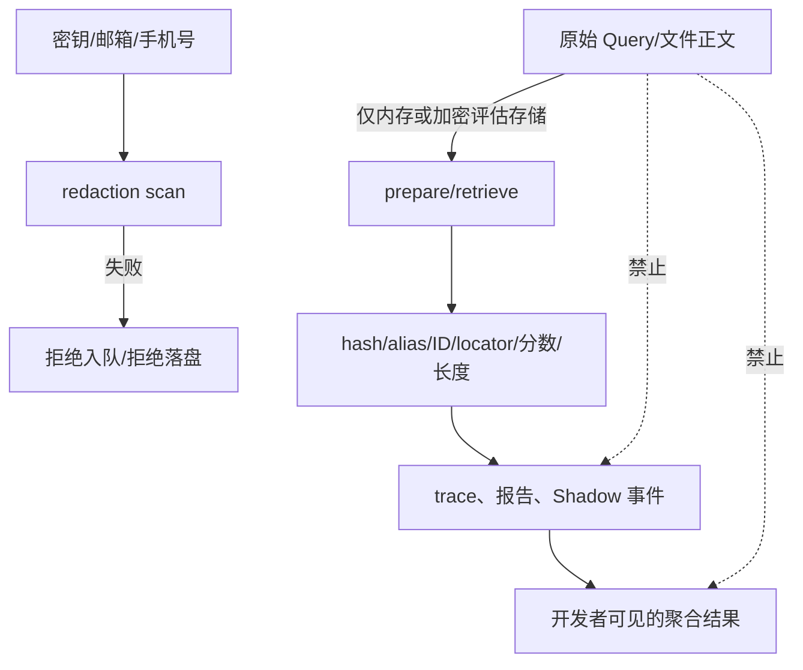
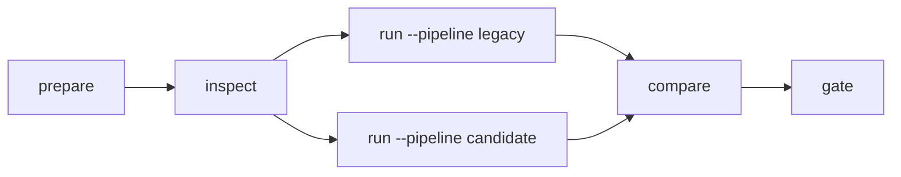

# Athena 检索评估系统流程

本文描述 Athena 检索评估系统从数据集、真实运行时、指标报告、CI 门禁到线上 Shadow 反馈的完整流程。

评估系统的核心原则是：评估使用真实生产检索组件，但使用独立 workspace；标准答案使用稳定别名和内容位置，不依赖运行时生成的 `chunk_id`；报告只保存可审计的元数据、ID、locator、分数和延迟，不保存候选正文。

## 1. 系统总览



四个 PR 的职责是串联关系：

| 阶段 | 主要问题 | 主要模块 | 产物 |
| --- | --- | --- | --- |
| PR-01 | 什么是正确答案，如何计算分数 | `models.py`、`dataset.py`、`relevance.py`、`metrics.py` | 版本化数据协议、标准答案、指标 |
| PR-02 | 如何用真实生产流程答题 | `runtime.py`、`snapshot.py`、`ingestion.py`、`readiness.py` | 隔离索引、快照清单、bindings |
| PR-03 | 新版本是否退化 | `comparison.py`、`report.py`、`gate.py`、`cli.py` | JSON/Markdown 报告、比较结果、gate-result |
| PR-04 | 线上长尾问题如何回流 | `shadow.py`、`feedback.py`、`annotation.py`、`storage.py` | Shadow 事件、标注任务、新金标用例 |

## 2. 离线评估主流程



### 2.1 准备阶段

`prepare` 阶段只允许写入评估 workspace，目录结构如下：

```text
.run/retrieval-evaluation/<run-id>/
├── athena.db
├── chromadb/
├── files/
├── bindings.json
├── snapshot-manifest.json
├── logs/
└── lock
```

运行时会拒绝以下情况：

- workspace 配置与生产路径部分重叠。
- 配置仍指向默认的 `data/athena.db`、`data/chromadb` 或 `data/files`。
- 同一个 workspace 已被其他任务通过 `lock` 占用。
- `manifest.case_count` 与实际加载的 JSONL case 数量不一致。
- 附件、索引、locator 或 bindings 未达到 readiness 要求。

### 2.2 真实数据摄取

memory 和文件必须走生产服务入口：



评估器不直接插入 SQLite 或 Chroma。这样可以保留生产中的 dual-write、metadata、FTS、解析状态和索引状态行为。

## 3. 标准答案与相关性判断

标准答案保存在 `cases.jsonl`，运行时生成的 ID 只进入 `bindings.json`，两者通过别名和 locator 连接。



支持的定位方式包括：

- PDF：`page`。
- Excel：`sheet`、`start_row`、`end_row`，可扩展到 value 信息。
- 代码：`path`、`start_line`、`end_line`，可带 symbol。
- memory：`memory_alias` 或文档别名级匹配。

数据加载时会拒绝重复 `case_id`、非法 locator、未知 label、未审核的负向用例和没有理由的 `gain=3` 标注。

## 4. 指标与报告

### 4.1 指标层次

```mermaid
flowchart TD
    A[候选结果] --> B[候选阶段]
    B --> B1[Recall@10]
    B --> B2[Recall@30]
    B --> B3[Recall@50]

    C[最终排序结果] --> D[排序阶段]
    D --> D1[Hit@1/3]
    D --> D2[MRR]
    D --> D3[nDCG@10]
    D --> D4[Precision@5]

    E[负向用例] --> F[安全与误报]
    F --> F1[empty_false_positive_rate]
    F --> F2[harmful_hit_rate]
    F --> F3[empty_false_negative_rate]

    G[定位与运行信息] --> H[诊断指标]
    H --> H1[locator_accuracy]
    H --> H2[latency P50/P95]
    H --> H3[stage latency]
```

空结果用例不参与 Recall 和 MRR 的平均值，但参与空结果误报率；明确禁止返回的内容会参与 `harmful_hit_rate`。

### 4.2 报告内容

报告包含：

- `overall`：总体候选、最终排序、负向、locator、延迟指标。
- `by_label`：按 query label 分组。
- `by_source`：按 memory/file 等来源分组。
- `outcomes`：每个 case 的结果 ID、locator、trace 摘要和错误码。
- `metadata`：dataset、snapshot、index、commit、模型等追溯信息。

报告通过安全序列化过滤 `query`、`content`、`document`、`raw_query` 和 `quote` 等字段；日志和报告不应包含候选正文、原始 Query 或密钥。

## 5. baseline、candidate 与 CI 门禁



比较前必须共享：

- dataset ID 和版本。
- snapshot/index version。
- case 集合和执行顺序。
- 模型配置及其他运行条件。

默认门禁规则位于 [`doc/retrieval-evaluation/evaluation-gate.yaml`](retrieval-evaluation/evaluation-gate.yaml)，包括 Recall@30、Hit@3、locator accuracy、空结果误报率和 P95 延迟。

其中相关性、安全性和精确查询退化会阻断门禁；延迟等体验指标默认生成 warning。使用 `--override-reason` 覆盖失败时，覆盖理由会写入 `gate-result.json`。

## 6. Shadow 与线上反馈闭环

Shadow 默认关闭，开启后只旁路执行，不参与用户回答：



Shadow 的安全约束：

- 不改变主链路排序和用户回答。
- 不增加 memory `access_count`，不刷新 TTL。
- 不触发文件解析、摘要、事实抽取、删除或索引迁移。
- 不记录原始 Query、候选正文或敏感附件内容。
- 超时、异常、队列满只影响 Shadow，并记录计数。

默认配置为：采样率 5%、最大并发 4、超时 5 秒、队列 1000、过载丢弃。

### 6.1 人工标注状态机



标注字段包括 `relevance`、`locator_correct`、`should_be_empty` 和 `error_stage`。已发布标注不能原地修改，后续变化必须通过新的 annotation/dataset version 表达。

## 7. 数据安全边界



可以进入普通报告和日志的字段：

```text
case_id、query_hash、query_length、document_alias、chunk_id、locator、rank、score、duration、error_code、版本信息
```

不应进入普通报告和日志的字段：

```text
原始 Query、候选正文、原始文件、quote 正文、API key、邮箱、手机号、用户 ID、默认生产路径
```

## 8. 命令行使用流程



典型命令：

```bash
python -m athena.evaluation.cli prepare \
  --dataset retrieval_eval/datasets/production-sanitized-v1 \
  --workspace .run/retrieval-evaluation/eval-001

python -m athena.evaluation.cli inspect \
  --workspace .run/retrieval-evaluation/eval-001

python -m athena.evaluation.cli run \
  --dataset retrieval_eval/datasets/production-sanitized-v1 \
  --workspace .run/retrieval-evaluation/eval-001 \
  --pipeline candidate \
  --output .run/retrieval-evaluation/reports/candidate.json

python -m athena.evaluation.cli compare \
  --baseline .run/retrieval-evaluation/reports/legacy.json \
  --candidate .run/retrieval-evaluation/reports/candidate.json \
  --output .run/retrieval-evaluation/reports/compare.json

python -m athena.evaluation.cli gate \
  --comparison .run/retrieval-evaluation/reports/compare.json \
  --rules doc/retrieval-evaluation/evaluation-gate.yaml
```

`prepare` 会构建真实隔离运行时；`run` 会在准备好的生产组件上逐 case 执行；`compare` 只接受同条件报告；`gate` 负责输出可被 CI 判断的退出码和 `gate-result.json`。

## 9. 代码入口索引

| 目标 | 入口 |
| --- | --- |
| 数据模型和校验 | [`athena/evaluation/models.py`](../athena/evaluation/models.py) |
| 数据集加载 | [`athena/evaluation/dataset.py`](../athena/evaluation/dataset.py) |
| 相关性与指标 | [`athena/evaluation/relevance.py`](../athena/evaluation/relevance.py)、[`athena/evaluation/metrics.py`](../athena/evaluation/metrics.py) |
| 隔离 workspace | [`athena/evaluation/snapshot.py`](../athena/evaluation/snapshot.py) |
| 真实运行时 | [`athena/evaluation/runtime.py`](../athena/evaluation/runtime.py) |
| 报告与比较 | [`athena/evaluation/report.py`](../athena/evaluation/report.py)、[`athena/evaluation/comparison.py`](../athena/evaluation/comparison.py) |
| CI 门禁 | [`athena/evaluation/gate.py`](../athena/evaluation/gate.py) |
| Shadow | [`athena/evaluation/shadow.py`](../athena/evaluation/shadow.py) |
| 人工反馈与回流 | [`athena/evaluation/feedback.py`](../athena/evaluation/feedback.py)、[`athena/evaluation/annotation.py`](../athena/evaluation/annotation.py) |

